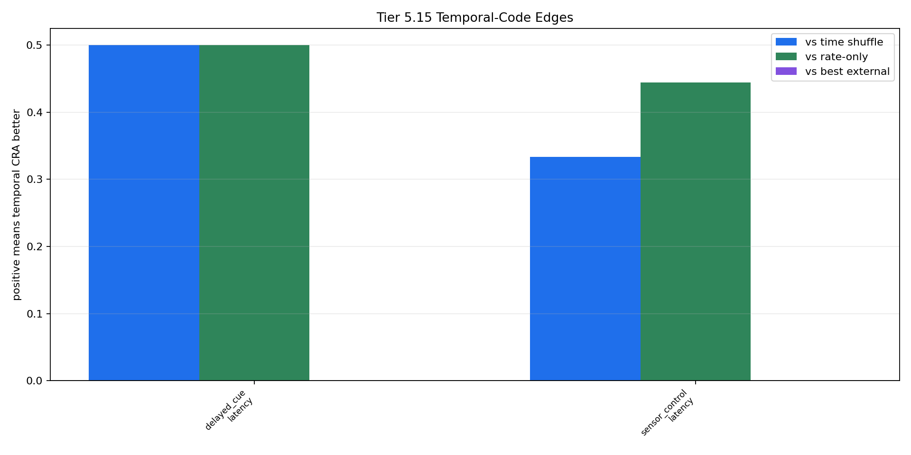
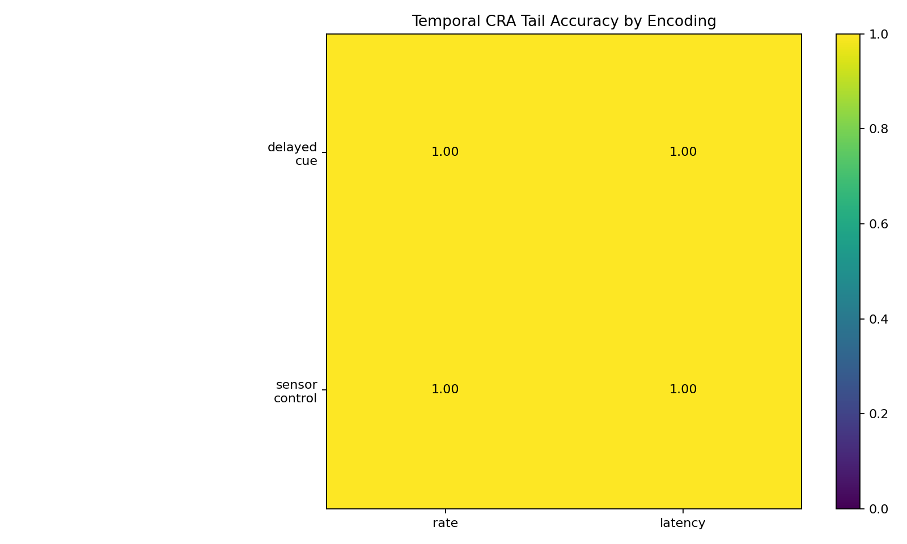

# Tier 5.15 Spike Encoding / Temporal Code Findings

- Generated: `2026-04-29T17:59:17+00:00`
- Status: **PASS**
- Backend: `numpy_temporal_code`
- Seeds: `42`
- Tasks: `delayed_cue, sensor_control`
- Encodings: `latency, rate`
- Models: `temporal_cra, time_shuffle_control, rate_only_control, sign_persistence, online_perceptron`
- Output directory: `<repo>/controlled_test_output/tier5_15_20260429_135917`

Tier 5.15 tests whether spike timing can carry task-relevant information, rather than only using spikes as a scalar transport layer.

## Claim Boundary

- Software diagnostic only; no SpiNNaker hardware claim.
- No custom-C/on-chip temporal-code claim.
- Not a frozen baseline by itself; promotion would require a separate compact regression/freeze gate.
- Passing means temporal spike structure was causally useful under this controlled diagnostic.

## Aggregate Summary

| Task | Encoding | Model | Family | Tail acc | Overall acc | Corr | Spike total | Sparsity | Runtime s |
| --- | --- | --- | --- | ---: | ---: | ---: | ---: | ---: | ---: |
| delayed_cue | latency | `online_perceptron` | linear | 1 | 0.851852 | 0.829775 | 0.563636 | 0.00464015 | 0.0147181 |
| delayed_cue | latency | `rate_only_control` | temporal_cra_readout | 0.5 | 0.444444 | -0.19401 | 0.563636 | 0.00464015 | 0.00596667 |
| delayed_cue | latency | `sign_persistence` | rule | 0.5 | 0.481481 | -0.0154561 | 0.563636 | 0.00464015 | 0.0101071 |
| delayed_cue | latency | `temporal_cra` | temporal_cra_readout | 1 | 0.925926 | 0.933064 | 0.563636 | 0.00464015 | 0.00825904 |
| delayed_cue | latency | `time_shuffle_control` | temporal_cra_readout | 0.5 | 0.444444 | -0.152625 | 0.563636 | 0.00501894 | 0.0144384 |
| delayed_cue | rate | `online_perceptron` | linear | 1 | 0.888889 | 0.699223 | 0.818182 | 0.00705492 | 0.00680383 |
| delayed_cue | rate | `rate_only_control` | temporal_cra_readout | 1 | 0.925926 | 0.903995 | 0.818182 | 0.00705492 | 0.00429967 |
| delayed_cue | rate | `sign_persistence` | rule | 0 | 0 | -1 | 0.818182 | 0.00705492 | 0.00499687 |
| delayed_cue | rate | `temporal_cra` | temporal_cra_readout | 1 | 0.888889 | 0.856583 | 0.818182 | 0.00705492 | 0.0148874 |
| delayed_cue | rate | `time_shuffle_control` | temporal_cra_readout | 1 | 0.888889 | 0.854298 | 0.818182 | 0.00719697 | 0.021397 |
| sensor_control | latency | `online_perceptron` | linear | 1 | 0.945946 | 0.941556 | 0.745455 | 0.00672348 | 0.0127185 |
| sensor_control | latency | `rate_only_control` | temporal_cra_readout | 0.555556 | 0.702703 | 0.331176 | 0.745455 | 0.00672348 | 0.00431883 |
| sensor_control | latency | `sign_persistence` | rule | 0.222222 | 0.189189 | -0.51595 | 0.745455 | 0.00672348 | 0.0125714 |
| sensor_control | latency | `temporal_cra` | temporal_cra_readout | 1 | 0.945946 | 0.943631 | 0.745455 | 0.00672348 | 0.0177935 |
| sensor_control | latency | `time_shuffle_control` | temporal_cra_readout | 0.666667 | 0.72973 | 0.440363 | 0.745455 | 0.00710227 | 0.0114111 |
| sensor_control | rate | `online_perceptron` | linear | 1 | 0.918919 | 0.779972 | 1.08636 | 0.00932765 | 0.00552479 |
| sensor_control | rate | `rate_only_control` | temporal_cra_readout | 1 | 0.918919 | 0.899334 | 1.08636 | 0.00932765 | 0.00866488 |
| sensor_control | rate | `sign_persistence` | rule | 0 | 0 | -1 | 1.08636 | 0.00932765 | 0.00959104 |
| sensor_control | rate | `temporal_cra` | temporal_cra_readout | 1 | 0.891892 | 0.842318 | 1.08636 | 0.00932765 | 0.00761325 |
| sensor_control | rate | `time_shuffle_control` | temporal_cra_readout | 1 | 0.864865 | 0.846968 | 1.08636 | 0.00918561 | 0.011637 |

## Temporal-Code Comparisons

| Task | Encoding | Temporal? | CRA tail | Time-shuffle tail | Rate-only tail | Edge vs shuffle | Edge vs rate-only | Best external | Edge vs best external |
| --- | --- | --- | ---: | ---: | ---: | ---: | ---: | --- | ---: |
| delayed_cue | latency | yes | 1 | 0.5 | 0.5 | 0.5 | 0.5 | `online_perceptron` | 0 |
| delayed_cue | rate | no | 1 | 1 | 1 | 0 | 0 | `online_perceptron` | 0 |
| sensor_control | latency | yes | 1 | 0.666667 | 0.555556 | 0.333333 | 0.444444 | `online_perceptron` | 0 |
| sensor_control | rate | no | 1 | 1 | 1 | 0 | 0 | `online_perceptron` | 0 |

## Criteria

| Criterion | Value | Rule | Pass | Note |
| --- | --- | --- | --- | --- |
| full task/encoding/model/seed matrix completed | 20 | == 20 | yes |  |
| spike trace artifacts exported | 4 | >= 4 | yes |  |
| encoding metadata artifacts exported | 4 | >= 4 | yes |  |
| CRA learns under genuinely temporal encoding above controls | 2 | >= 1 | yes | Requires a genuinely temporal encoding plus loss in time-shuffle or rate-only controls. |
| at least one non-finance temporal task passes | 1 | >= 1 | yes | Sensor-control prevents this from being only a finance-shaped task result. |
| time-shuffle control loses somewhere temporal | 2 | >= 1 | yes |  |
| rate-only control loses somewhere temporal | 2 | >= 1 | yes |  |
| not explained by standard temporal-feature baselines everywhere | 2 | >= 1 | yes | External baselines are reviewer-defense references; Tier 5.15 is primarily a spike-timing causality diagnostic. |

## Artifacts

- `tier5_15_results.json`: machine-readable manifest.
- `tier5_15_summary.csv`: aggregate task/encoding/model metrics.
- `tier5_15_comparisons.csv`: temporal CRA versus controls/external baselines.
- `tier5_15_temporal_edges.png`: timing-control edge plot.
- `tier5_15_encoding_matrix.png`: temporal CRA tail accuracy matrix.
- `*_timeseries.csv`: per-task/per-encoding/per-model/per-seed traces.
- `*_spike_trace.csv`: sampled input spike trains.
- `*_encoding_metadata.json`: spike timing/sparsity metadata.

## Plots

