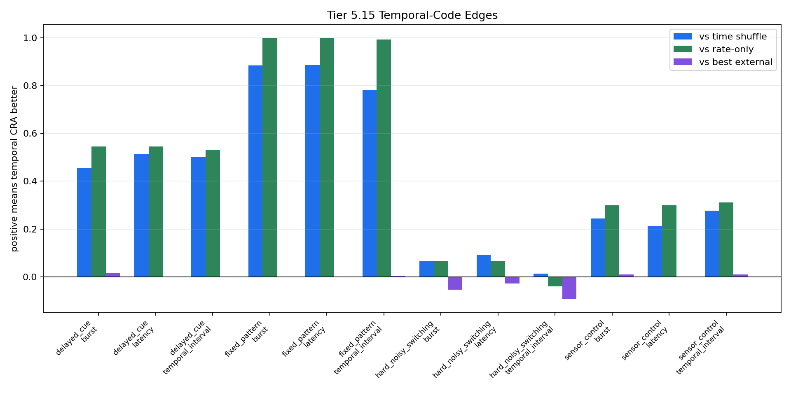
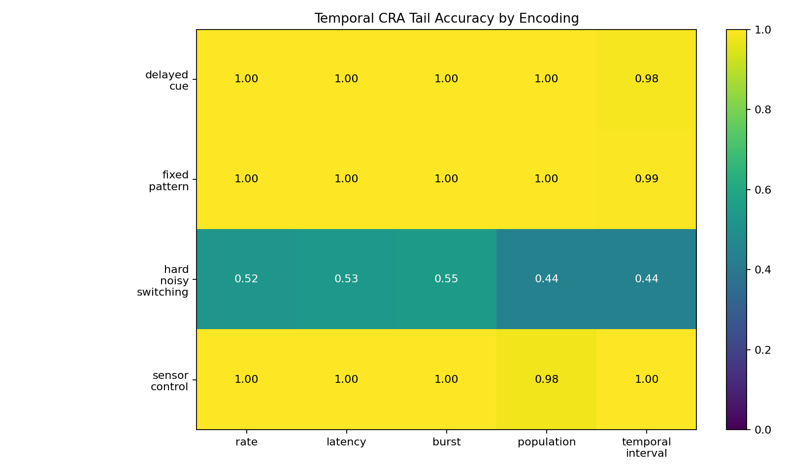

# Tier 5.15 Spike Encoding / Temporal Code Findings

- Generated: `2026-04-29T18:00:03+00:00`
- Status: **PASS**
- Backend: `numpy_temporal_code`
- Seeds: `42, 43, 44`
- Tasks: `fixed_pattern, delayed_cue, hard_noisy_switching, sensor_control`
- Encodings: `rate, latency, burst, population, temporal_interval`
- Models: `temporal_cra, time_shuffle_control, rate_only_control, sign_persistence, online_perceptron, online_logistic_regression, echo_state_network, small_gru, stdp_only_snn`
- Output directory: `<repo>/controlled_test_output/tier5_15_20260429_135924`

Tier 5.15 tests whether spike timing can carry task-relevant information, rather than only using spikes as a scalar transport layer.

## Claim Boundary

- Software diagnostic only; no SpiNNaker hardware claim.
- No custom-C/on-chip temporal-code claim.
- Not a frozen baseline by itself; promotion would require a separate compact regression/freeze gate.
- Passing means temporal spike structure was causally useful under this controlled diagnostic.

## Aggregate Summary

| Task | Encoding | Model | Family | Tail acc | Overall acc | Corr | Spike total | Sparsity | Runtime s |
| --- | --- | --- | --- | ---: | ---: | ---: | ---: | ---: | ---: |
| delayed_cue | burst | `echo_state_network` | reservoir | 0.848485 | 0.751852 | 0.559964 | 0.585648 | 0.00609568 | 0.0302014 |
| delayed_cue | burst | `online_logistic_regression` | linear | 0.984848 | 0.937037 | 0.900698 | 0.585648 | 0.00609568 | 0.0230648 |
| delayed_cue | burst | `online_perceptron` | linear | 0.969697 | 0.944444 | 0.911654 | 0.585648 | 0.00609568 | 0.0212189 |
| delayed_cue | burst | `rate_only_control` | temporal_cra_readout | 0.454545 | 0.444444 | -0.0847961 | 0.585648 | 0.00609568 | 0.0126714 |
| delayed_cue | burst | `sign_persistence` | rule | 0.5 | 0.492593 | -0.0142104 | 0.585648 | 0.00609568 | 0.0725482 |
| delayed_cue | burst | `small_gru` | recurrent | 0.575758 | 0.566667 | 0.252075 | 0.585648 | 0.00609568 | 0.0352429 |
| delayed_cue | burst | `stdp_only_snn` | snn_ablation | 0.348485 | 0.5 | -0.0668748 | 0.585648 | 0.00609568 | 0.0264586 |
| delayed_cue | burst | `temporal_cra` | temporal_cra_readout | 1 | 0.97037 | 0.954307 | 0.585648 | 0.00609568 | 0.0502308 |
| delayed_cue | burst | `time_shuffle_control` | temporal_cra_readout | 0.545455 | 0.492593 | -0.0148105 | 0.585648 | 0.00549769 | 0.0374359 |
| delayed_cue | latency | `echo_state_network` | reservoir | 1 | 0.914815 | 0.847625 | 0.578241 | 0.00472126 | 0.0334822 |
| delayed_cue | latency | `online_logistic_regression` | linear | 1 | 0.97037 | 0.952582 | 0.578241 | 0.00472126 | 0.0251267 |
| delayed_cue | latency | `online_perceptron` | linear | 1 | 0.974074 | 0.965212 | 0.578241 | 0.00472126 | 0.0229965 |
| delayed_cue | latency | `rate_only_control` | temporal_cra_readout | 0.454545 | 0.444444 | -0.0837045 | 0.578241 | 0.00472126 | 0.0201287 |
| delayed_cue | latency | `sign_persistence` | rule | 0.484848 | 0.485185 | -0.0306586 | 0.578241 | 0.00472126 | 0.0169949 |
| delayed_cue | latency | `small_gru` | recurrent | 0.954545 | 0.848148 | 0.718761 | 0.578241 | 0.00472126 | 0.0492733 |
| delayed_cue | latency | `stdp_only_snn` | snn_ablation | 0.651515 | 0.5 | 0.0708786 | 0.578241 | 0.00472126 | 0.0264101 |
| delayed_cue | latency | `temporal_cra` | temporal_cra_readout | 1 | 0.977778 | 0.977368 | 0.578241 | 0.00472126 | 0.026652 |
| delayed_cue | latency | `time_shuffle_control` | temporal_cra_readout | 0.484848 | 0.485185 | -0.0509662 | 0.578241 | 0.00542535 | 0.0323092 |
| delayed_cue | population | `echo_state_network` | reservoir | 0.621212 | 0.52963 | 0.120707 | 0.706944 | 0.00671779 | 0.0336617 |
| delayed_cue | population | `online_logistic_regression` | linear | 0.833333 | 0.692593 | 0.502136 | 0.706944 | 0.00671779 | 0.0291624 |
| delayed_cue | population | `online_perceptron` | linear | 0.969697 | 0.888889 | 0.670008 | 0.706944 | 0.00671779 | 0.020886 |
| delayed_cue | population | `rate_only_control` | temporal_cra_readout | 1 | 0.914815 | 0.848401 | 0.706944 | 0.00671779 | 0.0208702 |
| delayed_cue | population | `sign_persistence` | rule | 0.5 | 0.492593 | -0.0238421 | 0.706944 | 0.00671779 | 0.0277554 |
| delayed_cue | population | `small_gru` | recurrent | 0.515152 | 0.488889 | -0.0758836 | 0.706944 | 0.00671779 | 0.0454893 |
| delayed_cue | population | `stdp_only_snn` | snn_ablation | 0.5 | 0.5 | 0.00349203 | 0.706944 | 0.00671779 | 0.0337317 |
| delayed_cue | population | `temporal_cra` | temporal_cra_readout | 1 | 0.837037 | 0.73906 | 0.706944 | 0.00671779 | 0.0203917 |
| delayed_cue | population | `time_shuffle_control` | temporal_cra_readout | 1 | 0.855556 | 0.744626 | 0.706944 | 0.00670814 | 0.0351048 |
| delayed_cue | rate | `echo_state_network` | reservoir | 0.878788 | 0.722222 | 0.545597 | 0.82963 | 0.00710841 | 0.02736 |
| delayed_cue | rate | `online_logistic_regression` | linear | 1 | 0.955556 | 0.904339 | 0.82963 | 0.00710841 | 0.0189973 |
| delayed_cue | rate | `online_perceptron` | linear | 0.984848 | 0.97037 | 0.872695 | 0.82963 | 0.00710841 | 0.0221652 |
| delayed_cue | rate | `rate_only_control` | temporal_cra_readout | 1 | 0.977778 | 0.966674 | 0.82963 | 0.00710841 | 0.0169701 |
| delayed_cue | rate | `sign_persistence` | rule | 0 | 0 | -1 | 0.82963 | 0.00710841 | 0.0271216 |
| delayed_cue | rate | `small_gru` | recurrent | 0.666667 | 0.566667 | 0.143585 | 0.82963 | 0.00710841 | 0.0400038 |
| delayed_cue | rate | `stdp_only_snn` | snn_ablation | 0.469697 | 0.5 | 0.0497377 | 0.82963 | 0.00710841 | 0.0330205 |
| delayed_cue | rate | `temporal_cra` | temporal_cra_readout | 1 | 0.959259 | 0.955139 | 0.82963 | 0.00710841 | 0.0487178 |
| delayed_cue | rate | `time_shuffle_control` | temporal_cra_readout | 1 | 0.959259 | 0.954886 | 0.82963 | 0.00709877 | 0.0455233 |
| delayed_cue | temporal_interval | `echo_state_network` | reservoir | 0.69697 | 0.596296 | 0.254265 | 0.447222 | 0.00465374 | 0.0299548 |
| delayed_cue | temporal_interval | `online_logistic_regression` | linear | 0.984848 | 0.848148 | 0.765687 | 0.447222 | 0.00465374 | 0.0208304 |
| delayed_cue | temporal_interval | `online_perceptron` | linear | 0.969697 | 0.92963 | 0.771368 | 0.447222 | 0.00465374 | 0.0257574 |
| delayed_cue | temporal_interval | `rate_only_control` | temporal_cra_readout | 0.454545 | 0.437037 | -0.0892083 | 0.447222 | 0.00465374 | 0.016944 |
| delayed_cue | temporal_interval | `sign_persistence` | rule | 0.515152 | 0.485185 | -0.0298142 | 0.447222 | 0.00465374 | 0.0165106 |
| delayed_cue | temporal_interval | `small_gru` | recurrent | 0.5 | 0.507407 | 0.0515969 | 0.447222 | 0.00465374 | 0.0365773 |
| delayed_cue | temporal_interval | `stdp_only_snn` | snn_ablation | 0.469697 | 0.5 | 0.0384594 | 0.447222 | 0.00465374 | 0.0276139 |
| delayed_cue | temporal_interval | `temporal_cra` | temporal_cra_readout | 0.984848 | 0.9 | 0.875202 | 0.447222 | 0.00465374 | 0.0226149 |
| delayed_cue | temporal_interval | `time_shuffle_control` | temporal_cra_readout | 0.484848 | 0.485185 | -0.0328332 | 0.447222 | 0.00426312 | 0.0386581 |
| fixed_pattern | burst | `echo_state_network` | reservoir | 0.975926 | 0.882244 | 0.832893 | 4.08009 | 0.0424624 | 0.0836895 |
| fixed_pattern | burst | `online_logistic_regression` | linear | 1 | 0.9949 | 0.982729 | 4.08009 | 0.0424624 | 0.0754475 |
| fixed_pattern | burst | `online_perceptron` | linear | 0.998148 | 0.98841 | 0.948356 | 4.08009 | 0.0424624 | 0.0616259 |
| fixed_pattern | burst | `rate_only_control` | temporal_cra_readout | 0 | 0 | -0.997716 | 4.08009 | 0.0424624 | 0.0405576 |
| fixed_pattern | burst | `sign_persistence` | rule | 0.501852 | 0.498377 | -0.00325479 | 4.08009 | 0.0424624 | 0.0702581 |
| fixed_pattern | burst | `small_gru` | recurrent | 0.983333 | 0.855818 | 0.778587 | 4.08009 | 0.0424624 | 0.0930006 |
| fixed_pattern | burst | `stdp_only_snn` | snn_ablation | 0.5 | 0.499768 | -0.0020237 | 4.08009 | 0.0424624 | 0.0700799 |
| fixed_pattern | burst | `temporal_cra` | temporal_cra_readout | 1 | 0.996755 | 0.99153 | 4.08009 | 0.0424624 | 0.0668363 |
| fixed_pattern | burst | `time_shuffle_control` | temporal_cra_readout | 0.116667 | 0.116829 | -0.763942 | 4.08009 | 0.0373843 | 0.0975077 |
| fixed_pattern | latency | `echo_state_network` | reservoir | 0.998148 | 0.97172 | 0.945286 | 4.07269 | 0.0320264 | 0.0850908 |
| fixed_pattern | latency | `online_logistic_regression` | linear | 1 | 0.997218 | 0.993631 | 4.07269 | 0.0320264 | 0.0772212 |
| fixed_pattern | latency | `online_perceptron` | linear | 1 | 0.996755 | 0.97938 | 4.07269 | 0.0320264 | 0.0717914 |
| fixed_pattern | latency | `rate_only_control` | temporal_cra_readout | 0 | 0 | -0.997763 | 4.07269 | 0.0320264 | 0.0408997 |
| fixed_pattern | latency | `sign_persistence` | rule | 0.5 | 0.499305 | -0.0012303 | 4.07269 | 0.0320264 | 0.0637165 |
| fixed_pattern | latency | `small_gru` | recurrent | 0.988889 | 0.951785 | 0.881839 | 4.07269 | 0.0320264 | 0.078699 |
| fixed_pattern | latency | `stdp_only_snn` | snn_ablation | 0.5 | 0.500232 | -0.0018594 | 4.07269 | 0.0320264 | 0.0681408 |
| fixed_pattern | latency | `temporal_cra` | temporal_cra_readout | 1 | 0.997218 | 0.997127 | 4.07269 | 0.0320264 | 0.107767 |
| fixed_pattern | latency | `time_shuffle_control` | temporal_cra_readout | 0.114815 | 0.120538 | -0.770946 | 4.07269 | 0.0375386 | 0.113935 |
| fixed_pattern | population | `echo_state_network` | reservoir | 0.859259 | 0.552156 | 0.267482 | 5.07407 | 0.047989 | 0.071769 |
| fixed_pattern | population | `online_logistic_regression` | linear | 1 | 0.97682 | 0.928191 | 5.07407 | 0.047989 | 0.0702488 |
| fixed_pattern | population | `online_perceptron` | linear | 1 | 0.983774 | 0.949364 | 5.07407 | 0.047989 | 0.0760057 |
| fixed_pattern | population | `rate_only_control` | temporal_cra_readout | 1 | 0.988873 | 0.97658 | 5.07407 | 0.047989 | 0.0373277 |
| fixed_pattern | population | `sign_persistence` | rule | 0.501852 | 0.500232 | 0.000364567 | 5.07407 | 0.047989 | 0.0763571 |
| fixed_pattern | population | `small_gru` | recurrent | 0.574074 | 0.299026 | -0.364838 | 5.07407 | 0.047989 | 0.133234 |
| fixed_pattern | population | `stdp_only_snn` | snn_ablation | 0.5 | 0.499305 | 0.00356748 | 5.07407 | 0.047989 | 0.0735971 |
| fixed_pattern | population | `temporal_cra` | temporal_cra_readout | 1 | 0.977283 | 0.969064 | 5.07407 | 0.047989 | 0.0712633 |
| fixed_pattern | population | `time_shuffle_control` | temporal_cra_readout | 1 | 0.979138 | 0.969035 | 5.07407 | 0.0479456 | 0.12129 |
| fixed_pattern | rate | `echo_state_network` | reservoir | 0.988889 | 0.842837 | 0.763793 | 6.07407 | 0.0512828 | 0.0983774 |
| fixed_pattern | rate | `online_logistic_regression` | linear | 1 | 0.9949 | 0.986045 | 6.07407 | 0.0512828 | 0.0945985 |
| fixed_pattern | rate | `online_perceptron` | linear | 1 | 0.995828 | 0.988506 | 6.07407 | 0.0512828 | 0.098251 |
| fixed_pattern | rate | `rate_only_control` | temporal_cra_readout | 1 | 0.997218 | 0.995383 | 6.07407 | 0.0512828 | 0.0428354 |
| fixed_pattern | rate | `sign_persistence` | rule | 0 | 0 | -1 | 6.07407 | 0.0512828 | 0.102418 |
| fixed_pattern | rate | `small_gru` | recurrent | 0.996296 | 0.782105 | 0.676797 | 6.07407 | 0.0512828 | 0.116141 |
| fixed_pattern | rate | `stdp_only_snn` | snn_ablation | 0.5 | 0.500695 | 0.000387272 | 6.07407 | 0.0512828 | 0.0952323 |
| fixed_pattern | rate | `temporal_cra` | temporal_cra_readout | 1 | 0.996291 | 0.994404 | 6.07407 | 0.0512828 | 0.0982006 |
| fixed_pattern | rate | `time_shuffle_control` | temporal_cra_readout | 1 | 0.995828 | 0.99414 | 6.07407 | 0.0513117 | 0.134124 |
| fixed_pattern | temporal_interval | `echo_state_network` | reservoir | 0.97037 | 0.788595 | 0.667507 | 3.06806 | 0.0319444 | 0.0772586 |
| fixed_pattern | temporal_interval | `online_logistic_regression` | linear | 0.983333 | 0.974965 | 0.950053 | 3.06806 | 0.0319444 | 0.0679039 |
| fixed_pattern | temporal_interval | `online_perceptron` | linear | 0.988889 | 0.980065 | 0.881382 | 3.06806 | 0.0319444 | 0.0620925 |
| fixed_pattern | temporal_interval | `rate_only_control` | temporal_cra_readout | 0 | 0 | -0.99778 | 3.06806 | 0.0319444 | 0.0427517 |
| fixed_pattern | temporal_interval | `sign_persistence` | rule | 0.496296 | 0.498841 | -0.00233712 | 3.06806 | 0.0319444 | 0.0651382 |
| fixed_pattern | temporal_interval | `small_gru` | recurrent | 0.977778 | 0.772369 | 0.652841 | 3.06806 | 0.0319444 | 0.0912957 |
| fixed_pattern | temporal_interval | `stdp_only_snn` | snn_ablation | 0.5 | 0.500232 | 0.00167899 | 3.06806 | 0.0319444 | 0.0683587 |
| fixed_pattern | temporal_interval | `temporal_cra` | temporal_cra_readout | 0.992593 | 0.979138 | 0.971739 | 3.06806 | 0.0319444 | 0.0709271 |
| fixed_pattern | temporal_interval | `time_shuffle_control` | temporal_cra_readout | 0.211111 | 0.197497 | -0.628807 | 3.06806 | 0.0292921 | 0.0932445 |
| hard_noisy_switching | burst | `echo_state_network` | reservoir | 0.48 | 0.488673 | 0.030062 | 0.65787 | 0.00685282 | 0.0284621 |
| hard_noisy_switching | burst | `online_logistic_regression` | linear | 0.466667 | 0.475728 | -0.0516443 | 0.65787 | 0.00685282 | 0.0233357 |
| hard_noisy_switching | burst | `online_perceptron` | linear | 0.546667 | 0.517799 | 0.0153416 | 0.65787 | 0.00685282 | 0.0300337 |
| hard_noisy_switching | burst | `rate_only_control` | temporal_cra_readout | 0.48 | 0.495146 | 0.0340353 | 0.65787 | 0.00685282 | 0.0152992 |
| hard_noisy_switching | burst | `sign_persistence` | rule | 0.48 | 0.511327 | 0.00360195 | 0.65787 | 0.00685282 | 0.0212204 |
| hard_noisy_switching | burst | `small_gru` | recurrent | 0.453333 | 0.466019 | -0.039653 | 0.65787 | 0.00685282 | 0.0419344 |
| hard_noisy_switching | burst | `stdp_only_snn` | snn_ablation | 0.6 | 0.495146 | 0.0437939 | 0.65787 | 0.00685282 | 0.0310263 |
| hard_noisy_switching | burst | `temporal_cra` | temporal_cra_readout | 0.546667 | 0.537217 | 0.0610655 | 0.65787 | 0.00685282 | 0.0279843 |
| hard_noisy_switching | burst | `time_shuffle_control` | temporal_cra_readout | 0.48 | 0.508091 | 0.0366683 | 0.65787 | 0.00611979 | 0.0433994 |
| hard_noisy_switching | latency | `echo_state_network` | reservoir | 0.506667 | 0.495146 | 0.0186476 | 0.650463 | 0.0053723 | 0.0372356 |
| hard_noisy_switching | latency | `online_logistic_regression` | linear | 0.466667 | 0.466019 | -0.0599478 | 0.650463 | 0.0053723 | 0.0335547 |
| hard_noisy_switching | latency | `online_perceptron` | linear | 0.56 | 0.553398 | 0.0691646 | 0.650463 | 0.0053723 | 0.0206451 |
| hard_noisy_switching | latency | `rate_only_control` | temporal_cra_readout | 0.466667 | 0.495146 | 0.0346222 | 0.650463 | 0.0053723 | 0.0147055 |
| hard_noisy_switching | latency | `sign_persistence` | rule | 0.56 | 0.501618 | -0.00778535 | 0.650463 | 0.0053723 | 0.0409562 |
| hard_noisy_switching | latency | `small_gru` | recurrent | 0.48 | 0.472492 | -0.0474883 | 0.650463 | 0.0053723 | 0.0577681 |
| hard_noisy_switching | latency | `stdp_only_snn` | snn_ablation | 0.4 | 0.504854 | -0.0431032 | 0.650463 | 0.0053723 | 0.0291984 |
| hard_noisy_switching | latency | `temporal_cra` | temporal_cra_readout | 0.533333 | 0.556634 | 0.113075 | 0.650463 | 0.0053723 | 0.0239551 |
| hard_noisy_switching | latency | `time_shuffle_control` | temporal_cra_readout | 0.44 | 0.478964 | -0.00673446 | 0.650463 | 0.0060571 | 0.0372857 |
| hard_noisy_switching | population | `echo_state_network` | reservoir | 0.493333 | 0.504854 | 0.0303676 | 0.934722 | 0.00879147 | 0.0300215 |
| hard_noisy_switching | population | `online_logistic_regression` | linear | 0.44 | 0.472492 | -0.0329228 | 0.934722 | 0.00879147 | 0.0301086 |
| hard_noisy_switching | population | `online_perceptron` | linear | 0.453333 | 0.488673 | -0.0261737 | 0.934722 | 0.00879147 | 0.0280664 |
| hard_noisy_switching | population | `rate_only_control` | temporal_cra_readout | 0.493333 | 0.504854 | 0.027958 | 0.934722 | 0.00879147 | 0.0142717 |
| hard_noisy_switching | population | `sign_persistence` | rule | 0.52 | 0.495146 | 0.0242657 | 0.934722 | 0.00879147 | 0.0255529 |
| hard_noisy_switching | population | `small_gru` | recurrent | 0.453333 | 0.459547 | -0.0340226 | 0.934722 | 0.00879147 | 0.0466359 |
| hard_noisy_switching | population | `stdp_only_snn` | snn_ablation | 0.613333 | 0.511327 | 0.0301825 | 0.934722 | 0.00879147 | 0.033943 |
| hard_noisy_switching | population | `temporal_cra` | temporal_cra_readout | 0.44 | 0.498382 | 0.0146624 | 0.934722 | 0.00879147 | 0.0316391 |
| hard_noisy_switching | population | `time_shuffle_control` | temporal_cra_readout | 0.506667 | 0.514563 | 0.0197905 | 0.934722 | 0.00884934 | 0.0422555 |
| hard_noisy_switching | rate | `echo_state_network` | reservoir | 0.493333 | 0.501618 | 0.0365816 | 0.88287 | 0.00767265 | 0.0367879 |
| hard_noisy_switching | rate | `online_logistic_regression` | linear | 0.48 | 0.462783 | -0.0425222 | 0.88287 | 0.00767265 | 0.0294669 |
| hard_noisy_switching | rate | `online_perceptron` | linear | 0.506667 | 0.508091 | 0.0308158 | 0.88287 | 0.00767265 | 0.0221426 |
| hard_noisy_switching | rate | `rate_only_control` | temporal_cra_readout | 0.573333 | 0.546926 | 0.0484332 | 0.88287 | 0.00767265 | 0.0195903 |
| hard_noisy_switching | rate | `sign_persistence` | rule | 0.533333 | 0.521036 | 0.0453149 | 0.88287 | 0.00767265 | 0.02622 |
| hard_noisy_switching | rate | `small_gru` | recurrent | 0.44 | 0.456311 | -0.0377274 | 0.88287 | 0.00767265 | 0.0390567 |
| hard_noisy_switching | rate | `stdp_only_snn` | snn_ablation | 0.453333 | 0.459547 | -0.02236 | 0.88287 | 0.00767265 | 0.0225201 |
| hard_noisy_switching | rate | `temporal_cra` | temporal_cra_readout | 0.52 | 0.521036 | 0.0497993 | 0.88287 | 0.00767265 | 0.020149 |
| hard_noisy_switching | rate | `time_shuffle_control` | temporal_cra_readout | 0.506667 | 0.556634 | 0.101108 | 0.88287 | 0.00763889 | 0.035497 |
| hard_noisy_switching | temporal_interval | `echo_state_network` | reservoir | 0.493333 | 0.501618 | 0.0333506 | 0.501389 | 0.0052228 | 0.0282218 |
| hard_noisy_switching | temporal_interval | `online_logistic_regression` | linear | 0.453333 | 0.472492 | -0.0287952 | 0.501389 | 0.0052228 | 0.0288256 |
| hard_noisy_switching | temporal_interval | `online_perceptron` | linear | 0.453333 | 0.514563 | 0.00448163 | 0.501389 | 0.0052228 | 0.0217707 |
| hard_noisy_switching | temporal_interval | `rate_only_control` | temporal_cra_readout | 0.48 | 0.495146 | 0.0335578 | 0.501389 | 0.0052228 | 0.016958 |
| hard_noisy_switching | temporal_interval | `sign_persistence` | rule | 0.533333 | 0.469256 | -0.0532764 | 0.501389 | 0.0052228 | 0.0292285 |
| hard_noisy_switching | temporal_interval | `small_gru` | recurrent | 0.426667 | 0.459547 | -0.0368368 | 0.501389 | 0.0052228 | 0.0399279 |
| hard_noisy_switching | temporal_interval | `stdp_only_snn` | snn_ablation | 0.453333 | 0.459547 | -0.0136462 | 0.501389 | 0.0052228 | 0.03479 |
| hard_noisy_switching | temporal_interval | `temporal_cra` | temporal_cra_readout | 0.44 | 0.498382 | 0.0326765 | 0.501389 | 0.0052228 | 0.0370003 |
| hard_noisy_switching | temporal_interval | `time_shuffle_control` | temporal_cra_readout | 0.426667 | 0.495146 | 0.00549722 | 0.501389 | 0.00486593 | 0.0429632 |
| sensor_control | burst | `echo_state_network` | reservoir | 0.877778 | 0.808333 | 0.669588 | 0.752315 | 0.00782697 | 0.0324825 |
| sensor_control | burst | `online_logistic_regression` | linear | 0.988889 | 0.922222 | 0.883061 | 0.752315 | 0.00782697 | 0.0397227 |
| sensor_control | burst | `online_perceptron` | linear | 0.977778 | 0.952778 | 0.881186 | 0.752315 | 0.00782697 | 0.0216093 |
| sensor_control | burst | `rate_only_control` | temporal_cra_readout | 0.7 | 0.697222 | 0.390949 | 0.752315 | 0.00782697 | 0.0199705 |
| sensor_control | burst | `sign_persistence` | rule | 0.5 | 0.488889 | -0.0137602 | 0.752315 | 0.00782697 | 0.0196279 |
| sensor_control | burst | `small_gru` | recurrent | 0.7 | 0.669444 | 0.305089 | 0.752315 | 0.00782697 | 0.0365282 |
| sensor_control | burst | `stdp_only_snn` | snn_ablation | 0.666667 | 0.572222 | 0.074073 | 0.752315 | 0.00782697 | 0.0244304 |
| sensor_control | burst | `temporal_cra` | temporal_cra_readout | 1 | 0.972222 | 0.957176 | 0.752315 | 0.00782697 | 0.0231355 |
| sensor_control | burst | `time_shuffle_control` | temporal_cra_readout | 0.755556 | 0.733333 | 0.467423 | 0.752315 | 0.00705536 | 0.0394859 |
| sensor_control | latency | `echo_state_network` | reservoir | 1 | 0.919444 | 0.843786 | 0.744907 | 0.00612944 | 0.0292677 |
| sensor_control | latency | `online_logistic_regression` | linear | 1 | 0.977778 | 0.961002 | 0.744907 | 0.00612944 | 0.0315607 |
| sensor_control | latency | `online_perceptron` | linear | 1 | 0.980556 | 0.937882 | 0.744907 | 0.00612944 | 0.0238178 |
| sensor_control | latency | `rate_only_control` | temporal_cra_readout | 0.7 | 0.697222 | 0.390357 | 0.744907 | 0.00612944 | 0.0264183 |
| sensor_control | latency | `sign_persistence` | rule | 0.477778 | 0.394444 | -0.219687 | 0.744907 | 0.00612944 | 0.0312448 |
| sensor_control | latency | `small_gru` | recurrent | 0.933333 | 0.788889 | 0.659269 | 0.744907 | 0.00612944 | 0.0736966 |
| sensor_control | latency | `stdp_only_snn` | snn_ablation | 0.333333 | 0.427778 | -0.0738116 | 0.744907 | 0.00612944 | 0.029252 |
| sensor_control | latency | `temporal_cra` | temporal_cra_readout | 1 | 0.983333 | 0.982781 | 0.744907 | 0.00612944 | 0.0247724 |
| sensor_control | latency | `time_shuffle_control` | temporal_cra_readout | 0.788889 | 0.741667 | 0.47922 | 0.744907 | 0.00692998 | 0.0418675 |
| sensor_control | population | `echo_state_network` | reservoir | 0.755556 | 0.722222 | 0.478246 | 0.995833 | 0.00952932 | 0.0380109 |
| sensor_control | population | `online_logistic_regression` | linear | 0.822222 | 0.744444 | 0.516531 | 0.995833 | 0.00952932 | 0.0275542 |
| sensor_control | population | `online_perceptron` | linear | 1 | 0.922222 | 0.74565 | 0.995833 | 0.00952932 | 0.0246136 |
| sensor_control | population | `rate_only_control` | temporal_cra_readout | 1 | 0.919444 | 0.859804 | 0.995833 | 0.00952932 | 0.0223762 |
| sensor_control | population | `sign_persistence` | rule | 0.466667 | 0.530556 | 0.0438653 | 0.995833 | 0.00952932 | 0.0935205 |
| sensor_control | population | `small_gru` | recurrent | 0.622222 | 0.627778 | 0.168691 | 0.995833 | 0.00952932 | 0.0773825 |
| sensor_control | population | `stdp_only_snn` | snn_ablation | 0.488889 | 0.5 | 0.00788037 | 0.995833 | 0.00952932 | 0.0286372 |
| sensor_control | population | `temporal_cra` | temporal_cra_readout | 0.977778 | 0.9 | 0.80558 | 0.995833 | 0.00952932 | 0.025961 |
| sensor_control | population | `time_shuffle_control` | temporal_cra_readout | 0.966667 | 0.891667 | 0.813565 | 0.995833 | 0.00946663 | 0.0332856 |
| sensor_control | rate | `echo_state_network` | reservoir | 0.877778 | 0.813889 | 0.673184 | 1.07176 | 0.00922068 | 0.0310892 |
| sensor_control | rate | `online_logistic_regression` | linear | 1 | 0.922222 | 0.886779 | 1.07176 | 0.00922068 | 0.0270827 |
| sensor_control | rate | `online_perceptron` | linear | 1 | 0.975 | 0.90561 | 1.07176 | 0.00922068 | 0.0229523 |
| sensor_control | rate | `rate_only_control` | temporal_cra_readout | 1 | 0.977778 | 0.971072 | 1.07176 | 0.00922068 | 0.0209844 |
| sensor_control | rate | `sign_persistence` | rule | 0 | 0 | -1 | 1.07176 | 0.00922068 | 0.0238678 |
| sensor_control | rate | `small_gru` | recurrent | 0.666667 | 0.65 | 0.269313 | 1.07176 | 0.00922068 | 0.0526555 |
| sensor_control | rate | `stdp_only_snn` | snn_ablation | 0.511111 | 0.5 | 0.00264688 | 1.07176 | 0.00922068 | 0.0330005 |
| sensor_control | rate | `temporal_cra` | temporal_cra_readout | 1 | 0.969444 | 0.962031 | 1.07176 | 0.00922068 | 0.0313896 |
| sensor_control | rate | `time_shuffle_control` | temporal_cra_readout | 1 | 0.969444 | 0.962185 | 1.07176 | 0.0091387 | 0.0745359 |
| sensor_control | temporal_interval | `echo_state_network` | reservoir | 0.811111 | 0.761111 | 0.551064 | 0.572222 | 0.00596065 | 0.0291327 |
| sensor_control | temporal_interval | `online_logistic_regression` | linear | 0.955556 | 0.811111 | 0.72711 | 0.572222 | 0.00596065 | 0.0199373 |
| sensor_control | temporal_interval | `online_perceptron` | linear | 0.988889 | 0.955556 | 0.812709 | 0.572222 | 0.00596065 | 0.0232431 |
| sensor_control | temporal_interval | `rate_only_control` | temporal_cra_readout | 0.688889 | 0.688889 | 0.372503 | 0.572222 | 0.00596065 | 0.0166557 |
| sensor_control | temporal_interval | `sign_persistence` | rule | 0.7 | 0.536111 | 0.0885087 | 0.572222 | 0.00596065 | 0.0231177 |
| sensor_control | temporal_interval | `small_gru` | recurrent | 0.644444 | 0.636111 | 0.225908 | 0.572222 | 0.00596065 | 0.0439918 |
| sensor_control | temporal_interval | `stdp_only_snn` | snn_ablation | 0.511111 | 0.5 | -0.0135678 | 0.572222 | 0.00596065 | 0.0252574 |
| sensor_control | temporal_interval | `temporal_cra` | temporal_cra_readout | 1 | 0.938889 | 0.90801 | 0.572222 | 0.00596065 | 0.0292932 |
| sensor_control | temporal_interval | `time_shuffle_control` | temporal_cra_readout | 0.722222 | 0.716667 | 0.452147 | 0.572222 | 0.00548322 | 0.0329211 |

## Temporal-Code Comparisons

| Task | Encoding | Temporal? | CRA tail | Time-shuffle tail | Rate-only tail | Edge vs shuffle | Edge vs rate-only | Best external | Edge vs best external |
| --- | --- | --- | ---: | ---: | ---: | ---: | ---: | --- | ---: |
| delayed_cue | burst | yes | 1 | 0.545455 | 0.454545 | 0.454545 | 0.545455 | `online_logistic_regression` | 0.0151515 |
| delayed_cue | latency | yes | 1 | 0.484848 | 0.454545 | 0.515152 | 0.545455 | `echo_state_network` | 0 |
| delayed_cue | population | no | 1 | 1 | 1 | 0 | 0 | `online_perceptron` | 0.030303 |
| delayed_cue | rate | no | 1 | 1 | 1 | 0 | 0 | `online_logistic_regression` | 0 |
| delayed_cue | temporal_interval | yes | 0.984848 | 0.484848 | 0.454545 | 0.5 | 0.530303 | `online_logistic_regression` | 0 |
| fixed_pattern | burst | yes | 1 | 0.116667 | 0 | 0.883333 | 1 | `online_logistic_regression` | 0 |
| fixed_pattern | latency | yes | 1 | 0.114815 | 0 | 0.885185 | 1 | `online_logistic_regression` | 0 |
| fixed_pattern | population | no | 1 | 1 | 1 | 0 | 0 | `online_logistic_regression` | 0 |
| fixed_pattern | rate | no | 1 | 1 | 1 | 0 | 0 | `online_logistic_regression` | 0 |
| fixed_pattern | temporal_interval | yes | 0.992593 | 0.211111 | 0 | 0.781481 | 0.992593 | `online_perceptron` | 0.0037037 |
| hard_noisy_switching | burst | yes | 0.546667 | 0.48 | 0.48 | 0.0666667 | 0.0666667 | `stdp_only_snn` | -0.0533333 |
| hard_noisy_switching | latency | yes | 0.533333 | 0.44 | 0.466667 | 0.0933333 | 0.0666667 | `online_perceptron` | -0.0266667 |
| hard_noisy_switching | population | no | 0.44 | 0.506667 | 0.493333 | -0.0666667 | -0.0533333 | `stdp_only_snn` | -0.173333 |
| hard_noisy_switching | rate | no | 0.52 | 0.506667 | 0.573333 | 0.0133333 | -0.0533333 | `sign_persistence` | -0.0133333 |
| hard_noisy_switching | temporal_interval | yes | 0.44 | 0.426667 | 0.48 | 0.0133333 | -0.04 | `sign_persistence` | -0.0933333 |
| sensor_control | burst | yes | 1 | 0.755556 | 0.7 | 0.244444 | 0.3 | `online_logistic_regression` | 0.0111111 |
| sensor_control | latency | yes | 1 | 0.788889 | 0.7 | 0.211111 | 0.3 | `echo_state_network` | 0 |
| sensor_control | population | no | 0.977778 | 0.966667 | 1 | 0.0111111 | -0.0222222 | `online_perceptron` | -0.0222222 |
| sensor_control | rate | no | 1 | 1 | 1 | 0 | 0 | `online_logistic_regression` | 0 |
| sensor_control | temporal_interval | yes | 1 | 0.722222 | 0.688889 | 0.277778 | 0.311111 | `online_perceptron` | 0.0111111 |

## Criteria

| Criterion | Value | Rule | Pass | Note |
| --- | --- | --- | --- | --- |
| full task/encoding/model/seed matrix completed | 540 | == 540 | yes |  |
| spike trace artifacts exported | 60 | >= 60 | yes |  |
| encoding metadata artifacts exported | 60 | >= 60 | yes |  |
| CRA learns under genuinely temporal encoding above controls | 9 | >= 2 | yes | Requires a genuinely temporal encoding plus loss in time-shuffle or rate-only controls. |
| at least one non-finance temporal task passes | 3 | >= 1 | yes | Sensor-control prevents this from being only a finance-shaped task result. |
| time-shuffle control loses somewhere temporal | 9 | >= 1 | yes |  |
| rate-only control loses somewhere temporal | 9 | >= 1 | yes |  |
| not explained by standard temporal-feature baselines everywhere | 9 | >= 1 | yes | External baselines are reviewer-defense references; Tier 5.15 is primarily a spike-timing causality diagnostic. |

## Artifacts

- `tier5_15_results.json`: machine-readable manifest.
- `tier5_15_summary.csv`: aggregate task/encoding/model metrics.
- `tier5_15_comparisons.csv`: temporal CRA versus controls/external baselines.
- `tier5_15_temporal_edges.png`: timing-control edge plot.
- `tier5_15_encoding_matrix.png`: temporal CRA tail accuracy matrix.
- `*_timeseries.csv`: per-task/per-encoding/per-model/per-seed traces.
- `*_spike_trace.csv`: sampled input spike trains.
- `*_encoding_metadata.json`: spike timing/sparsity metadata.

## Plots

