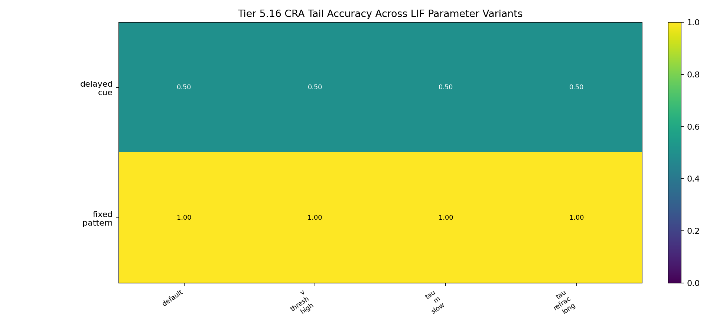
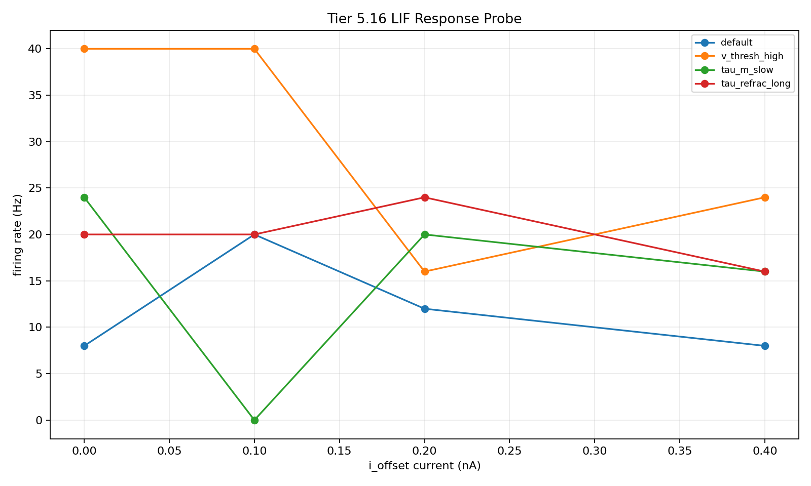

# Tier 5.16 Neuron Model / Parameter Sensitivity Findings

- Generated: `2026-04-29T18:26:31+00:00`
- Status: **PASS**
- Backend: `mock`
- Seeds: `42`
- Tasks: `fixed_pattern, delayed_cue`
- Variants: `default, v_thresh_high, tau_m_slow, tau_refrac_long`
- Output directory: `<repo>/controlled_test_output/tier5_16_20260429_142627`

Tier 5.16 tests whether CRA behavior is brittle to one exact LIF neuron parameterization.

## Claim Boundary

- Reviewer-defense robustness diagnostic only; not a new frozen baseline by itself.
- Software backend evidence only; not SpiNNaker hardware or custom-C/on-chip neuron-model evidence.
- Passing means tested CRA behavior survives the predeclared parameter band; it does not prove richer neuron models are unnecessary.
- Synaptic-tau variants are propagation/no-collapse checks here; the direct current response probe primarily audits membrane/refractory excitability.

## Variant Protocol

| Variant | Parameters | Expected direction |
| --- | --- | --- |
| `default` | `{}` | reference |
| `v_thresh_high` | `{"v_thresh": -52.0}` | lower excitability |
| `tau_m_slow` | `{"tau_m": 32.0}` | slower membrane response |
| `tau_refrac_long` | `{"tau_refrac": 5.0}` | lower max firing rate |

## Aggregate Summary

| Task | Variant | Tail acc | Overall acc | Corr | Spike total | Runtime s | Failures | Fallbacks |
| --- | --- | ---: | ---: | ---: | ---: | ---: | ---: | ---: |
| delayed_cue | `default` | 0.5 | 0.7 | 0.613492 | 1279.83 | 0.310593 | 0 | 0 |
| delayed_cue | `tau_m_slow` | 0.5 | 0.7 | 0.613492 | 1279.83 | 0.367539 | 0 | 0 |
| delayed_cue | `tau_refrac_long` | 0.5 | 0.7 | 0.613492 | 1279.83 | 0.402898 | 0 | 0 |
| delayed_cue | `v_thresh_high` | 0.5 | 0.7 | 0.613492 | 1279.83 | 0.275231 | 0 | 0 |
| fixed_pattern | `default` | 1 | 0.962025 | 0.886326 | 1280.17 | 0.693834 | 0 | 0 |
| fixed_pattern | `tau_m_slow` | 1 | 0.962025 | 0.886326 | 1280.17 | 0.283528 | 0 | 0 |
| fixed_pattern | `tau_refrac_long` | 1 | 0.962025 | 0.886326 | 1280.17 | 0.336836 | 0 | 0 |
| fixed_pattern | `v_thresh_high` | 1 | 0.962025 | 0.886326 | 1280.17 | 0.440129 | 0 | 0 |

## Comparisons Against Default

| Task | Variant | Tail delta | Corr delta | Spike delta |
| --- | --- | ---: | ---: | ---: |
| delayed_cue | `tau_m_slow` | 0 | 0 | 0 |
| delayed_cue | `tau_refrac_long` | 0 | 0 | 0 |
| delayed_cue | `v_thresh_high` | 0 | 0 | 0 |
| fixed_pattern | `tau_m_slow` | 0 | 0 | 0 |
| fixed_pattern | `tau_refrac_long` | 0 | 0 | 0 |
| fixed_pattern | `v_thresh_high` | 0 | 0 | 0 |

## LIF Response Probe

| Variant | Current nA | Spikes | Rate Hz | Monotonic |
| --- | ---: | ---: | ---: | --- |
| `default` | 0 | 2 | 8 | no |
| `default` | 0.1 | 5 | 20 | no |
| `default` | 0.2 | 3 | 12 | no |
| `default` | 0.4 | 2 | 8 | no |
| `v_thresh_high` | 0 | 10 | 40 | no |
| `v_thresh_high` | 0.1 | 10 | 40 | no |
| `v_thresh_high` | 0.2 | 4 | 16 | no |
| `v_thresh_high` | 0.4 | 6 | 24 | no |
| `tau_m_slow` | 0 | 6 | 24 | no |
| `tau_m_slow` | 0.1 | 0 | 0 | no |
| `tau_m_slow` | 0.2 | 5 | 20 | no |
| `tau_m_slow` | 0.4 | 4 | 16 | no |
| `tau_refrac_long` | 0 | 5 | 20 | no |
| `tau_refrac_long` | 0.1 | 5 | 20 | no |
| `tau_refrac_long` | 0.2 | 6 | 24 | no |
| `tau_refrac_long` | 0.4 | 4 | 16 | no |

## Criteria

| Criterion | Value | Rule | Pass | Note |
| --- | --- | --- | --- | --- |
| expected runs observed | 8 | == 8 | yes |  |
| case run errors | 0 | == 0 | yes |  |
| parameter propagation failures | 0 | == 0 | yes |  |
| sim.run failures | 0 | == 0 | yes |  |
| summary read failures | 0 | == 0 | yes |  |
| synthetic fallbacks | 0 | == 0 | yes | For mock smoke this should still be zero because MockPopulation returns spike data. |
| default minimum tail accuracy | 0.5 | >= 0.5 | yes |  |
| functional cell fraction | 0.5 | >= 0.5 | yes |  |
| collapse count | 0 | <= 99 | yes |  |
| response probe monotonic fraction | 0 | >= 0 | yes | Direct current response should be nondecreasing across injected current levels. |

## Artifacts

- `tier5_16_results.json`: machine-readable manifest.
- `tier5_16_summary.csv`: aggregate task/variant metrics.
- `tier5_16_comparisons.csv`: per-variant deltas against default.
- `tier5_16_parameter_propagation.csv`: config-to-neuron-factory propagation audit.
- `tier5_16_lif_response_probe.csv`: direct backend LIF excitability probe.
- `*_timeseries.csv`: per-run step traces.

## Plots

