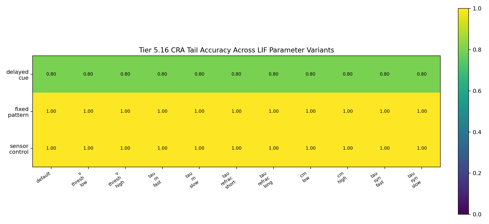
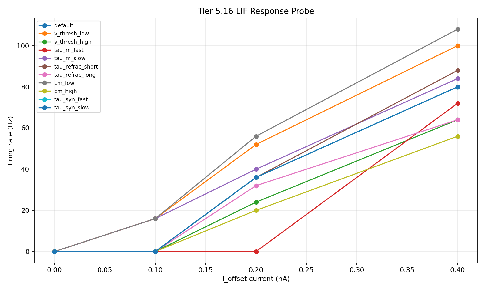

# Tier 5.16 Neuron Model / Parameter Sensitivity Findings

- Generated: `2026-04-29T18:34:02+00:00`
- Status: **PASS**
- Backend: `nest`
- Seeds: `42, 43`
- Tasks: `fixed_pattern, delayed_cue, sensor_control`
- Variants: `default, v_thresh_low, v_thresh_high, tau_m_fast, tau_m_slow, tau_refrac_short, tau_refrac_long, cm_low, cm_high, tau_syn_fast, tau_syn_slow`
- Output directory: `<repo>/controlled_test_output/tier5_16_20260429_142647`

Tier 5.16 tests whether CRA behavior is brittle to one exact LIF neuron parameterization.

## Claim Boundary

- Reviewer-defense robustness diagnostic only; not a new frozen baseline by itself.
- Software backend evidence only; not SpiNNaker hardware or custom-C/on-chip neuron-model evidence.
- Passing means tested CRA behavior survives the predeclared parameter band; it does not prove richer neuron models are unnecessary.
- Synaptic-tau variants are propagation/no-collapse checks here; the direct current response probe primarily audits membrane/refractory excitability.

## Variant Protocol

| Variant | Parameters | Expected direction |
| --- | --- | --- |
| `default` | `{}` | reference |
| `v_thresh_low` | `{"v_thresh": -58.0}` | higher excitability |
| `v_thresh_high` | `{"v_thresh": -52.0}` | lower excitability |
| `tau_m_fast` | `{"tau_m": 12.0}` | faster membrane response |
| `tau_m_slow` | `{"tau_m": 32.0}` | slower membrane response |
| `tau_refrac_short` | `{"tau_refrac": 1.0}` | higher max firing rate |
| `tau_refrac_long` | `{"tau_refrac": 5.0}` | lower max firing rate |
| `cm_low` | `{"cm": 0.18}` | higher current sensitivity |
| `cm_high` | `{"cm": 0.35}` | lower current sensitivity |
| `tau_syn_fast` | `{"tau_syn_e": 2.5, "tau_syn_i": 2.5}` | faster synaptic filtering |
| `tau_syn_slow` | `{"tau_syn_e": 10.0, "tau_syn_i": 10.0}` | slower synaptic filtering |

## Aggregate Summary

| Task | Variant | Tail acc | Overall acc | Corr | Spike total | Runtime s | Failures | Fallbacks |
| --- | --- | ---: | ---: | ---: | ---: | ---: | ---: | ---: |
| delayed_cue | `cm_high` | 0.8 | 0.840909 | 0.739392 | 941.422 | 5.25887 | 0 | 0 |
| delayed_cue | `cm_low` | 0.8 | 0.840909 | 0.739392 | 1390.73 | 5.36313 | 0 | 0 |
| delayed_cue | `default` | 0.8 | 0.840909 | 0.739392 | 1157.42 | 7.85524 | 0 | 0 |
| delayed_cue | `tau_m_fast` | 0.8 | 0.840909 | 0.739392 | 1129.44 | 7.24619 | 0 | 0 |
| delayed_cue | `tau_m_slow` | 0.8 | 0.840909 | 0.739392 | 1169.78 | 6.12921 | 0 | 0 |
| delayed_cue | `tau_refrac_long` | 0.8 | 0.840909 | 0.739392 | 669.15 | 4.80786 | 0 | 0 |
| delayed_cue | `tau_refrac_short` | 0.8 | 0.840909 | 0.739392 | 1580.69 | 6.07878 | 0 | 0 |
| delayed_cue | `tau_syn_fast` | 0.8 | 0.840909 | 0.739392 | 1177.07 | 5.23387 | 0 | 0 |
| delayed_cue | `tau_syn_slow` | 0.8 | 0.840909 | 0.739392 | 1251.33 | 5.39776 | 0 | 0 |
| delayed_cue | `v_thresh_high` | 0.8 | 0.840909 | 0.739392 | 1026.58 | 7.44284 | 0 | 0 |
| delayed_cue | `v_thresh_low` | 0.8 | 0.840909 | 0.739392 | 1324.25 | 8.11834 | 0 | 0 |
| fixed_pattern | `cm_high` | 1 | 0.98324 | 0.938016 | 1476.57 | 7.64926 | 0 | 0 |
| fixed_pattern | `cm_low` | 1 | 0.98324 | 0.938016 | 1932.68 | 6.71433 | 0 | 0 |
| fixed_pattern | `default` | 1 | 0.98324 | 0.938016 | 1699.74 | 6.46666 | 0 | 0 |
| fixed_pattern | `tau_m_fast` | 1 | 0.98324 | 0.938016 | 1679.56 | 7.463 | 0 | 0 |
| fixed_pattern | `tau_m_slow` | 1 | 0.98324 | 0.938016 | 1709.55 | 8.29248 | 0 | 0 |
| fixed_pattern | `tau_refrac_long` | 1 | 0.98324 | 0.938016 | 1313.76 | 7.14319 | 0 | 0 |
| fixed_pattern | `tau_refrac_short` | 1 | 0.98324 | 0.938016 | 2371.2 | 9.77758 | 0 | 0 |
| fixed_pattern | `tau_syn_fast` | 1 | 0.98324 | 0.938016 | 2306.83 | 8.21847 | 0 | 0 |
| fixed_pattern | `tau_syn_slow` | 1 | 0.98324 | 0.938016 | 1728.98 | 6.94806 | 0 | 0 |
| fixed_pattern | `v_thresh_high` | 1 | 0.98324 | 0.938016 | 1566.37 | 7.91739 | 0 | 0 |
| fixed_pattern | `v_thresh_low` | 1 | 0.98324 | 0.938016 | 1859.59 | 9.41241 | 0 | 0 |
| sensor_control | `cm_high` | 1 | 0.966667 | 0.90889 | 926.069 | 5.14349 | 0 | 0 |
| sensor_control | `cm_low` | 1 | 0.966667 | 0.90889 | 1389.22 | 5.26873 | 0 | 0 |
| sensor_control | `default` | 1 | 0.966667 | 0.90889 | 1151.42 | 5.7659 | 0 | 0 |
| sensor_control | `tau_m_fast` | 1 | 0.966667 | 0.90889 | 1099.46 | 5.52841 | 0 | 0 |
| sensor_control | `tau_m_slow` | 1 | 0.966667 | 0.90889 | 1167.32 | 5.58657 | 0 | 0 |
| sensor_control | `tau_refrac_long` | 1 | 0.966667 | 0.90889 | 659.142 | 5.19143 | 0 | 0 |
| sensor_control | `tau_refrac_short` | 1 | 0.966667 | 0.90889 | 1574.72 | 5.6227 | 0 | 0 |
| sensor_control | `tau_syn_fast` | 1 | 0.966667 | 0.90889 | 1143.09 | 5.62441 | 0 | 0 |
| sensor_control | `tau_syn_slow` | 1 | 0.966667 | 0.90889 | 1247.46 | 6.1464 | 0 | 0 |
| sensor_control | `v_thresh_high` | 1 | 0.966667 | 0.90889 | 1014.47 | 5.34007 | 0 | 0 |
| sensor_control | `v_thresh_low` | 1 | 0.966667 | 0.90889 | 1323.07 | 5.39807 | 0 | 0 |

## Comparisons Against Default

| Task | Variant | Tail delta | Corr delta | Spike delta |
| --- | --- | ---: | ---: | ---: |
| delayed_cue | `cm_high` | 0 | 0 | -215.994 |
| delayed_cue | `cm_low` | 0 | 0 | 233.317 |
| delayed_cue | `tau_m_fast` | 0 | 0 | -27.975 |
| delayed_cue | `tau_m_slow` | 0 | 0 | 12.3611 |
| delayed_cue | `tau_refrac_long` | 0 | 0 | -488.267 |
| delayed_cue | `tau_refrac_short` | 0 | 0 | 423.275 |
| delayed_cue | `tau_syn_fast` | 0 | 0 | 19.65 |
| delayed_cue | `tau_syn_slow` | 0 | 0 | 93.9167 |
| delayed_cue | `v_thresh_high` | 0 | 0 | -130.833 |
| delayed_cue | `v_thresh_low` | 0 | 0 | 166.836 |
| fixed_pattern | `cm_high` | 0 | 0 | -223.164 |
| fixed_pattern | `cm_low` | 0 | 0 | 232.947 |
| fixed_pattern | `tau_m_fast` | 0 | 0 | -20.1722 |
| fixed_pattern | `tau_m_slow` | 0 | 0 | 9.81667 |
| fixed_pattern | `tau_refrac_long` | 0 | 0 | -385.981 |
| fixed_pattern | `tau_refrac_short` | 0 | 0 | 671.467 |
| fixed_pattern | `tau_syn_fast` | 0 | 0 | 607.097 |
| fixed_pattern | `tau_syn_slow` | 0 | 0 | 29.2417 |
| fixed_pattern | `v_thresh_high` | 0 | 0 | -133.367 |
| fixed_pattern | `v_thresh_low` | 0 | 0 | 159.858 |
| sensor_control | `cm_high` | 0 | 2.22045e-16 | -225.35 |
| sensor_control | `cm_low` | 0 | 2.22045e-16 | 237.8 |
| sensor_control | `tau_m_fast` | 0 | 2.22045e-16 | -51.9556 |
| sensor_control | `tau_m_slow` | 0 | 0 | 15.9028 |
| sensor_control | `tau_refrac_long` | 0 | 1.11022e-16 | -492.278 |
| sensor_control | `tau_refrac_short` | 0 | 1.11022e-16 | 423.303 |
| sensor_control | `tau_syn_fast` | 0 | 0 | -8.33333 |
| sensor_control | `tau_syn_slow` | 0 | 1.11022e-16 | 96.0361 |
| sensor_control | `v_thresh_high` | 0 | 0 | -136.95 |
| sensor_control | `v_thresh_low` | 0 | 0 | 171.647 |

## LIF Response Probe

| Variant | Current nA | Spikes | Rate Hz | Monotonic |
| --- | ---: | ---: | ---: | --- |
| `default` | 0 | 0 | 0 | yes |
| `default` | 0.1 | 0 | 0 | yes |
| `default` | 0.2 | 9 | 36 | yes |
| `default` | 0.4 | 20 | 80 | yes |
| `v_thresh_low` | 0 | 0 | 0 | yes |
| `v_thresh_low` | 0.1 | 4 | 16 | yes |
| `v_thresh_low` | 0.2 | 13 | 52 | yes |
| `v_thresh_low` | 0.4 | 25 | 100 | yes |
| `v_thresh_high` | 0 | 0 | 0 | yes |
| `v_thresh_high` | 0.1 | 0 | 0 | yes |
| `v_thresh_high` | 0.2 | 6 | 24 | yes |
| `v_thresh_high` | 0.4 | 16 | 64 | yes |
| `tau_m_fast` | 0 | 0 | 0 | yes |
| `tau_m_fast` | 0.1 | 0 | 0 | yes |
| `tau_m_fast` | 0.2 | 0 | 0 | yes |
| `tau_m_fast` | 0.4 | 18 | 72 | yes |
| `tau_m_slow` | 0 | 0 | 0 | yes |
| `tau_m_slow` | 0.1 | 4 | 16 | yes |
| `tau_m_slow` | 0.2 | 10 | 40 | yes |
| `tau_m_slow` | 0.4 | 21 | 84 | yes |
| `tau_refrac_short` | 0 | 0 | 0 | yes |
| `tau_refrac_short` | 0.1 | 0 | 0 | yes |
| `tau_refrac_short` | 0.2 | 9 | 36 | yes |
| `tau_refrac_short` | 0.4 | 22 | 88 | yes |
| `tau_refrac_long` | 0 | 0 | 0 | yes |
| `tau_refrac_long` | 0.1 | 0 | 0 | yes |
| `tau_refrac_long` | 0.2 | 8 | 32 | yes |
| `tau_refrac_long` | 0.4 | 16 | 64 | yes |
| `cm_low` | 0 | 0 | 0 | yes |
| `cm_low` | 0.1 | 4 | 16 | yes |
| `cm_low` | 0.2 | 14 | 56 | yes |
| `cm_low` | 0.4 | 27 | 108 | yes |
| `cm_high` | 0 | 0 | 0 | yes |
| `cm_high` | 0.1 | 0 | 0 | yes |
| `cm_high` | 0.2 | 5 | 20 | yes |
| `cm_high` | 0.4 | 14 | 56 | yes |
| `tau_syn_fast` | 0 | 0 | 0 | yes |
| `tau_syn_fast` | 0.1 | 0 | 0 | yes |
| `tau_syn_fast` | 0.2 | 9 | 36 | yes |
| `tau_syn_fast` | 0.4 | 20 | 80 | yes |
| `tau_syn_slow` | 0 | 0 | 0 | yes |
| `tau_syn_slow` | 0.1 | 0 | 0 | yes |
| `tau_syn_slow` | 0.2 | 9 | 36 | yes |
| `tau_syn_slow` | 0.4 | 20 | 80 | yes |

## Criteria

| Criterion | Value | Rule | Pass | Note |
| --- | --- | --- | --- | --- |
| expected runs observed | 66 | == 66 | yes |  |
| case run errors | 0 | == 0 | yes |  |
| parameter propagation failures | 0 | == 0 | yes |  |
| sim.run failures | 0 | == 0 | yes |  |
| summary read failures | 0 | == 0 | yes |  |
| synthetic fallbacks | 0 | == 0 | yes | For mock smoke this should still be zero because MockPopulation returns spike data. |
| default minimum tail accuracy | 0.8 | >= 0.7 | yes |  |
| functional cell fraction | 1 | >= 0.8 | yes |  |
| collapse count | 0 | <= 3 | yes |  |
| response probe monotonic fraction | 1 | >= 1 | yes | Direct current response should be nondecreasing across injected current levels. |

## Artifacts

- `tier5_16_results.json`: machine-readable manifest.
- `tier5_16_summary.csv`: aggregate task/variant metrics.
- `tier5_16_comparisons.csv`: per-variant deltas against default.
- `tier5_16_parameter_propagation.csv`: config-to-neuron-factory propagation audit.
- `tier5_16_lif_response_probe.csv`: direct backend LIF excitability probe.
- `*_timeseries.csv`: per-run step traces.

## Plots

