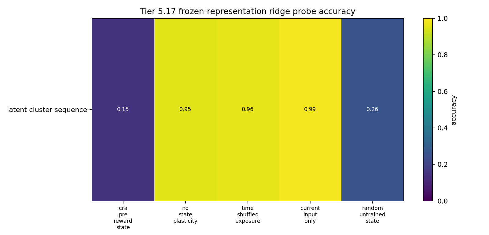
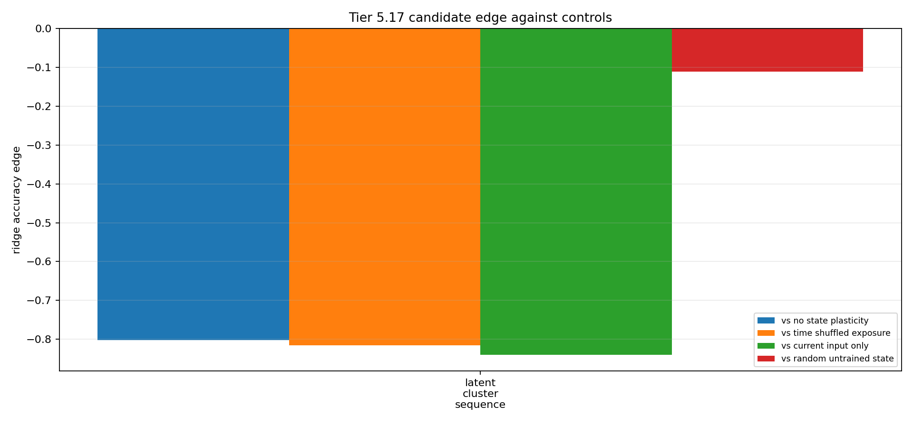

# Tier 5.17 Pre-Reward Representation Formation Findings

- Generated: `2026-04-29T18:57:27+00:00`
- Status: **PASS**
- Output directory: `<repo>/controlled_test_output/tier5_17_20260429_185726`
- Tasks: `latent_cluster_sequence`
- Seeds: `[42]`

Tier 5.17 asks whether a CRA-compatible label-free state module can form useful latent structure before labels, reward, correctness feedback, or dopamine are introduced.

## Claim Boundary

- Noncanonical software diagnostic evidence only.
- Exposure is label-free and reward-free for all non-oracle rows.
- Hidden labels are used only after frozen/snapshotted representations are produced, for offline probes.
- This is not SpiNNaker hardware evidence, native/custom-C on-chip representation learning, language, planning, AGI, or a v2.0 freeze.
- The oracle row is an upper bound and is excluded from no-leakage promotion checks.

## Summary

- expected_runs: `5`
- observed_runs: `5`
- candidate_min_ridge_probe_accuracy: `0.148148`
- candidate_min_knn_probe_accuracy: `0.91358`
- non_oracle_label_leakage_runs: `0`
- reward_leakage_runs: `0`
- max_abs_raw_dopamine_non_oracle: `0`
- temporal_control_losses: `0`
- non_encoder_wins: `0`
- sample_efficiency_wins: `0`

## Comparisons

| Task | Candidate ridge | No-plasticity | Time-shuffled | Input-only | History-only | Random projection | Oracle | Edge vs best non-oracle |
| --- | ---: | ---: | ---: | ---: | ---: | ---: | ---: | ---: |
| latent_cluster_sequence | 0.148148 | 0.950617 | 0.962963 | 0.987654 | None | None | None | -0.839506 |

## Criteria

| Criterion | Value | Rule | Pass | Note |
| --- | --- | --- | --- | --- |
| task/variant/seed matrix completed | 5 | == 5 | yes |  |
| non-oracle exposure has no hidden-label leakage | 0 | == 0 | yes |  |
| exposure has no reward visibility | 0 | == 0 | yes |  |
| pre-reward raw dopamine remains zero | 0 | <= 1e-12 | yes |  |

## Artifacts

- `tier5_17_results.json`: machine-readable manifest.
- `tier5_17_report.md`: human findings and claim boundary.
- `tier5_17_summary.csv`: aggregate probe metrics by task and variant.
- `tier5_17_comparisons.csv`: candidate edges against controls.
- `tier5_17_fairness_contract.json`: no-label/no-reward exposure contract.
- `tier5_17_representation_matrix.png`: ridge-probe accuracy heatmap.
- `tier5_17_control_edges.png`: candidate-control edge plot.

