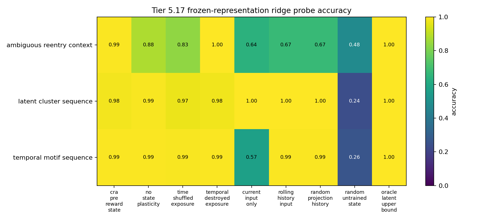
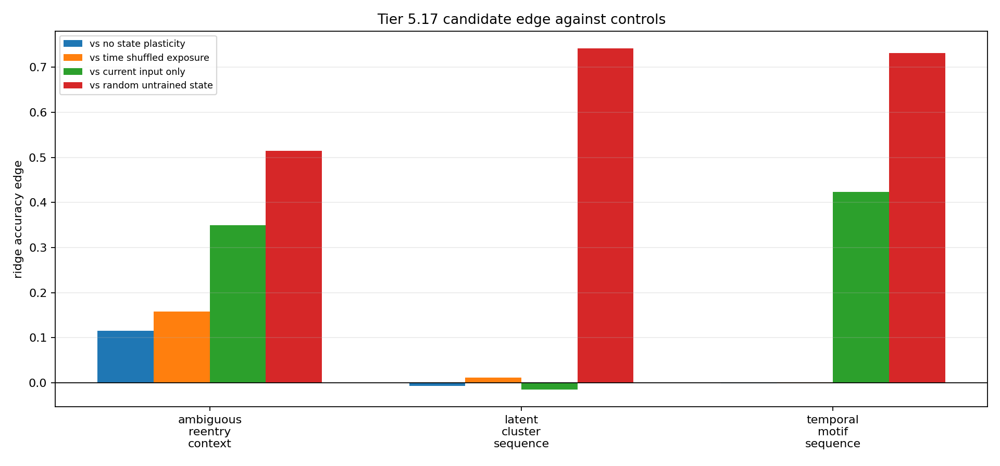

# Tier 5.17 Pre-Reward Representation Formation Findings

- Generated: `2026-04-29T18:58:02+00:00`
- Status: **FAIL**
- Output directory: `<repo>/controlled_test_output/tier5_17_20260429_185759`
- Tasks: `latent_cluster_sequence, temporal_motif_sequence, ambiguous_reentry_context`
- Seeds: `[42, 43, 44]`

Tier 5.17 asks whether a CRA-compatible label-free state module can form useful latent structure before labels, reward, correctness feedback, or dopamine are introduced.

## Claim Boundary

- Noncanonical software diagnostic evidence only.
- Exposure is label-free and reward-free for all non-oracle rows.
- Hidden labels are used only after frozen/snapshotted representations are produced, for offline probes.
- This is not SpiNNaker hardware evidence, native/custom-C on-chip representation learning, language, planning, AGI, or a v2.0 freeze.
- The oracle row is an upper bound and is excluded from no-leakage promotion checks.

## Summary

- expected_runs: `81`
- observed_runs: `81`
- candidate_min_ridge_probe_accuracy: `0.974249`
- candidate_min_knn_probe_accuracy: `0.773504`
- non_oracle_label_leakage_runs: `0`
- reward_leakage_runs: `0`
- max_abs_raw_dopamine_non_oracle: `0`
- temporal_control_losses: `1`
- non_encoder_wins: `2`
- sample_efficiency_wins: `0`

## Comparisons

| Task | Candidate ridge | No-plasticity | Time-shuffled | Input-only | History-only | Random projection | Oracle | Edge vs best non-oracle |
| --- | ---: | ---: | ---: | ---: | ---: | ---: | ---: | ---: |
| ambiguous_reentry_context | 0.992877 | 0.877493 | 0.834758 | 0.643875 | 0.673789 | 0.673789 | 1 | -0.0042735 |
| latent_cluster_sequence | 0.982906 | 0.990047 | 0.971534 | 0.998582 | 0.998582 | 0.998582 | 1 | -0.0156759 |
| temporal_motif_sequence | 0.99289 | 0.994308 | 0.991459 | 0.568976 | 0.994308 | 0.994308 | 1 | -0.00141844 |

## Criteria

| Criterion | Value | Rule | Pass | Note |
| --- | --- | --- | --- | --- |
| task/variant/seed matrix completed | 81 | == 81 | yes |  |
| non-oracle exposure has no hidden-label leakage | 0 | == 0 | yes |  |
| exposure has no reward visibility | 0 | == 0 | yes |  |
| pre-reward raw dopamine remains zero | 0 | <= 1e-12 | yes |  |
| candidate reaches minimum ridge-probe accuracy | 0.974249 | >= 0.72 | yes |  |
| candidate reaches minimum kNN-probe accuracy | 0.773504 | >= 0.7 | yes |  |
| candidate beats no-state-plasticity control | -0.0071409 | >= 0.05 | no |  |
| candidate beats random untrained state | 0.514245 | >= 0.2 | yes |  |
| temporal shams lose on temporal-pressure tasks | 1 | >= 2 | no |  |
| candidate beats current-input-only on temporal-pressure tasks | 2 | >= 2 | yes |  |
| candidate improves downstream sample efficiency somewhere | 0 | >= 2 | no |  |

Failure: Failed criteria: candidate beats no-state-plasticity control, temporal shams lose on temporal-pressure tasks, candidate improves downstream sample efficiency somewhere

## Artifacts

- `tier5_17_results.json`: machine-readable manifest.
- `tier5_17_report.md`: human findings and claim boundary.
- `tier5_17_summary.csv`: aggregate probe metrics by task and variant.
- `tier5_17_comparisons.csv`: candidate edges against controls.
- `tier5_17_fairness_contract.json`: no-label/no-reward exposure contract.
- `tier5_17_representation_matrix.png`: ridge-probe accuracy heatmap.
- `tier5_17_control_edges.png`: candidate-control edge plot.

