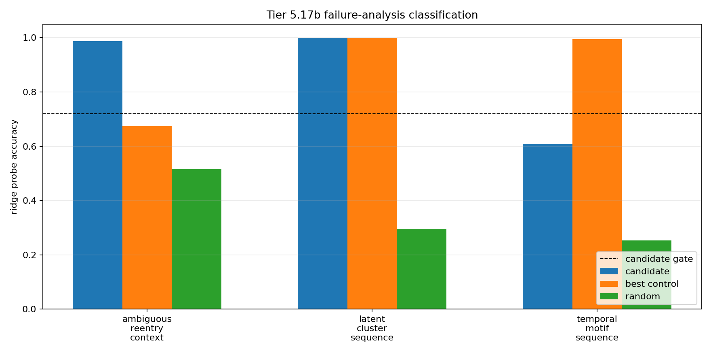

# Tier 5.17b Pre-Reward Representation Failure Analysis

- Generated: `2026-04-29T19:19:51+00:00`
- Status: **PASS**
- Source Tier 5.17 bundle: `<repo>/controlled_test_output/tier5_17_20260429_190501`
- Classification: `mechanism_needs_intrinsic_predictive_objective`
- Next step: `Tier 5.17c - intrinsic predictive / MI-based preexposure objective`

Tier 5.17b diagnoses why Tier 5.17 failed. It does not add a new mechanism and does not promote pre-reward representation learning.

## Boundary

- Diagnostic analysis only; no new baseline freeze.
- Does not claim reward-free representation learning, unsupervised concept learning, or hardware/on-chip representation formation.
- Does not send us back to Tier 5.9 unless future evidence shows useful pre-reward structure exists but downstream credit/preservation fails.

## Task Diagnostics

| Task | Mode | Candidate | Best control | Edge vs best | Edge vs random | Temporal order matters | Sample efficiency ok | Repair |
| --- | --- | ---: | ---: | ---: | ---: | --- | --- | --- |
| ambiguous_reentry_context | `candidate_structure_present` | 0.987179 | 0.673789 | 0.31339 | 0.47151 | True | True | retain_as_positive_subcase: keep task as evidence of possible structure but require additional tasks and transfer gates before promotion. |
| latent_cluster_sequence | `input_encoded_too_easy` | 0.998582 | 0.998582 | 0 | 0.702572 | False | False | repair_task_pressure: use same-visible-input/different-latent-state streams, masked-channel recovery, or held-out cross-channel binding so input-only/history controls cannot solve the task. |
| temporal_motif_sequence | `history_baseline_dominates` | 0.608844 | 0.994308 | -0.385464 | 0.355604 | True | False | repair_mechanism: add an intrinsic predictive/MI objective so internal state learns temporal continuation instead of relying on fixed history features. |

## Failure Modes

| Mode | Tasks | Interpretation | Repair |
| --- | --- | --- | --- |
| `candidate_structure_present` | ambiguous_reentry_context | The candidate forms useful structure and separates from controls on this task, but this alone is not enough for full-tier promotion. | retain_as_positive_subcase: keep task as evidence of possible structure but require additional tasks and transfer gates before promotion. |
| `history_baseline_dominates` | temporal_motif_sequence | A fixed rolling-history or random-projection history baseline solves the task far better than the candidate, so the candidate lacks sufficient temporal state. | repair_mechanism: add an intrinsic predictive/MI objective so internal state learns temporal continuation instead of relying on fixed history features. |
| `input_encoded_too_easy` | latent_cluster_sequence | Visible input or simple history already recovers the latent target, so the task cannot prove representation formation. | repair_task_pressure: use same-visible-input/different-latent-state streams, masked-channel recovery, or held-out cross-channel binding so input-only/history controls cannot solve the task. |

## Decision

- promote_pre_reward_representation: `False`
- revisit_tier5_9_now: `False`
- rationale: Temporal-pressure tasks expose that fixed history can dominate the current scaffold, so the next repair should give CRA an intrinsic label-free reason to learn temporal continuation or masked-channel structure.
- Tier 5.9 revisit rule: Only revisit delayed-credit / eligibility if a future pre-reward mechanism forms useful structure but downstream reward cannot credit, preserve, or use it.

## Criteria

| Criterion | Value | Rule | Pass |
| --- | --- | --- | --- |
| source Tier 5.17 bundle was found | <repo>/controlled_test_output/tier5_17_20260429_190501 | exists True | yes |
| source Tier 5.17 completed expected matrix | 81 | == 81 | yes |
| non-oracle source had no label leakage | 0 | == 0 | yes |
| source had no reward visibility | 0 | == 0 | yes |
| source raw dopamine stayed zero | 0 | <= 1e-12 | yes |
| all expected tasks classified | 3 | == 3 | yes |
| at least one concrete failure mode assigned | 3 | >= 1 | yes |
| repair plan does not promote representation | False | == False | yes |
| repair plan does not jump to Tier 5.9 | False | == False | yes |

## Artifacts

- `tier5_17b_results.json`: machine-readable manifest.
- `tier5_17b_report.md`: human-readable classification.
- `tier5_17b_task_diagnostics.csv`: per-task failure analysis.
- `tier5_17b_failure_modes.csv`: mode-level repair map.
- `tier5_17b_repair_plan.json`: next-step decision and Tier 5.9 revisit rule.
- `tier5_17b_failure_modes.png`: candidate/control diagnostic plot.

