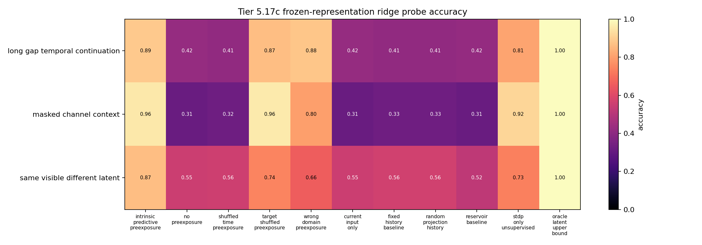
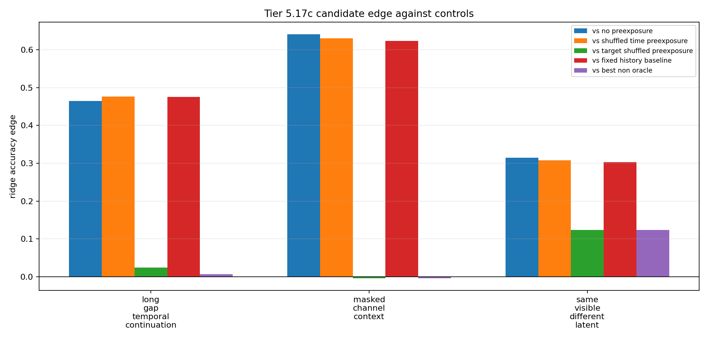

# Tier 5.17c Intrinsic Predictive Preexposure Findings

- Generated: `2026-04-29T19:30:58+00:00`
- Status: **FAIL**
- Output directory: `/Users/james/JKS:CRA/controlled_test_output/tier5_17c_20260429_193054`
- Tasks: `masked_channel_context, long_gap_temporal_continuation, same_visible_different_latent`
- Seeds: `[42, 43, 44]`

Tier 5.17c tests whether label-free predictive/sensory pressure can make preexposure useful before reward arrives.

## Claim Boundary

- Noncanonical software diagnostic evidence only.
- Non-oracle variants receive no labels, reward, correctness feedback, or dopamine during preexposure.
- Hidden labels are used only after representations are frozen/snapshotted for offline probes.
- This is not SpiNNaker hardware evidence, native/custom-C on-chip representation learning, full world modeling, language, planning, AGI, or a v2.0 freeze.
- Oracle rows are upper bounds and excluded from no-leakage promotion checks.

## Summary

- expected_runs: `99`
- observed_runs: `99`
- candidate_min_ridge_probe_accuracy: `0.786184`
- candidate_min_knn_probe_accuracy: `0.565789`
- non_oracle_label_leakage_runs: `0`
- reward_leakage_runs: `0`
- max_abs_raw_dopamine_non_oracle: `0`
- sample_efficiency_wins: `3`

## Comparisons

| Task | Candidate | No preexposure | Time shuffled | Target shuffled | Wrong domain | Fixed history | Reservoir | STDP-only | Best non-oracle edge |
| --- | ---: | ---: | ---: | ---: | ---: | ---: | ---: | ---: | ---: |
| long_gap_temporal_continuation | 0.889254 | 0.424342 | 0.412281 | 0.865132 | 0.882675 | 0.413377 | 0.419956 | 0.810307 | 0.00657895 |
| masked_channel_context | 0.955044 | 0.313596 | 0.324561 | 0.95943 | 0.799342 | 0.33114 | 0.314693 | 0.916667 | -0.00438596 |
| same_visible_different_latent | 0.866228 | 0.551535 | 0.558114 | 0.742325 | 0.656798 | 0.563596 | 0.519737 | 0.734649 | 0.123904 |

## Criteria

| Criterion | Value | Rule | Pass | Note |
| --- | --- | --- | --- | --- |
| task/variant/seed matrix completed | 99 | == 99 | yes |  |
| non-oracle exposure has no hidden-label leakage | 0 | == 0 | yes |  |
| exposure has no reward visibility | 0 | == 0 | yes |  |
| pre-reward raw dopamine remains zero | 0 | <= 1e-12 | yes |  |
| candidate reaches minimum ridge-probe accuracy | 0.786184 | >= 0.74 | yes |  |
| candidate reaches minimum kNN-probe accuracy | 0.565789 | >= 0.68 | no |  |
| candidate beats no-preexposure control | 0.314693 | >= 0.08 | yes |  |
| time-shuffled preexposure loses | 0.308114 | >= 0.05 | yes |  |
| target-shuffled preexposure loses | -0.00438596 | >= 0.05 | no |  |
| wrong-domain preexposure loses | 0.00657895 | >= 0.05 | no |  |
| fixed-history baseline does not explain result | 0.302632 | >= 0.02 | yes |  |
| reservoir baseline does not explain result | 0.346491 | >= 0.02 | yes |  |
| STDP-only baseline does not explain result | 0.0383772 | >= 0.02 | yes |  |
| candidate beats best non-oracle control | -0.00438596 | >= 0.01 | no |  |
| downstream sample-efficiency improves | 3 | >= 2 | yes |  |

Failure: Failed criteria: candidate reaches minimum kNN-probe accuracy, target-shuffled preexposure loses, wrong-domain preexposure loses, candidate beats best non-oracle control

## Artifacts

- `tier5_17c_results.json`: machine-readable manifest.
- `tier5_17c_report.md`: human findings and claim boundary.
- `tier5_17c_runs.csv`: per-task/variant/seed probe rows.
- `tier5_17c_summary.csv`: aggregate probe metrics.
- `tier5_17c_comparisons.csv`: candidate-control edges.
- `tier5_17c_fairness_contract.json`: no-label/no-reward intrinsic preexposure contract.
- `tier5_17c_representation_matrix.png`: ridge-probe accuracy heatmap.
- `tier5_17c_control_edges.png`: candidate-control edge plot.

