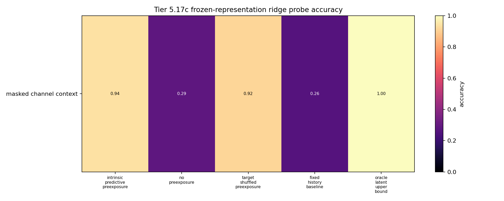
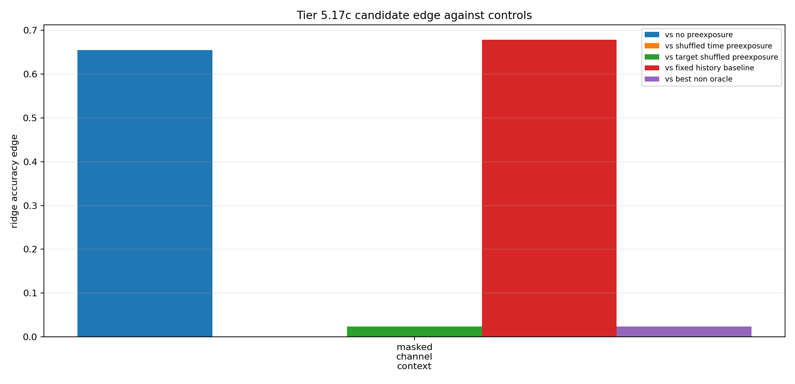

# Tier 5.17c Intrinsic Predictive Preexposure Findings

- Generated: `2026-04-29T19:35:39+00:00`
- Status: **PASS**
- Output directory: `/Users/james/JKS:CRA/controlled_test_output/tier5_17c_20260429_193539`
- Tasks: `masked_channel_context`
- Seeds: `[42]`

Tier 5.17c tests whether label-free predictive/sensory pressure can make preexposure useful before reward arrives.

## Claim Boundary

- Noncanonical software diagnostic evidence only.
- Non-oracle variants receive no labels, reward, correctness feedback, or dopamine during preexposure.
- Hidden labels are used only after representations are frozen/snapshotted for offline probes.
- This is not SpiNNaker hardware evidence, native/custom-C on-chip representation learning, full world modeling, language, planning, AGI, or a v2.0 freeze.
- Oracle rows are upper bounds and excluded from no-leakage promotion checks.

## Summary

- expected_runs: `5`
- observed_runs: `5`
- candidate_min_ridge_probe_accuracy: `0.940476`
- candidate_min_knn_probe_accuracy: `0.785714`
- non_oracle_label_leakage_runs: `0`
- reward_leakage_runs: `0`
- max_abs_raw_dopamine_non_oracle: `0`
- sample_efficiency_wins: `1`

## Comparisons

| Task | Candidate | No preexposure | Time shuffled | Target shuffled | Wrong domain | Fixed history | Reservoir | STDP-only | Best non-oracle edge |
| --- | ---: | ---: | ---: | ---: | ---: | ---: | ---: | ---: | ---: |
| masked_channel_context | 0.940476 | 0.285714 | None | 0.916667 | None | 0.261905 | None | None | 0.0238095 |

## Criteria

| Criterion | Value | Rule | Pass | Note |
| --- | --- | --- | --- | --- |
| task/variant/seed matrix completed | 5 | == 5 | yes |  |
| non-oracle exposure has no hidden-label leakage | 0 | == 0 | yes |  |
| exposure has no reward visibility | 0 | == 0 | yes |  |
| pre-reward raw dopamine remains zero | 0 | <= 1e-12 | yes |  |

## Artifacts

- `tier5_17c_results.json`: machine-readable manifest.
- `tier5_17c_report.md`: human findings and claim boundary.
- `tier5_17c_runs.csv`: per-task/variant/seed probe rows.
- `tier5_17c_summary.csv`: aggregate probe metrics.
- `tier5_17c_comparisons.csv`: candidate-control edges.
- `tier5_17c_fairness_contract.json`: no-label/no-reward intrinsic preexposure contract.
- `tier5_17c_representation_matrix.png`: ridge-probe accuracy heatmap.
- `tier5_17c_control_edges.png`: candidate-control edge plot.

