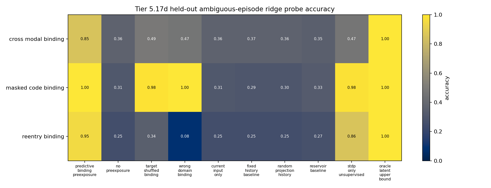
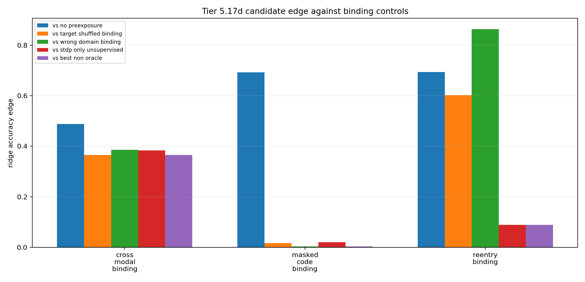

# Tier 5.17d Predictive Preexposure Binding/Sham Repair Findings

- Generated: `2026-04-29T19:45:25+00:00`
- Status: **FAIL**
- Output directory: `<repo>/controlled_test_output/tier5_17d_20260429_194522`
- Tasks: `masked_code_binding, cross_modal_binding, reentry_binding`
- Seeds: `[42, 43, 44]`

Tier 5.17d repairs the 5.17c sham-separation failure by testing target/domain binding on held-out ambiguous episodes after context cues fade.

## Claim Boundary

- Noncanonical software diagnostic evidence only.
- Non-oracle variants receive no labels, reward, correctness feedback, or dopamine during preexposure.
- Hidden labels are used only after representations are generated, for held-out ambiguous-episode probes.
- This is not SpiNNaker hardware evidence, native/custom-C on-chip representation learning, full world modeling, language, planning, AGI, or a v2.0 freeze.

## Summary

- expected_runs: `90`
- observed_runs: `90`
- candidate_min_ridge_probe_accuracy: `0.666667`
- candidate_min_knn_probe_accuracy: `0.769841`
- non_oracle_label_leakage_runs: `0`
- reward_leakage_runs: `0`
- max_abs_raw_dopamine_non_oracle: `0`
- min_candidate_probe_rows: `176`
- sample_efficiency_wins: `3`

## Comparisons

| Task | Candidate | No preexposure | Target shuffled | Wrong domain | Fixed history | Reservoir | STDP-only | Best non-oracle edge |
| --- | ---: | ---: | ---: | ---: | ---: | ---: | ---: | ---: |
| cross_modal_binding | 0.853122 | 0.364436 | 0.488077 | 0.466975 | 0.365915 | 0.35152 | 0.469668 | 0.365045 |
| masked_code_binding | 1 | 0.30705 | 0.982914 | 0.9967 | 0.293435 | 0.326422 | 0.97963 | 0.00330033 |
| reentry_binding | 0.94697 | 0.253788 | 0.344697 | 0.0833333 | 0.251894 | 0.268939 | 0.857955 | 0.0890152 |

## Criteria

| Criterion | Value | Rule | Pass | Note |
| --- | --- | --- | --- | --- |
| task/variant/seed matrix completed | 90 | == 90 | yes |  |
| non-oracle exposure has no hidden-label leakage | 0 | == 0 | yes |  |
| exposure has no reward visibility | 0 | == 0 | yes |  |
| pre-reward raw dopamine remains zero | 0 | <= 1e-12 | yes |  |
| held-out ambiguous probe rows available | 176 | >= 70 | yes |  |
| candidate reaches minimum ridge-probe accuracy | 0.666667 | >= 0.76 | no |  |
| candidate reaches minimum kNN-probe accuracy | 0.769841 | >= 0.64 | yes |  |
| candidate beats no-preexposure control | 0.488686 | >= 0.1 | yes |  |
| target-shuffled binding loses | 0.0170862 | >= 0.08 | no |  |
| wrong-domain binding loses | 0.00330033 | >= 0.08 | no |  |
| fixed-history baseline does not explain result | 0.487207 | >= 0.05 | yes |  |
| reservoir baseline does not explain result | 0.501602 | >= 0.05 | yes |  |
| STDP-only baseline does not explain result | 0.0203704 | >= 0.04 | no |  |
| candidate beats best non-oracle control | 0.00330033 | >= 0.03 | no |  |
| downstream sample-efficiency improves | 3 | >= 2 | yes |  |

Failure: Failed criteria: candidate reaches minimum ridge-probe accuracy, target-shuffled binding loses, wrong-domain binding loses, STDP-only baseline does not explain result, candidate beats best non-oracle control

## Artifacts

- `tier5_17d_results.json`: machine-readable manifest.
- `tier5_17d_report.md`: human findings and claim boundary.
- `tier5_17d_runs.csv`: per-task/variant/seed probe rows.
- `tier5_17d_summary.csv`: aggregate probe metrics.
- `tier5_17d_comparisons.csv`: candidate-control edges.
- `tier5_17d_fairness_contract.json`: predeclared no-label/no-reward binding contract.
- `tier5_17d_representation_matrix.png`: ridge-probe accuracy heatmap.
- `tier5_17d_control_edges.png`: binding-control edge plot.

