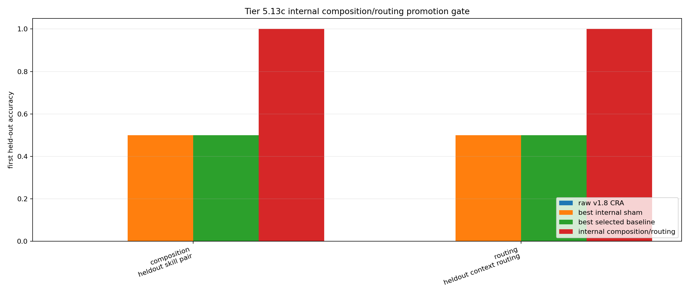

# Tier 5.13c Internal Composition / Routing Promotion Findings

- Generated: `2026-04-29T22:09:53+00:00`
- Status: **PASS**
- Backend for CRA comparators: `mock`
- Composition steps: `360`
- Routing steps: `760`
- Seeds: `42`
- Composition tasks: `heldout_skill_pair`
- Routing tasks: `heldout_context_routing`
- Selected standard baselines: `sign_persistence,online_perceptron`
- Smoke mode: `True`
- Output directory: `<repo>/controlled_test_output/tier5_18c_20260429_220841/v2_0_compact_regression_gate/v1_9_composition_routing_guardrail`

Tier 5.13c tests whether the composition/router scaffolds from Tier 5.13 and 5.13b can be internalized into CRA as a bounded host-side mechanism with causal sham controls.

## Claim Boundary

- This is software evidence, not SpiNNaker hardware evidence.
- The mechanism is internal to the CRA host loop, but not native on-chip routing.
- This does not prove language reasoning, long-horizon planning, AGI, or autonomous tool use.
- A pass authorizes a new composition/routing candidate baseline only after compact regression also passes.

## Comparisons

| Suite | Task | Candidate first | Candidate heldout | Router acc | Raw first | Scaffold first | Best sham | Sham first | Best baseline | Baseline first | Edge vs raw | Edge vs sham | Edge vs baseline |
| --- | --- | ---: | ---: | ---: | ---: | ---: | --- | ---: | --- | ---: | ---: | ---: | ---: |
| composition | heldout_skill_pair | 1 | 1 | None | 0 | 1 | `internal_reset_ablation` | 0.5 | `online_perceptron` | 0.5 | 1 | 0.5 | 0.5 |
| routing | heldout_context_routing | 1 | 1 | 1 | 0 | 1 | `internal_random_router_ablation` | 0.5 | `sign_persistence` | 0.5 | 1 | 0.5 | 0.5 |

## Criteria

| Criterion | Value | Rule | Pass | Note |
| --- | --- | --- | --- | --- |
| full internal/scaffold/baseline/task/seed matrix completed | 19 | == 19 | yes |  |
| feedback timing has no leakage violations | 0 | == 0 | yes |  |
| internal candidate learned primitive module tables | 64 | > 0 | yes |  |
| internal candidate learned context router | 32 | > 0 | yes |  |
| internal candidate selected routed/composed features before feedback | 127 | > 0 | yes |  |

## Artifacts

- `tier5_13c_results.json`: machine-readable manifest.
- `tier5_13c_report.md`: human findings and claim boundary.
- `tier5_13c_summary.csv`: aggregate task/model metrics.
- `tier5_13c_comparisons.csv`: candidate-vs-sham/baseline table.
- `tier5_13c_fairness_contract.json`: predeclared fairness/leakage rules.
- `tier5_13c_internal_composition_routing.png`: first-heldout plot.
- `*_timeseries.csv`: per-task/per-model/per-seed traces.

