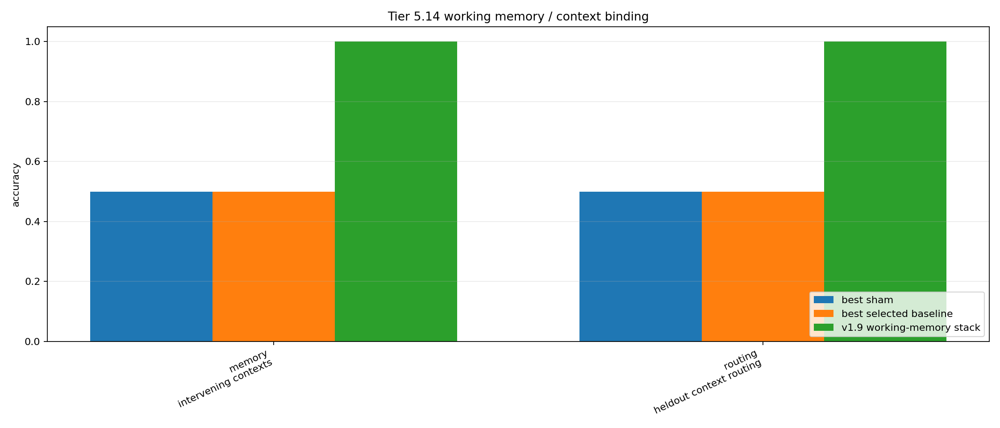

# Tier 5.14 Working Memory / Context Binding Findings

- Generated: `2026-04-29T22:10:28+00:00`
- Status: **PASS**
- Backend: `mock`
- Seeds: `seed_count=3`
- Memory tasks: `intervening_contexts,overlapping_contexts,context_reentry_interference`
- Routing tasks: `heldout_context_routing,distractor_router_chain,context_reentry_routing`
- Output directory: `<repo>/controlled_test_output/tier5_18c_20260429_220841/v2_0_compact_regression_gate/working_memory_context_guardrail`

Tier 5.14 asks whether the frozen v1.9 host-side software stack can maintain working state across time: context/cue memory, active module state, and pending subgoal/routing state.

## Claim Boundary

- Software diagnostic only.
- Host-side mechanisms only; not native SpiNNaker/custom-C working memory.
- Not language, long-horizon planning, AGI, or external-baseline superiority evidence.
- A pass authorizes considering a v2.0 freeze only after compact regression; it does not freeze anything by itself.

## Subsuite Status

- Memory/context binding: **PASS** ``
- Module-state/routing: **PASS** ``

## Memory Comparisons

| Task | Candidate acc | Best sham | Sham acc | Best baseline | Baseline acc | Edge vs sham | Edge vs sign |
| --- | ---: | --- | ---: | --- | ---: | ---: | ---: |
| intervening_contexts | 1 | `slot_shuffle_ablation` | 0.5 | `sign_persistence` | 0.5 | 0.5 | 0.5 |

## Routing Comparisons

| Task | Candidate first | Candidate heldout | Router acc | Best sham | Sham first | Best baseline | Baseline first | Edge vs raw | Edge vs sham |
| --- | ---: | ---: | ---: | --- | ---: | --- | ---: | ---: | ---: |
| heldout_context_routing | 1 | 1 | 1 | `internal_random_router_ablation` | 0.5 | `sign_persistence` | 0.5 | 1 | 0.5 |

## Criteria

| Criterion | Value | Rule | Pass | Note |
| --- | --- | --- | --- | --- |
| memory/context-binding subsuite passed | pass | == pass | yes |  |
| module-state/routing subsuite passed | pass | == pass | yes |  |

## Artifacts

- `tier5_14_results.json`: machine-readable manifest.
- `tier5_14_report.md`: human findings and claim boundary.
- `tier5_14_fairness_contract.json`: fairness/leakage contract.
- `tier5_14_working_memory_summary.png`: candidate/sham/baseline plot.
- `memory_context_binding/`: reused keyed-context-memory traces and summaries.
- `module_state_routing/`: delayed contextual-routing traces and summaries.

