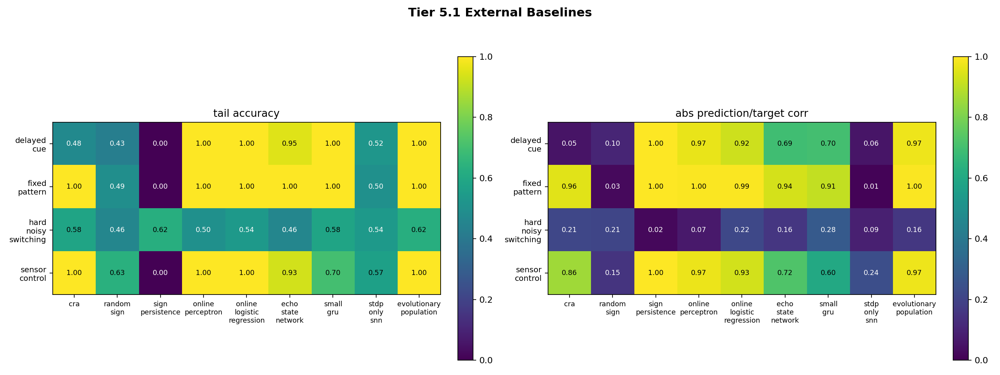
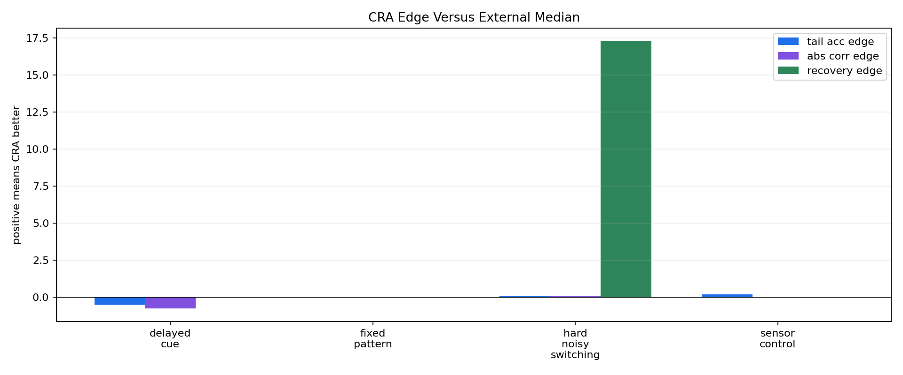

# Tier 5.1 External Baselines Findings

- Generated: `2026-04-27T03:27:05+00:00`
- Status: **PASS**
- CRA backend: `nest`
- Seeds: `42, 43, 44`
- Steps per task: `240`
- Output directory: `<repo>/controlled_test_output/tier5_1_20260426_232530`

Tier 5.1 compares CRA against simpler learners under identical online streams. Every model predicts before seeing the label; delayed tasks only update when consequence feedback matures.

## Claim Boundary

- This is a controlled external-baseline comparison, not a hardware result.
- Success does not require CRA to win every task or every metric.
- The claim is limited to whether CRA shows a defensible advantage under delay, sensor/control transfer, noise, nonstationarity, or recovery versus the external median while documenting best external competitors.

## Models

- `cra` (CRA)
- `random_sign` (chance)
- `sign_persistence` (rule)
- `online_perceptron` (linear)
- `online_logistic_regression` (linear)
- `echo_state_network` (reservoir)
- `small_gru` (recurrent)
- `stdp_only_snn` (snn_ablation)
- `evolutionary_population` (population)

## Aggregate Summary

| Task | Model | Family | Tail acc | Overall acc | Corr | Recovery | Runtime s |
| --- | --- | --- | ---: | ---: | ---: | ---: | ---: |
| delayed_cue | `cra` | CRA | 0.47619 | 0.488889 | 0.0540199 | None | 8.87985 |
| delayed_cue | `echo_state_network` | reservoir | 0.952381 | 0.777778 | 0.693228 | None | 0.00282604 |
| delayed_cue | `evolutionary_population` | population | 1 | 0.988889 | 0.974803 | None | 0.00685632 |
| delayed_cue | `online_logistic_regression` | linear | 1 | 0.933333 | 0.924082 | None | 0.00212671 |
| delayed_cue | `online_perceptron` | linear | 1 | 0.933333 | 0.966092 | None | 0.00142529 |
| delayed_cue | `random_sign` | chance | 0.428571 | 0.466667 | -0.101931 | None | 0.00295726 |
| delayed_cue | `sign_persistence` | rule | 0 | 0 | -1 | None | 0.00130747 |
| delayed_cue | `small_gru` | recurrent | 1 | 0.777778 | 0.701122 | None | 0.00577136 |
| delayed_cue | `stdp_only_snn` | snn_ablation | 0.52381 | 0.511111 | 0.0555812 | None | 0.00243335 |
| fixed_pattern | `cra` | CRA | 1 | 0.987448 | 0.956741 | None | 7.50642 |
| fixed_pattern | `echo_state_network` | reservoir | 1 | 0.969317 | 0.936726 | None | 0.00423767 |
| fixed_pattern | `evolutionary_population` | population | 1 | 0.998605 | 0.99573 | None | 0.0312202 |
| fixed_pattern | `online_logistic_regression` | linear | 1 | 0.991632 | 0.992593 | None | 0.00409768 |
| fixed_pattern | `online_perceptron` | linear | 1 | 0.991632 | 0.995807 | None | 0.00219111 |
| fixed_pattern | `random_sign` | chance | 0.494444 | 0.48675 | -0.0268029 | None | 0.00385371 |
| fixed_pattern | `sign_persistence` | rule | 0 | 0 | -1 | None | 0.00168247 |
| fixed_pattern | `small_gru` | recurrent | 1 | 0.973501 | 0.908113 | None | 0.00727131 |
| fixed_pattern | `stdp_only_snn` | snn_ablation | 0.5 | 0.499303 | -0.0100286 | None | 0.00301807 |
| hard_noisy_switching | `cra` | CRA | 0.583333 | 0.598039 | 0.213866 | 15.0667 | 7.22622 |
| hard_noisy_switching | `echo_state_network` | reservoir | 0.458333 | 0.45098 | -0.159422 | 34.6667 | 0.00284104 |
| hard_noisy_switching | `evolutionary_population` | population | 0.625 | 0.45098 | -0.163298 | 30 | 0.00865329 |
| hard_noisy_switching | `online_logistic_regression` | linear | 0.541667 | 0.460784 | -0.218356 | 26.8667 | 0.00213975 |
| hard_noisy_switching | `online_perceptron` | linear | 0.5 | 0.519608 | 0.0679565 | 29.2 | 0.00156131 |
| hard_noisy_switching | `random_sign` | chance | 0.458333 | 0.392157 | -0.209393 | 61.0667 | 0.00243431 |
| hard_noisy_switching | `sign_persistence` | rule | 0.625 | 0.509804 | 0.0206561 | 21.1333 | 0.00125599 |
| hard_noisy_switching | `small_gru` | recurrent | 0.583333 | 0.5 | -0.284822 | 35.1333 | 0.00557806 |
| hard_noisy_switching | `stdp_only_snn` | snn_ablation | 0.541667 | 0.45098 | 0.087374 | 45.0667 | 0.00343357 |
| sensor_control | `cra` | CRA | 1 | 0.95 | 0.85728 | None | 7.33593 |
| sensor_control | `echo_state_network` | reservoir | 0.933333 | 0.833333 | 0.724266 | None | 0.00376846 |
| sensor_control | `evolutionary_population` | population | 1 | 0.991667 | 0.973801 | None | 0.00862164 |
| sensor_control | `online_logistic_regression` | linear | 1 | 0.95 | 0.933175 | None | 0.00213825 |
| sensor_control | `online_perceptron` | linear | 1 | 0.95 | 0.971582 | None | 0.00172251 |
| sensor_control | `random_sign` | chance | 0.633333 | 0.583333 | 0.152331 | None | 0.00531172 |
| sensor_control | `sign_persistence` | rule | 0 | 0 | -1 | None | 0.0020989 |
| sensor_control | `small_gru` | recurrent | 0.7 | 0.775 | 0.602274 | None | 0.00856154 |
| sensor_control | `stdp_only_snn` | snn_ablation | 0.566667 | 0.441667 | 0.239895 | None | 0.00364869 |

## CRA Versus External Baselines

| Task | CRA tail | Best external tail | Best external model | CRA edge vs median tail | CRA abs corr edge vs median | Recovery edge vs median |
| --- | ---: | ---: | --- | ---: | ---: | ---: |
| delayed_cue | 0.47619 | 1 | `evolutionary_population` | -0.5 | -0.758582 | None |
| fixed_pattern | 1 | 1 | `echo_state_network` | 0 | -0.007918 | None |
| hard_noisy_switching | 0.583333 | 0.625 | `evolutionary_population` | 0.0416667 | 0.0525062 | 17.2667 |
| sensor_control | 1 | 1 | `evolutionary_population` | 0.183333 | 0.0285596 | None |

## Criteria

| Criterion | Value | Rule | Pass | Note |
| --- | --- | --- | --- | --- |
| full task/model/seed matrix completed | 108 | == 108 | yes |  |
| simple external baseline learns fixed-pattern task | 1 | >= 0.85 | yes | This catches a broken baseline harness. |
| CRA has hard-task advantage versus external median | 2 | >= 2 | yes | Advantage may be tail accuracy, abs correlation, or recovery versus the external median. |
| CRA is not dominated on every hard task by best external baseline | 2 | >= 2 | yes | Best-external comparison is documented separately; this criterion prevents overclaiming if CRA is broadly dominated. |

## Artifacts

- `tier5_1_results.json`: machine-readable manifest.
- `tier5_1_summary.csv`: aggregate task/model metrics.
- `tier5_1_comparisons.csv`: CRA-vs-external comparison table.
- `tier5_1_task_model_matrix.png`: task/model heatmap.
- `tier5_1_cra_edges.png`: CRA edge versus external median.
- `*_timeseries.csv`: per-task/per-model/per-seed online traces.

## Plots

