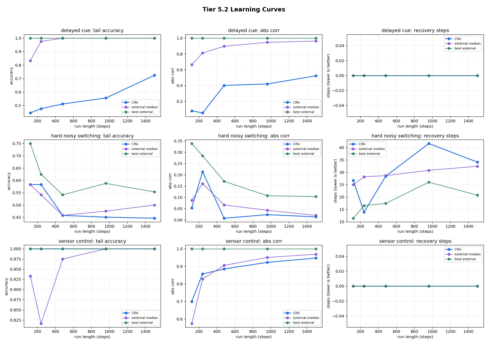
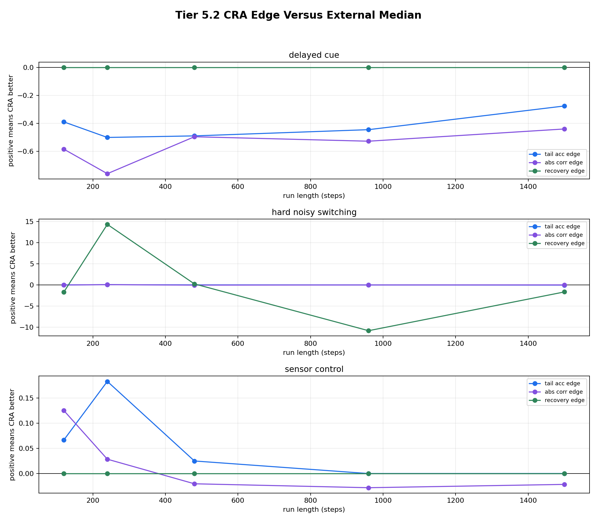
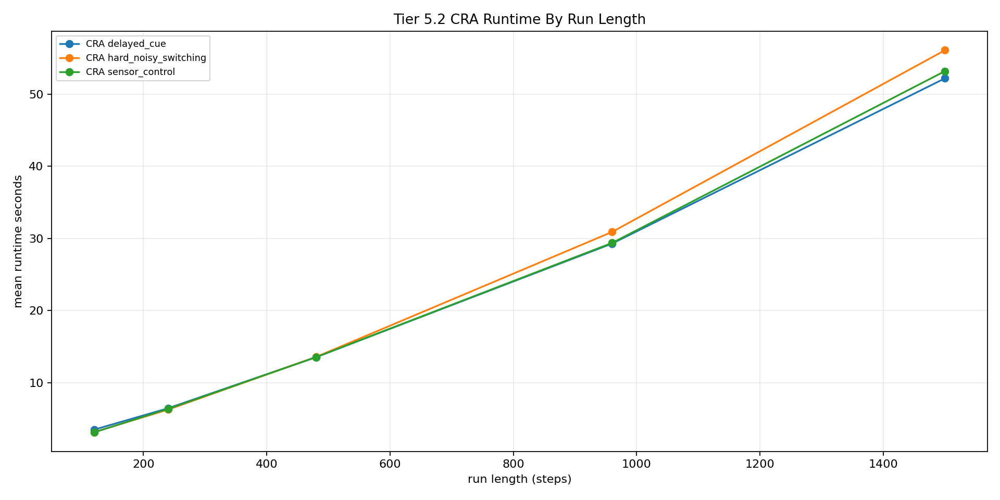

# Tier 5.2 Learning Curve / Run-Length Sweep Findings

- Generated: `2026-04-27T04:01:13+00:00`
- Status: **PASS**
- CRA backend: `nest`
- Seeds: `42, 43, 44`
- Run lengths: `120, 240, 480, 960, 1500`
- Tasks: `sensor_control,hard_noisy_switching,delayed_cue`
- Models: `all`
- Output directory: `/Users/james/Kimi_Agent_Spinnaker Neuromorphic Design/controlled_test_output/tier5_2_20260426_234500`

Tier 5.2 extends Tier 5.1 by repeating the same CRA and external-baseline comparison across multiple online run lengths. It answers whether CRA's hard-task edge grows, disappears, or remains mixed as the stream gets longer.

## Claim Boundary

- This is controlled software evidence, not hardware evidence.
- Passing this tier means the learning curves are complete and interpretable; it does not require CRA to win every task.
- A simple learner beating CRA is recorded as a scientific finding, not hidden as a harness failure.
- Tier 4.16 hardware should use the strongest task identified here, not a task chosen by vibes.

## Task-Level Interpretation

| Task | Classification | Final CRA tail | Final best external tail | Best model | Final tail edge vs median | Final corr edge vs median | Final recovery edge |
| --- | --- | ---: | ---: | --- | ---: | ---: | ---: |
| delayed_cue | `external_baselines_dominate_final` | 0.724638 | 1 | `echo_state_network` | -0.275362 | -0.43947 | 0 |
| hard_noisy_switching | `mixed_or_neutral` | 0.446541 | 0.553459 | `online_perceptron` | -0.0534591 | -0.00645838 | -1.66364 |
| sensor_control | `mixed_or_neutral` | 1 | 1 | `echo_state_network` | 0 | -0.0216044 | 0 |

## Final-Length Comparison

Final length: `1500` steps.

| Task | CRA tail | External median tail | Best external tail | Best external model | CRA runtime s | External median runtime s |
| --- | ---: | ---: | ---: | --- | ---: | ---: |
| delayed_cue | 0.724638 | 1 | 1 | `echo_state_network` | 52.189 | 0.0135295 |
| hard_noisy_switching | 0.446541 | 0.5 | 0.553459 | `online_perceptron` | 56.0865 | 0.0171252 |
| sensor_control | 1 | 1 | 1 | `echo_state_network` | 53.187 | 0.0199289 |

## All Curve Points

| Steps | Task | CRA tail | External median tail | Tail edge | CRA abs corr | External median abs corr | Corr edge | Recovery edge |
| ---: | --- | ---: | ---: | ---: | ---: | ---: | ---: | ---: |
| 120 | delayed_cue | 0.444444 | 0.833333 | -0.388889 | 0.0809494 | 0.664328 | -0.583378 | None |
| 240 | delayed_cue | 0.47619 | 0.97619 | -0.5 | 0.0540199 | 0.812602 | -0.758582 | None |
| 480 | delayed_cue | 0.511111 | 1 | -0.488889 | 0.402964 | 0.898006 | -0.495042 | None |
| 960 | delayed_cue | 0.555556 | 1 | -0.444444 | 0.421303 | 0.948116 | -0.526813 | None |
| 1500 | delayed_cue | 0.724638 | 1 | -0.275362 | 0.524441 | 0.96391 | -0.43947 | None |
| 120 | hard_noisy_switching | 0.583333 | 0.583333 | 0 | 0.0533911 | 0.0869958 | -0.0336047 | -1.71429 |
| 240 | hard_noisy_switching | 0.583333 | 0.541667 | 0.0416667 | 0.213866 | 0.16136 | 0.0525062 | 14.2941 |
| 480 | hard_noisy_switching | 0.458333 | 0.458333 | 0 | 0.00758859 | 0.066494 | -0.0589054 | 0.228571 |
| 960 | hard_noisy_switching | 0.45098 | 0.47549 | -0.0245098 | 0.0235617 | 0.0429714 | -0.0194096 | -10.8286 |
| 1500 | hard_noisy_switching | 0.446541 | 0.5 | -0.0534591 | 0.0138567 | 0.0203151 | -0.00645838 | -1.66364 |
| 120 | sensor_control | 1 | 0.933333 | 0.0666667 | 0.70025 | 0.574747 | 0.125503 | None |
| 240 | sensor_control | 1 | 0.816667 | 0.183333 | 0.85728 | 0.82872 | 0.0285596 | None |
| 480 | sensor_control | 1 | 0.975 | 0.025 | 0.885645 | 0.906031 | -0.0203858 | None |
| 960 | sensor_control | 1 | 1 | 0 | 0.922945 | 0.951144 | -0.0281993 | None |
| 1500 | sensor_control | 1 | 1 | 0 | 0.947594 | 0.969198 | -0.0216044 | None |

## Criteria

| Criterion | Value | Rule | Pass | Note |
| --- | --- | --- | --- | --- |
| full run-length/task/model/seed matrix completed | 405 | == 405 | yes |  |
| all requested run lengths represented | [120, 240, 480, 960, 1500] | == [120, 240, 480, 960, 1500] | yes |  |
| all aggregate curve cells produced | 135 | == 135 | yes |  |
| task-level learning-curve interpretations produced | 3 | == 3 | yes |  |
| runtime recorded for every aggregate cell | 135 | == 135 | yes |  |

## Artifacts

- `tier5_2_results.json`: machine-readable manifest.
- `tier5_2_summary.csv`: aggregate task/model/run-length metrics.
- `tier5_2_comparisons.csv`: CRA-vs-external comparison for every task and run length.
- `tier5_2_curve_analysis.csv`: task-level interpretation of whether CRA's edge grows, persists, fades, or remains mixed.
- `tier5_2_learning_curves.png`: CRA vs external median/best curves.
- `tier5_2_cra_edges_by_length.png`: CRA edge versus external median by run length.
- `tier5_2_runtime_by_length.png`: CRA runtime by run length.
- `*_timeseries.csv`: per-task/per-model/per-seed/per-length online traces.

## Plots

