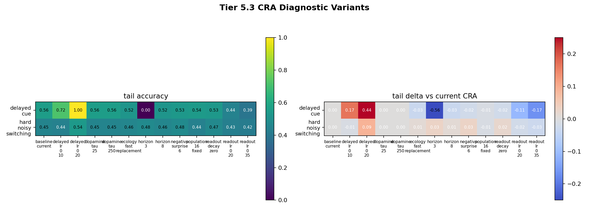
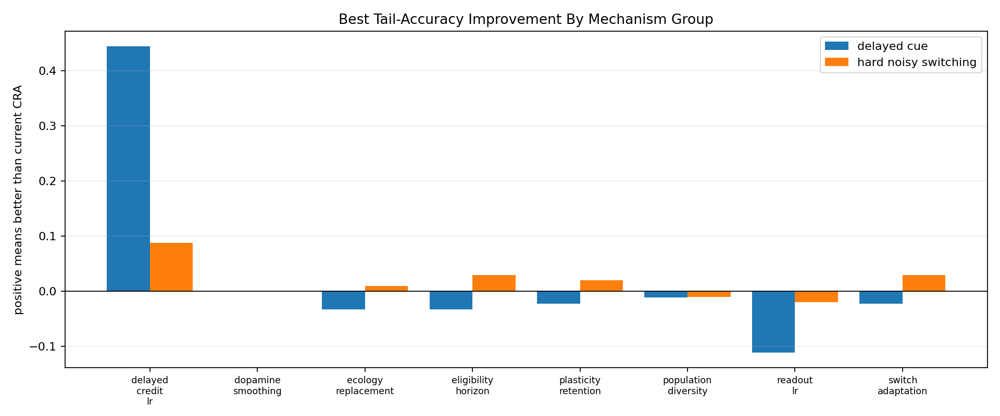

# Tier 5.3 CRA Failure Analysis / Learning Dynamics Debug Findings

- Generated: `2026-04-27T10:40:11+00:00`
- Status: **PASS**
- CRA backend: `nest`
- Steps: `960`
- Seeds: `42, 43, 44`
- Tasks: `delayed_cue,hard_noisy_switching`
- Variants: `core`
- Output directory: `<repo>/controlled_test_output/tier5_3_20260427_055629`

Tier 5.3 is diagnostic, not a new hardware or superiority claim. It asks which CRA learning-dynamics knobs move the failing Tier 5.2 tasks, using Tier 5.2 external baselines as reference.

## Claim Boundary

- This is controlled software tuning/failure-analysis evidence only.
- A pass means the diagnostic matrix completed and produced interpretable findings.
- It does not mean CRA is competitively recovered unless a variant beats the external reference.
- `sensor_control` is removed from advantage claims because Tier 5.2 showed it saturates for both CRA and baselines.

## Task Diagnoses

| Task | Likely diagnosis | Best variant | Best tail | Delta vs current CRA | Delta vs external median | Recovered vs external median? |
| --- | --- | --- | ---: | ---: | ---: | --- |
| delayed_cue | delayed credit is underpowered | `delayed_lr_0_20` | 1.0 | 0.4444444444444444 | 0.0 | yes |
| hard_noisy_switching | delayed credit improves hard-switch tail accuracy, but the best external baseline still leads | `delayed_lr_0_20` | 0.5392156862745098 | 0.08823529411764702 | 0.06372549019607848 | yes |

## Variant Comparisons

| Task | Variant | Group | Tail acc | Delta vs current CRA | Delta vs external median | Abs corr delta vs current | Recovery delta vs current |
| --- | --- | --- | ---: | ---: | ---: | ---: | ---: |
| delayed_cue | `baseline_current` | `control` | 0.5555555555555556 | 0.0 | -0.4444444444444444 | 0.0 |  |
| delayed_cue | `delayed_lr_0_10` | `delayed_credit_lr` | 0.7222222222222222 | 0.16666666666666663 | -0.2777777777777778 | 0.2404603576349591 |  |
| delayed_cue | `delayed_lr_0_20` | `delayed_credit_lr` | 1.0 | 0.4444444444444444 | 0.0 | 0.4415382194516022 |  |
| delayed_cue | `dopamine_tau_25` | `dopamine_smoothing` | 0.5555555555555556 | 0.0 | -0.4444444444444444 | 0.0 |  |
| delayed_cue | `dopamine_tau_250` | `dopamine_smoothing` | 0.5555555555555556 | 0.0 | -0.4444444444444444 | 0.0 |  |
| delayed_cue | `ecology_fast_replacement` | `ecology_replacement` | 0.5222222222222223 | -0.033333333333333326 | -0.47777777777777775 | 0.013654778743281193 |  |
| delayed_cue | `horizon_3` | `eligibility_horizon` | 0.0 | -0.5555555555555556 | -1.0 | 0.5786968156910146 |  |
| delayed_cue | `horizon_8` | `eligibility_horizon` | 0.5222222222222223 | -0.033333333333333326 | -0.47777777777777775 | -0.06411003855593539 |  |
| delayed_cue | `readout_decay_zero` | `plasticity_retention` | 0.5333333333333333 | -0.022222222222222254 | -0.4666666666666667 | 0.028850922758315356 |  |
| delayed_cue | `population_16_fixed` | `population_diversity` | 0.5444444444444444 | -0.011111111111111183 | -0.4555555555555556 | 0.004837907089599469 |  |
| delayed_cue | `readout_lr_0_20` | `readout_lr` | 0.4444444444444444 | -0.11111111111111116 | -0.5555555555555556 | -0.17314538461723009 |  |
| delayed_cue | `readout_lr_0_35` | `readout_lr` | 0.3888888888888889 | -0.16666666666666669 | -0.6111111111111112 | -0.3287223789312322 |  |
| delayed_cue | `negative_surprise_6` | `switch_adaptation` | 0.5333333333333333 | -0.022222222222222254 | -0.4666666666666667 | -0.025676453857101877 |  |
| hard_noisy_switching | `baseline_current` | `control` | 0.45098039215686275 | 0.0 | -0.02450980392156854 | 0.0 | 0.0 |
| hard_noisy_switching | `delayed_lr_0_10` | `delayed_credit_lr` | 0.4411764705882353 | -0.009803921568627472 | -0.03431372549019601 | 0.03621306634577502 | 3.7428571428571473 |
| hard_noisy_switching | `delayed_lr_0_20` | `delayed_credit_lr` | 0.5392156862745098 | 0.08823529411764702 | 0.06372549019607848 | 0.059716710616691135 | 12.728571428571431 |
| hard_noisy_switching | `dopamine_tau_25` | `dopamine_smoothing` | 0.45098039215686275 | 0.0 | -0.02450980392156854 | 0.0 | 0.0 |
| hard_noisy_switching | `dopamine_tau_250` | `dopamine_smoothing` | 0.45098039215686275 | 0.0 | -0.02450980392156854 | 0.0 | 0.0 |
| hard_noisy_switching | `ecology_fast_replacement` | `ecology_replacement` | 0.46078431372549017 | 0.009803921568627416 | -0.014705882352941124 | 0.006635364045202187 | 4.700000000000003 |
| hard_noisy_switching | `horizon_3` | `eligibility_horizon` | 0.4803921568627451 | 0.02941176470588236 | 0.004901960784313819 | 0.004976816169357731 | 17.300000000000004 |
| hard_noisy_switching | `horizon_8` | `eligibility_horizon` | 0.46078431372549017 | 0.009803921568627416 | -0.014705882352941124 | 0.009326880309405889 | -0.37142857142856656 |
| hard_noisy_switching | `readout_decay_zero` | `plasticity_retention` | 0.4705882352941177 | 0.019607843137254943 | -0.004901960784313597 | -0.0017791088380985053 | 0.5 |
| hard_noisy_switching | `population_16_fixed` | `population_diversity` | 0.44117647058823534 | -0.009803921568627416 | -0.034313725490195957 | 0.017350053230218317 | 0.10000000000000142 |
| hard_noisy_switching | `readout_lr_0_20` | `readout_lr` | 0.43137254901960786 | -0.019607843137254888 | -0.04411764705882343 | -0.010815953296640082 | 9.271428571428572 |
| hard_noisy_switching | `readout_lr_0_35` | `readout_lr` | 0.4215686274509804 | -0.02941176470588236 | -0.0539215686274509 | -0.00925937235630461 | 3.528571428571432 |
| hard_noisy_switching | `negative_surprise_6` | `switch_adaptation` | 0.4803921568627451 | 0.02941176470588236 | 0.004901960784313819 | 0.04713808916916644 | 7.557142857142857 |

## Criteria

| Criterion | Value | Rule | Pass | Note |
| --- | --- | --- | --- | --- |
| full CRA diagnostic matrix completed | 78 | == 78 | yes |  |
| all aggregate diagnostic cells produced | 26 | == 26 | yes |  |
| task-level diagnoses produced | 2 | == 2 | yes |  |
| sensor_control removed from advantage probe | True | == True | yes | Tier 5.2 saturated sensor_control, so Tier 5.3 should not use it as a CRA advantage task. |
| comparison rows generated | 26 | == 26 | yes |  |

## Artifacts

- `tier5_3_results.json`: machine-readable manifest.
- `tier5_3_summary.csv`: aggregate task/variant metrics.
- `tier5_3_comparisons.csv`: variant comparisons versus current CRA and Tier 5.2 external references.
- `tier5_3_findings.csv`: task-level diagnoses.
- `tier5_3_variant_matrix.png`: tail accuracy and deltas by variant.
- `tier5_3_group_effects.png`: best mechanism-group improvements.
- `*_timeseries.csv`: per-task/per-variant/per-seed CRA traces.

## Plots

