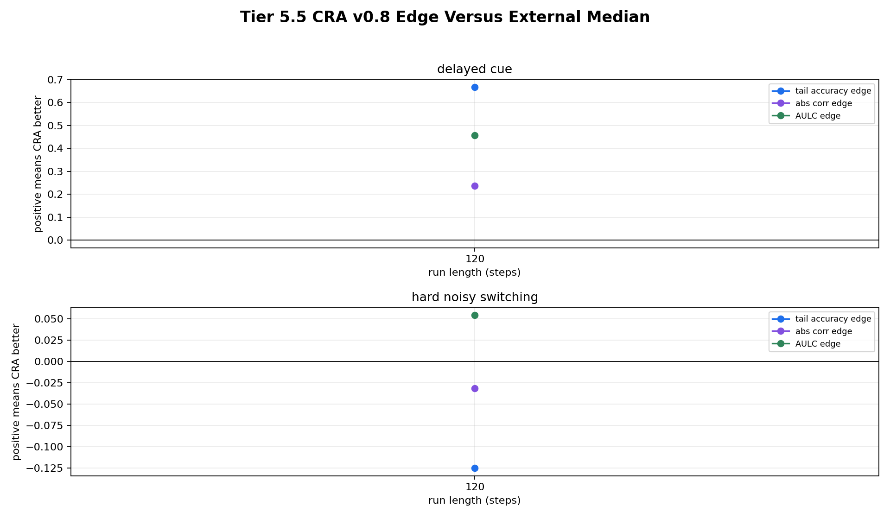

# Tier 5.5 Expanded Baseline Suite Findings

- Generated: `2026-04-28T02:25:28+00:00`
- Status: **PASS**
- CRA backend: `mock`
- Seeds: `42`
- Run lengths: `120`
- Tasks: `delayed_cue,hard_noisy_switching`
- Output directory: `/Users/james/Kimi_Agent_Spinnaker Neuromorphic Design/controlled_test_output/tier5_5_20260427_222527`

Tier 5.5 compares the locked CRA v0.8 delayed-credit configuration against fair external baselines across run lengths and seeds. It exports paired seed deltas, confidence intervals, effect sizes, recovery, runtime, and sample-efficiency metrics.

## Claim Boundary

- This is controlled software evidence, not hardware evidence.
- Passing does not mean CRA wins every task or every metric.
- A strong paper claim requires Tier 5.6 hyperparameter fairness audit after this suite.
- Reviewer-defense baselines that are not implemented here are listed as deferred, not silently claimed.

## Fairness Contract

- all models receive the same task stream for the same task seed and seed
- models predict before seeing the current evaluation label
- delayed tasks update only when the feedback_due_step matures
- no baseline receives future labels, switch locations, or reward signs early
- CRA and baselines share train/evaluation windows and task masks

## CRA Versus External Baselines

| Steps | Task | CRA | CRA tail | Median external tail | Best external tail | Best model | Paired delta vs median | CI low | CI high | d | Robust edge | Not dominated |
| ---: | --- | --- | ---: | ---: | ---: | --- | ---: | ---: | ---: | ---: | --- | --- |
| 120 | delayed_cue | `cra_v0_8_delayed_lr_0_20` | 1 | 0.333333 | 0.666667 | `random_sign` | 0.666667 | 0.666667 | 0.666667 | 0 | yes | yes |
| 120 | hard_noisy_switching | `cra_v0_8_delayed_lr_0_20` | 0.5 | 0.625 | 0.75 | `sign_persistence` | -0.125 | -0.125 | -0.125 | 0 | yes | no |

## Aggregate Cells

| Steps | Task | Model | Family | Runs | Tail acc | Tail CI | Corr | AULC | Reward events to threshold | Runtime s |
| ---: | --- | --- | --- | ---: | ---: | --- | ---: | ---: | ---: | ---: |
| 120 | delayed_cue | `cra_v0_8_delayed_lr_0_20` | CRA | 1 | 1 | [1, 1] | 0.772092 | 0.709792 | 8 | 0.26841 |
| 120 | delayed_cue | `random_sign` | chance | 1 | 0.666667 | [0.666667, 0.666667] | 0.0714286 | 0.505275 | None | 0.00202225 |
| 120 | delayed_cue | `sign_persistence` | rule | 1 | 0 | [0, 0] | -1 | 0 | None | 0.000621209 |
| 120 | hard_noisy_switching | `cra_v0_8_delayed_lr_0_20` | CRA | 1 | 0.5 | [0.5, 0.5] | 0.0492029 | 0.666297 | None | 0.2541 |
| 120 | hard_noisy_switching | `random_sign` | chance | 1 | 0.5 | [0.5, 0.5] | -0.0435194 | 0.606361 | None | 0.00116263 |
| 120 | hard_noisy_switching | `sign_persistence` | rule | 1 | 0.75 | [0.75, 0.75] | 0.117698 | 0.617625 | None | 0.00060125 |

## Criteria

| Criterion | Value | Rule | Pass | Note |
| --- | --- | --- | --- | --- |
| full expanded baseline run matrix completed | 6 | == 6 | yes |  |
| all aggregate cells produced | 6 | == 6 | yes |  |
| all requested run lengths represented | [120] | == [120] | yes |  |
| all comparison rows produced | 2 | == 2 | yes |  |
| simple external baseline learns fixed-pattern sanity task | None | >= 0.85 | yes | Skipped if fixed_pattern is not part of this run. |
| paired confidence intervals produced for comparisons | 2 | == 2 | yes |  |
| CRA has at least one robust advantage regime | 2 | >= 0 | yes | Set --min-advantage-regimes 0 for smoke runs only. |
| CRA is not dominated on most hard/adaptive regimes | 1 | >= 0 | yes |  |

## Artifacts

- `tier5_5_results.json`: machine-readable manifest.
- `tier5_5_summary.csv`: aggregate task/model/run-length statistics.
- `tier5_5_comparisons.csv`: CRA-vs-external paired comparison rows.
- `tier5_5_per_seed.csv`: per-seed audit table.
- `tier5_5_fairness_contract.json`: causal/fairness contract for the run.
- `tier5_5_edge_summary.png`: CRA edge versus external median by task/run length.
- `*_timeseries.csv`: per-run traces for reproducibility.

## Plots

