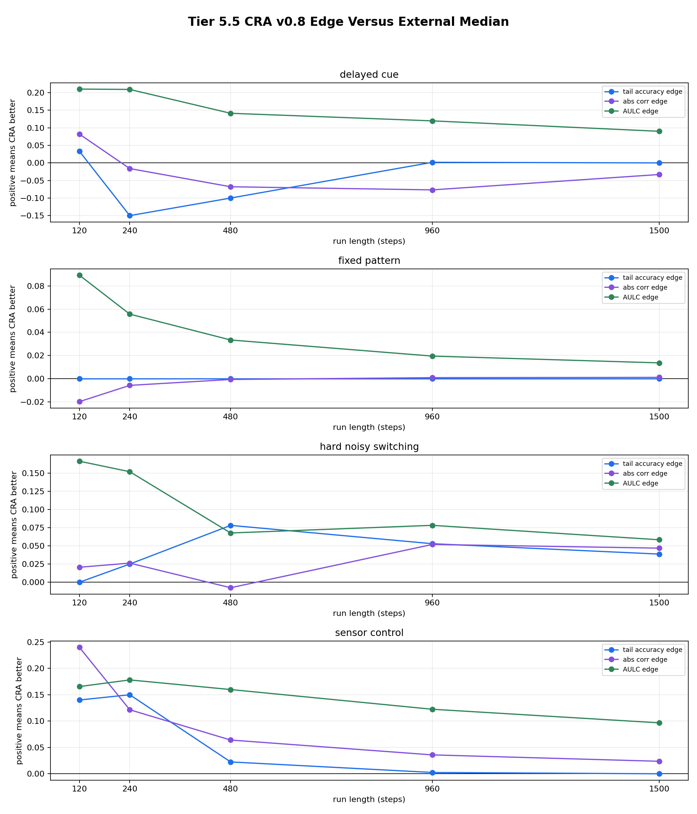

# Tier 5.5 Expanded Baseline Suite Findings

- Generated: `2026-04-28T03:35:32+00:00`
- Status: **PASS**
- CRA backend: `nest`
- Seeds: `42, 43, 44, 45, 46, 47, 48, 49, 50, 51`
- Run lengths: `120, 240, 480, 960, 1500`
- Tasks: `fixed_pattern,delayed_cue,hard_noisy_switching,sensor_control`
- Output directory: `/Users/james/Kimi_Agent_Spinnaker Neuromorphic Design/controlled_test_output/tier5_5_20260427_222736`

Tier 5.5 compares the locked CRA v0.8 delayed-credit configuration against fair external baselines across run lengths and seeds. It exports paired seed deltas, confidence intervals, effect sizes, recovery, runtime, and sample-efficiency metrics.

## Claim Boundary

- This is controlled software evidence, not hardware evidence.
- Passing does not mean CRA wins every task or every metric.
- A strong paper claim requires Tier 5.6 hyperparameter fairness audit after this suite.
- Reviewer-defense baselines that are not implemented here are listed as deferred, not silently claimed.

## Fairness Contract

- all models receive the same task stream for the same task seed and seed
- models predict before seeing the current evaluation label
- delayed tasks update only when the feedback_due_step matures
- no baseline receives future labels, switch locations, or reward signs early
- CRA and baselines share train/evaluation windows and task masks

## CRA Versus External Baselines

| Steps | Task | CRA | CRA tail | Median external tail | Best external tail | Best model | Paired delta vs median | CI low | CI high | d | Robust edge | Not dominated |
| ---: | --- | --- | ---: | ---: | ---: | --- | ---: | ---: | ---: | ---: | --- | --- |
| 120 | delayed_cue | `cra_v0_8_delayed_lr_0_20` | 0.833333 | 0.8 | 1 | `evolutionary_population` | -0.0166667 | -0.25 | 0.166667 | -0.0469094 | yes | yes |
| 240 | delayed_cue | `cra_v0_8_delayed_lr_0_20` | 0.814286 | 0.964286 | 1 | `evolutionary_population` | -0.15 | -0.335714 | 0.0214286 | -0.493606 | yes | yes |
| 480 | delayed_cue | `cra_v0_8_delayed_lr_0_20` | 0.893333 | 0.993333 | 1 | `echo_state_network` | -0.1 | -0.193333 | -0.0133333 | -0.659912 | yes | yes |
| 960 | delayed_cue | `cra_v0_8_delayed_lr_0_20` | 1 | 0.998333 | 1 | `echo_state_network` | 0.00166667 | 0 | 0.005 | 0.316228 | yes | yes |
| 1500 | delayed_cue | `cra_v0_8_delayed_lr_0_20` | 1 | 1 | 1 | `echo_state_network` | 0 | 0 | 0 | 0 | yes | yes |
| 120 | fixed_pattern | `cra_v0_8_delayed_lr_0_20` | 1 | 1 | 1 | `echo_state_network` | 0 | 0 | 0 | 0 | yes | yes |
| 240 | fixed_pattern | `cra_v0_8_delayed_lr_0_20` | 1 | 1 | 1 | `echo_state_network` | 0 | 0 | 0 | 0 | yes | yes |
| 480 | fixed_pattern | `cra_v0_8_delayed_lr_0_20` | 1 | 1 | 1 | `echo_state_network` | 0 | 0 | 0 | 0 | yes | yes |
| 960 | fixed_pattern | `cra_v0_8_delayed_lr_0_20` | 1 | 1 | 1 | `echo_state_network` | 0 | 0 | 0 | 0 | no | yes |
| 1500 | fixed_pattern | `cra_v0_8_delayed_lr_0_20` | 1 | 1 | 1 | `echo_state_network` | 0 | 0 | 0 | 0 | no | yes |
| 120 | hard_noisy_switching | `cra_v0_8_delayed_lr_0_20` | 0.55 | 0.55 | 0.65 | `stdp_only_snn` | 0.025 | -0.275 | 0.275312 | 0.0527046 | yes | yes |
| 240 | hard_noisy_switching | `cra_v0_8_delayed_lr_0_20` | 0.5375 | 0.5125 | 0.5625 | `sign_persistence` | 0.01875 | -0.125 | 0.150156 | 0.0777192 | yes | yes |
| 480 | hard_noisy_switching | `cra_v0_8_delayed_lr_0_20` | 0.54375 | 0.465625 | 0.54375 | `online_perceptron` | 0.071875 | 0.021875 | 0.128125 | 0.812609 | yes | yes |
| 960 | hard_noisy_switching | `cra_v0_8_delayed_lr_0_20` | 0.555882 | 0.502941 | 0.544118 | `online_perceptron` | 0.0573529 | 0.00441176 | 0.108824 | 0.619316 | yes | yes |
| 1500 | hard_noisy_switching | `cra_v0_8_delayed_lr_0_20` | 0.532075 | 0.493396 | 0.545283 | `online_perceptron` | 0.0339623 | -0.00757075 | 0.0764151 | 0.478984 | yes | yes |
| 120 | sensor_control | `cra_v0_8_delayed_lr_0_20` | 1 | 0.86 | 1 | `evolutionary_population` | 0.13 | 0.06 | 0.21025 | 0.916696 | yes | yes |
| 240 | sensor_control | `cra_v0_8_delayed_lr_0_20` | 1 | 0.85 | 1 | `evolutionary_population` | 0.125 | 0.065 | 0.2 | 1.09985 | yes | yes |
| 480 | sensor_control | `cra_v0_8_delayed_lr_0_20` | 1 | 0.9775 | 1 | `evolutionary_population` | 0.0225 | 0.0075 | 0.04 | 0.817806 | yes | yes |
| 960 | sensor_control | `cra_v0_8_delayed_lr_0_20` | 1 | 0.9975 | 1 | `evolutionary_population` | 0.0025 | 0 | 0.0075 | 0.316228 | yes | yes |
| 1500 | sensor_control | `cra_v0_8_delayed_lr_0_20` | 1 | 1 | 1 | `echo_state_network` | 0 | 0 | 0 | 0 | yes | yes |

## Aggregate Cells

| Steps | Task | Model | Family | Runs | Tail acc | Tail CI | Corr | AULC | Reward events to threshold | Runtime s |
| ---: | --- | --- | --- | ---: | ---: | --- | ---: | ---: | ---: | ---: |
| 120 | delayed_cue | `cra_v0_8_delayed_lr_0_20` | CRA | 10 | 0.833333 | [0.6, 1] | 0.713132 | 0.709592 | 8.22222 | 3.09541 |
| 120 | delayed_cue | `echo_state_network` | reservoir | 10 | 0.833333 | [0.733333, 0.933333] | 0.380046 | 0.389653 | 12.75 | 0.00134505 |
| 120 | delayed_cue | `evolutionary_population` | population | 10 | 1 | [1, 1] | 0.925927 | 0.820906 | 8 | 0.00283694 |
| 120 | delayed_cue | `online_logistic_regression` | linear | 10 | 1 | [1, 1] | 0.874976 | 0.641681 | 8 | 0.000846621 |
| 120 | delayed_cue | `online_perceptron` | linear | 10 | 1 | [1, 1] | 0.93063 | 0.641681 | 8 | 0.000766671 |
| 120 | delayed_cue | `random_sign` | chance | 10 | 0.633333 | [0.533333, 0.733333] | -0.0279346 | 0.497204 | 9.33333 | 0.00133638 |
| 120 | delayed_cue | `sign_persistence` | rule | 10 | 0 | [0, 0] | -1 | 0 | None | 0.000702129 |
| 120 | delayed_cue | `small_gru` | recurrent | 10 | 0.766667 | [0.6, 0.933333] | 0.387251 | 0.423765 | 11.4 | 0.00268323 |
| 120 | delayed_cue | `stdp_only_snn` | snn_ablation | 10 | 0.533333 | [0.366667, 0.733333] | -0.0259571 | 0.501984 | 11.5 | 0.00147142 |
| 240 | delayed_cue | `cra_v0_8_delayed_lr_0_20` | CRA | 10 | 0.814286 | [0.628214, 0.985714] | 0.768876 | 0.787235 | 8.8 | 6.31832 |
| 240 | delayed_cue | `echo_state_network` | reservoir | 10 | 0.957143 | [0.914286, 1] | 0.645861 | 0.585843 | 14.1 | 0.00264612 |
| 240 | delayed_cue | `evolutionary_population` | population | 10 | 1 | [1, 1] | 0.96225 | 0.905428 | 8 | 0.00534431 |
| 240 | delayed_cue | `online_logistic_regression` | linear | 10 | 1 | [1, 1] | 0.924081 | 0.780056 | 8 | 0.00717665 |
| 240 | delayed_cue | `online_perceptron` | linear | 10 | 1 | [1, 1] | 0.966092 | 0.780056 | 8 | 0.00135494 |
| 240 | delayed_cue | `random_sign` | chance | 10 | 0.5 | [0.4, 0.6] | -0.0305352 | 0.498117 | 11.3333 | 0.00227307 |
| 240 | delayed_cue | `sign_persistence` | rule | 10 | 0 | [0, 0] | -1 | 0 | None | 0.00122844 |
| 240 | delayed_cue | `small_gru` | recurrent | 10 | 0.971429 | [0.914286, 1] | 0.624818 | 0.570622 | 13.3 | 0.00501961 |
| 240 | delayed_cue | `stdp_only_snn` | snn_ablation | 10 | 0.485714 | [0.4, 0.571429] | -0.0467574 | 0.550606 | 16.1667 | 0.00211165 |
| 480 | delayed_cue | `cra_v0_8_delayed_lr_0_20` | CRA | 10 | 0.893333 | [0.806667, 0.973333] | 0.813474 | 0.849953 | 8 | 13.0862 |
| 480 | delayed_cue | `echo_state_network` | reservoir | 10 | 1 | [1, 1] | 0.805033 | 0.723044 | 13.1 | 0.00532364 |
| 480 | delayed_cue | `evolutionary_population` | population | 10 | 1 | [1, 1] | 0.977714 | 0.945102 | 8 | 0.0109337 |
| 480 | delayed_cue | `online_logistic_regression` | linear | 10 | 1 | [1, 1] | 0.957668 | 0.868838 | 8 | 0.00292263 |
| 480 | delayed_cue | `online_perceptron` | linear | 10 | 1 | [1, 1] | 0.983192 | 0.868838 | 8 | 0.00240863 |
| 480 | delayed_cue | `random_sign` | chance | 10 | 0.526667 | [0.453167, 0.6] | -0.0628069 | 0.432468 | 23.7778 | 0.00431176 |
| 480 | delayed_cue | `sign_persistence` | rule | 10 | 0 | [0, 0] | -1 | 0 | None | 0.00216454 |
| 480 | delayed_cue | `small_gru` | recurrent | 10 | 0.986667 | [0.96, 1] | 0.774159 | 0.694559 | 13.9 | 0.00981352 |
| 480 | delayed_cue | `stdp_only_snn` | snn_ablation | 10 | 0.466667 | [0.42, 0.513333] | -0.0545728 | 0.523988 | 20.2 | 0.0043644 |
| 960 | delayed_cue | `cra_v0_8_delayed_lr_0_20` | CRA | 10 | 1 | [1, 1] | 0.860028 | 0.91061 | 8.9 | 28.5664 |
| 960 | delayed_cue | `echo_state_network` | reservoir | 10 | 1 | [1, 1] | 0.895931 | 0.813607 | 10.6 | 0.00930827 |
| 960 | delayed_cue | `evolutionary_population` | population | 10 | 1 | [1, 1] | 0.987919 | 0.965845 | 8 | 0.0259129 |
| 960 | delayed_cue | `online_logistic_regression` | linear | 10 | 1 | [1, 1] | 0.977681 | 0.92163 | 8 | 0.00529018 |
| 960 | delayed_cue | `online_perceptron` | linear | 10 | 1 | [1, 1] | 0.991632 | 0.92163 | 8 | 0.00428041 |
| 960 | delayed_cue | `random_sign` | chance | 10 | 0.51 | [0.453333, 0.563333] | -0.021424 | 0.468495 | 31.6 | 0.00821495 |
| 960 | delayed_cue | `sign_persistence` | rule | 10 | 0 | [0, 0] | -1 | 0 | None | 0.0037246 |
| 960 | delayed_cue | `small_gru` | recurrent | 10 | 0.996667 | [0.99, 1] | 0.85147 | 0.768459 | 14.1 | 0.0203635 |
| 960 | delayed_cue | `stdp_only_snn` | snn_ablation | 10 | 0.476667 | [0.42, 0.523333] | -0.0206231 | 0.503077 | 31.5 | 0.0142308 |
| 1500 | delayed_cue | `cra_v0_8_delayed_lr_0_20` | CRA | 10 | 1 | [1, 1] | 0.925016 | 0.939809 | 8.6 | 49.4664 |
| 1500 | delayed_cue | `echo_state_network` | reservoir | 10 | 1 | [1, 1] | 0.930671 | 0.861071 | 10.3 | 0.0153978 |
| 1500 | delayed_cue | `evolutionary_population` | population | 10 | 1 | [1, 1] | 0.990752 | 0.981724 | 8 | 0.0323832 |
| 1500 | delayed_cue | `online_logistic_regression` | linear | 10 | 1 | [1, 1] | 0.985413 | 0.945996 | 8 | 0.00829075 |
| 1500 | delayed_cue | `online_perceptron` | linear | 10 | 1 | [1, 1] | 0.994638 | 0.945996 | 8 | 0.00687952 |
| 1500 | delayed_cue | `random_sign` | chance | 10 | 0.480435 | [0.428261, 0.528261] | 0.0308314 | 0.532517 | 25.8 | 0.0128672 |
| 1500 | delayed_cue | `sign_persistence` | rule | 10 | 0 | [0, 0] | -1 | 0 | None | 0.00561328 |
| 1500 | delayed_cue | `small_gru` | recurrent | 10 | 1 | [1, 1] | 0.894151 | 0.838776 | 12.4 | 0.0369385 |
| 1500 | delayed_cue | `stdp_only_snn` | snn_ablation | 10 | 0.486957 | [0.460815, 0.513043] | -0.0346182 | 0.521215 | 19.2 | 0.0122451 |
| 120 | fixed_pattern | `cra_v0_8_delayed_lr_0_20` | CRA | 10 | 1 | [1, 1] | 0.918475 | 0.876977 | 9.3 | 3.27085 |
| 120 | fixed_pattern | `echo_state_network` | reservoir | 10 | 1 | [1, 1] | 0.891645 | 0.773185 | 13.5 | 0.0018161 |
| 120 | fixed_pattern | `evolutionary_population` | population | 10 | 1 | [1, 1] | 0.989622 | 0.972669 | 8 | 0.0112939 |
| 120 | fixed_pattern | `online_logistic_regression` | linear | 10 | 1 | [1, 1] | 0.985183 | 0.91831 | 8 | 0.00139843 |
| 120 | fixed_pattern | `online_perceptron` | linear | 10 | 1 | [1, 1] | 0.99156 | 0.91831 | 8 | 0.000839708 |
| 120 | fixed_pattern | `random_sign` | chance | 10 | 0.48 | [0.443333, 0.513333] | 0.0115034 | 0.504815 | 37.3 | 0.00132816 |
| 120 | fixed_pattern | `sign_persistence` | rule | 10 | 0 | [0, 0] | -1 | 0 | None | 0.000730442 |
| 120 | fixed_pattern | `small_gru` | recurrent | 10 | 1 | [1, 1] | 0.874317 | 0.80193 | 14.5 | 0.00295903 |
| 120 | fixed_pattern | `stdp_only_snn` | snn_ablation | 10 | 0.5 | [0.5, 0.5] | -0.00557534 | 0.502545 | None | 0.00125005 |
| 240 | fixed_pattern | `cra_v0_8_delayed_lr_0_20` | CRA | 10 | 1 | [1, 1] | 0.958401 | 0.929146 | 9.3 | 6.52406 |
| 240 | fixed_pattern | `echo_state_network` | reservoir | 10 | 1 | [1, 1] | 0.935912 | 0.86525 | 13.5 | 0.00355699 |
| 240 | fixed_pattern | `evolutionary_population` | population | 10 | 1 | [1, 1] | 0.994258 | 0.984355 | 8 | 0.0226946 |
| 240 | fixed_pattern | `online_logistic_regression` | linear | 10 | 1 | [1, 1] | 0.992593 | 0.953508 | 8 | 0.00273976 |
| 240 | fixed_pattern | `online_perceptron` | linear | 10 | 1 | [1, 1] | 0.995807 | 0.953508 | 8 | 0.00159818 |
| 240 | fixed_pattern | `random_sign` | chance | 10 | 0.51 | [0.483333, 0.538333] | 0.0115796 | 0.504934 | 37.3 | 0.00252381 |
| 240 | fixed_pattern | `sign_persistence` | rule | 10 | 0 | [0, 0] | -1 | 0 | None | 0.00136353 |
| 240 | fixed_pattern | `small_gru` | recurrent | 10 | 1 | [1, 1] | 0.913187 | 0.881599 | 14.5 | 0.00589631 |
| 240 | fixed_pattern | `stdp_only_snn` | snn_ablation | 10 | 0.5 | [0.5, 0.5] | -0.00639425 | 0.501412 | None | 0.00229857 |
| 480 | fixed_pattern | `cra_v0_8_delayed_lr_0_20` | CRA | 10 | 1 | [1, 1] | 0.979134 | 0.959865 | 9.3 | 13.4897 |
| 480 | fixed_pattern | `echo_state_network` | reservoir | 10 | 1 | [1, 1] | 0.963447 | 0.921896 | 13.5 | 0.00675785 |
| 480 | fixed_pattern | `evolutionary_population` | population | 10 | 1 | [1, 1] | 0.996528 | 0.99118 | 8 | 0.0560137 |
| 480 | fixed_pattern | `online_logistic_regression` | linear | 10 | 1 | [1, 1] | 0.996297 | 0.973904 | 8 | 0.0116582 |
| 480 | fixed_pattern | `online_perceptron` | linear | 10 | 1 | [1, 1] | 0.99791 | 0.973904 | 8 | 0.00303345 |
| 480 | fixed_pattern | `random_sign` | chance | 10 | 0.5225 | [0.499146, 0.545] | 0.026712 | 0.507567 | 37.3 | 0.00471109 |
| 480 | fixed_pattern | `sign_persistence` | rule | 10 | 0 | [0, 0] | -1 | 0 | None | 0.00257393 |
| 480 | fixed_pattern | `small_gru` | recurrent | 10 | 1 | [1, 1] | 0.943812 | 0.931068 | 14.5 | 0.011916 |
| 480 | fixed_pattern | `stdp_only_snn` | snn_ablation | 10 | 0.5 | [0.5, 0.5] | -0.00700131 | 0.500777 | None | 0.00452881 |
| 960 | fixed_pattern | `cra_v0_8_delayed_lr_0_20` | CRA | 10 | 1 | [1, 1] | 0.989563 | 0.977566 | 9.3 | 28.6222 |
| 960 | fixed_pattern | `echo_state_network` | reservoir | 10 | 1 | [1, 1] | 0.979846 | 0.955564 | 13.5 | 0.0178433 |
| 960 | fixed_pattern | `evolutionary_population` | population | 10 | 1 | [1, 1] | 0.997662 | 0.995088 | 8 | 0.0900281 |
| 960 | fixed_pattern | `online_logistic_regression` | linear | 10 | 1 | [1, 1] | 0.998149 | 0.985519 | 8 | 0.0100944 |
| 960 | fixed_pattern | `online_perceptron` | linear | 10 | 1 | [1, 1] | 0.998957 | 0.985519 | 8 | 0.00549318 |
| 960 | fixed_pattern | `random_sign` | chance | 10 | 0.504167 | [0.490833, 0.518333] | 0.0164716 | 0.508689 | 37.3 | 0.00894116 |
| 960 | fixed_pattern | `sign_persistence` | rule | 10 | 0 | [0, 0] | -1 | 0 | None | 0.00471327 |
| 960 | fixed_pattern | `small_gru` | recurrent | 10 | 1 | [1, 1] | 0.966085 | 0.960651 | 14.5 | 0.0233545 |
| 960 | fixed_pattern | `stdp_only_snn` | snn_ablation | 10 | 0.5 | [0.5, 0.5] | -0.00773099 | 0.500424 | None | 0.00857994 |
| 1500 | fixed_pattern | `cra_v0_8_delayed_lr_0_20` | CRA | 10 | 1 | [1, 1] | 0.993321 | 0.984665 | 9.3 | 49.3365 |
| 1500 | fixed_pattern | `echo_state_network` | reservoir | 10 | 1 | [1, 1] | 0.986464 | 0.969338 | 13.5 | 0.0208597 |
| 1500 | fixed_pattern | `evolutionary_population` | population | 10 | 1 | [1, 1] | 0.998053 | 0.996649 | 8 | 0.166412 |
| 1500 | fixed_pattern | `online_logistic_regression` | linear | 10 | 1 | [1, 1] | 0.998815 | 0.99014 | 8 | 0.0164441 |
| 1500 | fixed_pattern | `online_perceptron` | linear | 10 | 1 | [1, 1] | 0.999333 | 0.99014 | 8 | 0.00898983 |
| 1500 | fixed_pattern | `random_sign` | chance | 10 | 0.490933 | [0.476533, 0.504] | 0.00452487 | 0.506841 | 37.3 | 0.0140349 |
| 1500 | fixed_pattern | `sign_persistence` | rule | 10 | 0 | [0, 0] | -1 | 0 | None | 0.00686612 |
| 1500 | fixed_pattern | `small_gru` | recurrent | 10 | 1 | [1, 1] | 0.976227 | 0.972801 | 14.5 | 0.0357962 |
| 1500 | fixed_pattern | `stdp_only_snn` | snn_ablation | 10 | 0.500267 | [0.499467, 0.501067] | -0.00844172 | 0.500286 | None | 0.0136684 |
| 120 | hard_noisy_switching | `cra_v0_8_delayed_lr_0_20` | CRA | 10 | 0.55 | [0.375, 0.725] | 0.144394 | 0.642113 | 8.42857 | 3.12884 |
| 120 | hard_noisy_switching | `echo_state_network` | reservoir | 10 | 0.5 | [0.375, 0.65] | -0.158919 | 0.477194 | 10.5 | 0.00135254 |
| 120 | hard_noisy_switching | `evolutionary_population` | population | 10 | 0.55 | [0.35, 0.725] | -0.103345 | 0.546473 | 8 | 0.00283672 |
| 120 | hard_noisy_switching | `online_logistic_regression` | linear | 10 | 0.475 | [0.275, 0.675] | -0.144576 | 0.410233 | 9.66667 | 0.000830783 |
| 120 | hard_noisy_switching | `online_perceptron` | linear | 10 | 0.575 | [0.425, 0.725] | 0.107265 | 0.443318 | 12 | 0.000727508 |
| 120 | hard_noisy_switching | `random_sign` | chance | 10 | 0.6 | [0.5, 0.7] | 0.0144842 | 0.464451 | 12.75 | 0.00121839 |
| 120 | hard_noisy_switching | `sign_persistence` | rule | 10 | 0.45 | [0.25, 0.675] | -0.00457685 | 0.501799 | 10.1429 | 0.000645537 |
| 120 | hard_noisy_switching | `small_gru` | recurrent | 10 | 0.55 | [0.4, 0.725] | -0.298461 | 0.474547 | 11.6 | 0.00260153 |
| 120 | hard_noisy_switching | `stdp_only_snn` | snn_ablation | 10 | 0.65 | [0.5, 0.8] | 0.140338 | 0.48971 | 9.16667 | 0.00123524 |
| 240 | hard_noisy_switching | `cra_v0_8_delayed_lr_0_20` | CRA | 10 | 0.5375 | [0.437188, 0.6375] | 0.104557 | 0.60462 | 10.5 | 6.41137 |
| 240 | hard_noisy_switching | `echo_state_network` | reservoir | 10 | 0.475 | [0.374688, 0.5875] | -0.115749 | 0.447235 | 14 | 0.00265313 |
| 240 | hard_noisy_switching | `evolutionary_population` | population | 10 | 0.525 | [0.4, 0.625] | -0.0949917 | 0.477644 | 15.1429 | 0.00547136 |
| 240 | hard_noisy_switching | `online_logistic_regression` | linear | 10 | 0.5125 | [0.4125, 0.625] | -0.153339 | 0.403338 | 19 | 0.00165461 |
| 240 | hard_noisy_switching | `online_perceptron` | linear | 10 | 0.5125 | [0.387188, 0.6375] | 0.0578564 | 0.434522 | 15.4444 | 0.00136698 |
| 240 | hard_noisy_switching | `random_sign` | chance | 10 | 0.4875 | [0.4, 0.575] | -0.0256213 | 0.45838 | 15.5714 | 0.00234829 |
| 240 | hard_noisy_switching | `sign_persistence` | rule | 10 | 0.5625 | [0.45, 0.675] | 0.0213125 | 0.531384 | 16.5 | 0.00121768 |
| 240 | hard_noisy_switching | `small_gru` | recurrent | 10 | 0.5125 | [0.4125, 0.6125] | -0.201339 | 0.432347 | 16.5 | 0.00491849 |
| 240 | hard_noisy_switching | `stdp_only_snn` | snn_ablation | 10 | 0.5125 | [0.4, 0.6375] | 0.0615394 | 0.458443 | 18.8333 | 0.00214707 |
| 480 | hard_noisy_switching | `cra_v0_8_delayed_lr_0_20` | CRA | 10 | 0.54375 | [0.50625, 0.5875] | 0.0689064 | 0.549306 | 26.2 | 13.1973 |
| 480 | hard_noisy_switching | `echo_state_network` | reservoir | 10 | 0.475 | [0.4125, 0.5375] | -0.0489183 | 0.489217 | 20.25 | 0.00486602 |
| 480 | hard_noisy_switching | `evolutionary_population` | population | 10 | 0.45625 | [0.406094, 0.5125] | -0.13679 | 0.447193 | 30.9 | 0.0115574 |
| 480 | hard_noisy_switching | `online_logistic_regression` | linear | 10 | 0.44375 | [0.39375, 0.4875] | -0.103935 | 0.443512 | 24.1429 | 0.00302318 |
| 480 | hard_noisy_switching | `online_perceptron` | linear | 10 | 0.54375 | [0.462344, 0.631406] | 0.11344 | 0.482192 | 20.7 | 0.00251908 |
| 480 | hard_noisy_switching | `random_sign` | chance | 10 | 0.4875 | [0.45625, 0.525] | -0.0253714 | 0.492369 | 22.5 | 0.00442118 |
| 480 | hard_noisy_switching | `sign_persistence` | rule | 10 | 0.45625 | [0.4125, 0.5] | -0.0439128 | 0.504677 | 19 | 0.00214493 |
| 480 | hard_noisy_switching | `small_gru` | recurrent | 10 | 0.45 | [0.375, 0.53125] | -0.111627 | 0.465934 | 22.8889 | 0.00987013 |
| 480 | hard_noisy_switching | `stdp_only_snn` | snn_ablation | 10 | 0.5375 | [0.49375, 0.5875] | 0.0447251 | 0.481073 | 21 | 0.00454346 |
| 960 | hard_noisy_switching | `cra_v0_8_delayed_lr_0_20` | CRA | 10 | 0.555882 | [0.514706, 0.591176] | 0.0778382 | 0.557233 | 18.9 | 28.5806 |
| 960 | hard_noisy_switching | `echo_state_network` | reservoir | 10 | 0.508824 | [0.438162, 0.576471] | -0.0165991 | 0.47362 | 33.3 | 0.0109644 |
| 960 | hard_noisy_switching | `evolutionary_population` | population | 10 | 0.5 | [0.458824, 0.532353] | 0.00634141 | 0.516368 | 15.2 | 0.0282837 |
| 960 | hard_noisy_switching | `online_logistic_regression` | linear | 10 | 0.464706 | [0.408824, 0.523529] | -0.0567704 | 0.467499 | 31.3 | 0.00543707 |
| 960 | hard_noisy_switching | `online_perceptron` | linear | 10 | 0.544118 | [0.514632, 0.576471] | 0.0818034 | 0.513496 | 24.1 | 0.0047033 |
| 960 | hard_noisy_switching | `random_sign` | chance | 10 | 0.541176 | [0.505882, 0.579485] | -0.0332176 | 0.464584 | 32.2 | 0.00832677 |
| 960 | hard_noisy_switching | `sign_persistence` | rule | 10 | 0.494118 | [0.455882, 0.532353] | -0.0007213 | 0.527971 | 15.1 | 0.0159407 |
| 960 | hard_noisy_switching | `small_gru` | recurrent | 10 | 0.505882 | [0.452941, 0.550074] | -0.0504524 | 0.466021 | 34.5 | 0.0200391 |
| 960 | hard_noisy_switching | `stdp_only_snn` | snn_ablation | 10 | 0.438235 | [0.394118, 0.479412] | -0.0186153 | 0.484506 | 33.2 | 0.0194114 |
| 1500 | hard_noisy_switching | `cra_v0_8_delayed_lr_0_20` | CRA | 10 | 0.532075 | [0.49434, 0.567925] | 0.0659596 | 0.558515 | 16.9 | 49.2737 |
| 1500 | hard_noisy_switching | `echo_state_network` | reservoir | 10 | 0.5 | [0.450896, 0.545283] | -0.00789583 | 0.504362 | 35.4 | 0.0153202 |
| 1500 | hard_noisy_switching | `evolutionary_population` | population | 10 | 0.471698 | [0.439623, 0.501887] | -0.00129099 | 0.520612 | 30.6 | 0.0350729 |
| 1500 | hard_noisy_switching | `online_logistic_regression` | linear | 10 | 0.477358 | [0.450943, 0.509434] | -0.055383 | 0.470912 | 41.6 | 0.00876087 |
| 1500 | hard_noisy_switching | `online_perceptron` | linear | 10 | 0.545283 | [0.520755, 0.571698] | 0.0987706 | 0.533399 | 26.6 | 0.00717165 |
| 1500 | hard_noisy_switching | `random_sign` | chance | 10 | 0.5 | [0.458491, 0.533962] | 0.00588554 | 0.495992 | 19.6 | 0.0128223 |
| 1500 | hard_noisy_switching | `sign_persistence` | rule | 10 | 0.496226 | [0.475472, 0.518868] | 0.00745279 | 0.51425 | 23 | 0.00586842 |
| 1500 | hard_noisy_switching | `small_gru` | recurrent | 10 | 0.490566 | [0.437689, 0.535849] | -0.0345212 | 0.481603 | 35.1 | 0.0487106 |
| 1500 | hard_noisy_switching | `stdp_only_snn` | snn_ablation | 10 | 0.488679 | [0.449057, 0.522689] | -0.0303269 | 0.492376 | 26.2 | 0.0128784 |
| 120 | sensor_control | `cra_v0_8_delayed_lr_0_20` | CRA | 10 | 1 | [1, 1] | 0.867738 | 0.820113 | 8 | 3.12796 |
| 120 | sensor_control | `echo_state_network` | reservoir | 10 | 0.9 | [0.82, 0.98] | 0.420253 | 0.661112 | 10.4 | 0.00144748 |
| 120 | sensor_control | `evolutionary_population` | population | 10 | 1 | [1, 1] | 0.886482 | 0.905873 | 8 | 0.00319237 |
| 120 | sensor_control | `online_logistic_regression` | linear | 10 | 1 | [1, 1] | 0.834995 | 0.753623 | 8 | 0.000881558 |
| 120 | sensor_control | `online_perceptron` | linear | 10 | 1 | [1, 1] | 0.912242 | 0.753623 | 8 | 0.000744538 |
| 120 | sensor_control | `random_sign` | chance | 10 | 0.52 | [0.4, 0.64] | -0.0465951 | 0.518163 | 11.4 | 0.00135275 |
| 120 | sensor_control | `sign_persistence` | rule | 10 | 0 | [0, 0] | -1 | 0 | None | 0.0007232 |
| 120 | sensor_control | `small_gru` | recurrent | 10 | 0.82 | [0.68, 0.94] | 0.308811 | 0.648058 | 9.7 | 0.00267473 |
| 120 | sensor_control | `stdp_only_snn` | snn_ablation | 10 | 0.44 | [0.24, 0.64] | 0.0129125 | 0.444213 | 11.1667 | 0.00135539 |
| 240 | sensor_control | `cra_v0_8_delayed_lr_0_20` | CRA | 10 | 1 | [1, 1] | 0.933517 | 0.893036 | 8 | 6.31495 |
| 240 | sensor_control | `echo_state_network` | reservoir | 10 | 0.92 | [0.85, 0.97] | 0.689087 | 0.733096 | 10.4 | 0.00269046 |
| 240 | sensor_control | `evolutionary_population` | population | 10 | 1 | [1, 1] | 0.959124 | 0.93932 | 8 | 0.00586827 |
| 240 | sensor_control | `online_logistic_regression` | linear | 10 | 1 | [1, 1] | 0.93491 | 0.842771 | 8 | 0.0020661 |
| 240 | sensor_control | `online_perceptron` | linear | 10 | 1 | [1, 1] | 0.972313 | 0.842771 | 8 | 0.0013185 |
| 240 | sensor_control | `random_sign` | chance | 10 | 0.57 | [0.48, 0.65] | 0.0259563 | 0.507604 | 20.5 | 0.0024936 |
| 240 | sensor_control | `sign_persistence` | rule | 10 | 0 | [0, 0] | -1 | 0 | None | 0.00118707 |
| 240 | sensor_control | `small_gru` | recurrent | 10 | 0.78 | [0.64, 0.9] | 0.569467 | 0.696734 | 9.7 | 0.00486662 |
| 240 | sensor_control | `stdp_only_snn` | snn_ablation | 10 | 0.48 | [0.36, 0.6] | 0.00841022 | 0.453521 | 18.5556 | 0.0021987 |
| 480 | sensor_control | `cra_v0_8_delayed_lr_0_20` | CRA | 10 | 1 | [1, 1] | 0.96303 | 0.937932 | 8 | 13.0634 |
| 480 | sensor_control | `echo_state_network` | reservoir | 10 | 0.98 | [0.95, 1] | 0.831646 | 0.803813 | 10.4 | 0.012098 |
| 480 | sensor_control | `evolutionary_population` | population | 10 | 1 | [1, 1] | 0.979156 | 0.962791 | 8 | 0.0128363 |
| 480 | sensor_control | `online_logistic_regression` | linear | 10 | 1 | [1, 1] | 0.966284 | 0.904212 | 8 | 0.00302507 |
| 480 | sensor_control | `online_perceptron` | linear | 10 | 1 | [1, 1] | 0.986714 | 0.904212 | 8 | 0.0024843 |
| 480 | sensor_control | `random_sign` | chance | 10 | 0.455 | [0.38, 0.53] | -0.0202649 | 0.508874 | 25.3 | 0.00484872 |
| 480 | sensor_control | `sign_persistence` | rule | 10 | 0 | [0, 0] | -1 | 0 | None | 0.00212635 |
| 480 | sensor_control | `small_gru` | recurrent | 10 | 0.975 | [0.94, 1] | 0.740086 | 0.752298 | 9.7 | 0.00998915 |
| 480 | sensor_control | `stdp_only_snn` | snn_ablation | 10 | 0.495 | [0.35, 0.63] | 0.0454527 | 0.470526 | 22.7 | 0.00412538 |
| 960 | sensor_control | `cra_v0_8_delayed_lr_0_20` | CRA | 10 | 1 | [1, 1] | 0.980102 | 0.964653 | 8 | 28.6468 |
| 960 | sensor_control | `echo_state_network` | reservoir | 10 | 0.995 | [0.985, 1] | 0.906147 | 0.866956 | 10.4 | 0.00952608 |
| 960 | sensor_control | `evolutionary_population` | population | 10 | 1 | [1, 1] | 0.987973 | 0.977945 | 8 | 0.0279408 |
| 960 | sensor_control | `online_logistic_regression` | linear | 10 | 1 | [1, 1] | 0.982329 | 0.943481 | 8 | 0.00561501 |
| 960 | sensor_control | `online_perceptron` | linear | 10 | 1 | [1, 1] | 0.993176 | 0.943481 | 8 | 0.00438134 |
| 960 | sensor_control | `random_sign` | chance | 10 | 0.465 | [0.4225, 0.5025] | -0.0308078 | 0.500489 | 25.3 | 0.00828043 |
| 960 | sensor_control | `sign_persistence` | rule | 10 | 0 | [0, 0] | -1 | 0 | None | 0.00401502 |
| 960 | sensor_control | `small_gru` | recurrent | 10 | 1 | [1, 1] | 0.84153 | 0.817407 | 9.7 | 0.0210923 |
| 960 | sensor_control | `stdp_only_snn` | snn_ablation | 10 | 0.6475 | [0.547438, 0.747563] | 0.11892 | 0.491598 | 22.7 | 0.0183951 |
| 1500 | sensor_control | `cra_v0_8_delayed_lr_0_20` | CRA | 10 | 1 | [1, 1] | 0.987229 | 0.975597 | 8 | 49.9963 |
| 1500 | sensor_control | `echo_state_network` | reservoir | 10 | 1 | [1, 1] | 0.938238 | 0.899776 | 10.4 | 0.0155345 |
| 1500 | sensor_control | `evolutionary_population` | population | 10 | 1 | [1, 1] | 0.991462 | 0.98446 | 8 | 0.0368354 |
| 1500 | sensor_control | `online_logistic_regression` | linear | 10 | 1 | [1, 1] | 0.98877 | 0.960266 | 8 | 0.00877594 |
| 1500 | sensor_control | `online_perceptron` | linear | 10 | 1 | [1, 1] | 0.995621 | 0.960266 | 8 | 0.00689097 |
| 1500 | sensor_control | `random_sign` | chance | 10 | 0.501613 | [0.470968, 0.537137] | -0.0182468 | 0.496018 | 25.3 | 0.0127491 |
| 1500 | sensor_control | `sign_persistence` | rule | 10 | 0 | [0, 0] | -1 | 0 | None | 0.00574043 |
| 1500 | sensor_control | `small_gru` | recurrent | 10 | 1 | [1, 1] | 0.892302 | 0.858033 | 9.7 | 0.0390052 |
| 1500 | sensor_control | `stdp_only_snn` | snn_ablation | 10 | 0.467742 | [0.4, 0.530685] | 0.0135742 | 0.50478 | 22.7 | 0.0122847 |

## Criteria

| Criterion | Value | Rule | Pass | Note |
| --- | --- | --- | --- | --- |
| full expanded baseline run matrix completed | 1800 | == 1800 | yes |  |
| all aggregate cells produced | 180 | == 180 | yes |  |
| all requested run lengths represented | [120, 240, 480, 960, 1500] | == [120, 240, 480, 960, 1500] | yes |  |
| all comparison rows produced | 20 | == 20 | yes |  |
| simple external baseline learns fixed-pattern sanity task | 1 | >= 0.85 | yes | Skipped if fixed_pattern is not part of this run. |
| paired confidence intervals produced for comparisons | 20 | == 20 | yes |  |
| CRA has at least one robust advantage regime | 18 | >= 1 | yes | Set --min-advantage-regimes 0 for smoke runs only. |
| CRA is not dominated on most hard/adaptive regimes | 15 | >= 13 | yes |  |

## Artifacts

- `tier5_5_results.json`: machine-readable manifest.
- `tier5_5_summary.csv`: aggregate task/model/run-length statistics.
- `tier5_5_comparisons.csv`: CRA-vs-external paired comparison rows.
- `tier5_5_per_seed.csv`: per-seed audit table.
- `tier5_5_fairness_contract.json`: causal/fairness contract for the run.
- `tier5_5_edge_summary.png`: CRA edge versus external median by task/run length.
- `*_timeseries.csv`: per-run traces for reproducibility.

## Plots

