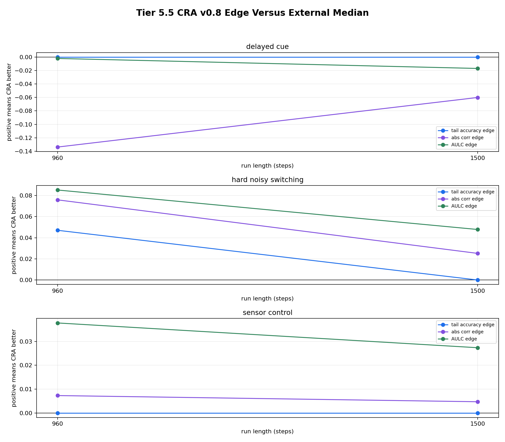

# Tier 5.6 Baseline Hyperparameter Fairness Audit Findings

- Generated: `2026-04-28T04:38:50+00:00`
- Status: **PASS**
- CRA backend: `nest`
- Seeds: `42, 43, 44, 45, 46`
- Run lengths: `960, 1500`
- Tasks: `delayed_cue,hard_noisy_switching,sensor_control`
- Candidate budget: `standard`
- Output directory: `<repo>/controlled_test_output/tier5_6_20260428_001834`

Tier 5.6 locks the promoted CRA delayed-credit setting and gives external baselines a documented hyperparameter budget. It is a reviewer-defense audit against the claim that Tier 5.5 only beat weak/default baselines.

## Claim Boundary

- This is controlled software evidence, not hardware evidence.
- Passing does not mean CRA wins every task, metric, or tuned baseline.
- Failing is actionable: it narrows the paper claim or forces mechanism work before stronger claims.

## Fairness Contract

- all candidates receive the same task stream for the same task seed and seed
- all candidates predict before seeing the current evaluation label
- delayed tasks update only when feedback_due_step matures
- no candidate receives future labels, switch locations, reward signs, or privileged task metadata
- CRA and all external candidates share train/evaluation windows and task masks
- candidate selection is reported after the run rather than silently substituted into the task stream

## Candidate Budget

| Base model | Candidate count |
| --- | ---: |
| `echo_state_network` | 5 |
| `evolutionary_population` | 5 |
| `online_logistic_regression` | 5 |
| `online_perceptron` | 5 |
| `random_sign` | 1 |
| `sign_persistence` | 1 |
| `small_gru` | 5 |
| `stdp_only_snn` | 5 |

## Best Tuned Profiles

| Steps | Task | Base model | Candidates | Best candidate | Best tail | Median candidate tail | Best AULC | Overrides |
| ---: | --- | --- | ---: | --- | ---: | ---: | ---: | --- |
| 960 | delayed_cue | `echo_state_network` | 5 | `echo_state_network__reservoir_hidden_32_reservoir_leak_0p5_reservoir_lr_0p06_reservoir_radius_0p95` | 1 | 1 | 0.893266 | `{"reservoir_hidden": 32, "reservoir_leak": 0.5, "reservoir_lr": 0.06, "reservoir_radius": 0.95}` |
| 960 | delayed_cue | `evolutionary_population` | 5 | `evolutionary_population__evo_fitness_decay_0p97_evo_mutation_0p12_evo_population_64` | 1 | 1 | 0.98377 | `{"evo_fitness_decay": 0.97, "evo_mutation": 0.12, "evo_population": 64}` |
| 960 | delayed_cue | `online_logistic_regression` | 5 | `online_logistic_regression__logistic_l2_0p005_logistic_lr_0p3` | 1 | 1 | 0.920519 | `{"logistic_l2": 0.005, "logistic_lr": 0.3}` |
| 960 | delayed_cue | `online_perceptron` | 5 | `online_perceptron__perceptron_lr_0p15_perceptron_margin_0p05` | 1 | 1 | 0.920519 | `{"perceptron_lr": 0.15, "perceptron_margin": 0.05}` |
| 960 | delayed_cue | `random_sign` | 1 | `random_sign__default` | 0.56 | 0.56 | 0.467488 | `{}` |
| 960 | delayed_cue | `sign_persistence` | 1 | `sign_persistence__default` | 0 | 0 | 0 | `{}` |
| 960 | delayed_cue | `small_gru` | 5 | `small_gru__gru_hidden_32_gru_lr_0p1` | 1 | 1 | 0.879976 | `{"gru_hidden": 32, "gru_lr": 0.1}` |
| 960 | delayed_cue | `stdp_only_snn` | 5 | `stdp_only_snn__stdp_hidden_24_stdp_lr_0p0008_stdp_threshold_0p25_stdp_trace_decay_0p9` | 0.533333 | 0.52 | 0.476226 | `{"stdp_hidden": 24, "stdp_lr": 0.0008, "stdp_threshold": 0.25, "stdp_trace_decay": 0.9}` |
| 1500 | delayed_cue | `echo_state_network` | 5 | `echo_state_network__reservoir_hidden_32_reservoir_leak_0p5_reservoir_lr_0p06_reservoir_radius_0p95` | 1 | 1 | 0.932139 | `{"reservoir_hidden": 32, "reservoir_leak": 0.5, "reservoir_lr": 0.06, "reservoir_radius": 0.95}` |
| 1500 | delayed_cue | `evolutionary_population` | 5 | `evolutionary_population__evo_fitness_decay_0p95_evo_mutation_0p08_evo_population_48` | 1 | 1 | 1 | `{"evo_fitness_decay": 0.95, "evo_mutation": 0.08, "evo_population": 48}` |
| 1500 | delayed_cue | `online_logistic_regression` | 5 | `online_logistic_regression__logistic_l2_0p005_logistic_lr_0p3` | 1 | 1 | 0.944802 | `{"logistic_l2": 0.005, "logistic_lr": 0.3}` |
| 1500 | delayed_cue | `online_perceptron` | 5 | `online_perceptron__perceptron_lr_0p05_perceptron_margin_0` | 1 | 1 | 0.944802 | `{"perceptron_lr": 0.05, "perceptron_margin": 0.0}` |
| 1500 | delayed_cue | `random_sign` | 1 | `random_sign__default` | 0.426087 | 0.426087 | 0.486056 | `{}` |
| 1500 | delayed_cue | `sign_persistence` | 1 | `sign_persistence__default` | 0 | 0 | 0 | `{}` |
| 1500 | delayed_cue | `small_gru` | 5 | `small_gru__gru_hidden_32_gru_lr_0p1` | 1 | 1 | 0.923116 | `{"gru_hidden": 32, "gru_lr": 0.1}` |
| 1500 | delayed_cue | `stdp_only_snn` | 5 | `stdp_only_snn__stdp_hidden_16_stdp_lr_0p0005_stdp_threshold_0p15_stdp_trace_decay_0p85` | 0.508696 | 0.5 | 0.497638 | `{"stdp_hidden": 16, "stdp_lr": 0.0005, "stdp_threshold": 0.15, "stdp_trace_decay": 0.85}` |
| 960 | hard_noisy_switching | `echo_state_network` | 5 | `echo_state_network__reservoir_hidden_48_reservoir_leak_0p55_reservoir_lr_0p08_reservoir_radius_1p2` | 0.552941 | 0.535294 | 0.46749 | `{"reservoir_hidden": 48, "reservoir_leak": 0.55, "reservoir_lr": 0.08, "reservoir_radius": 1.2}` |
| 960 | hard_noisy_switching | `evolutionary_population` | 5 | `evolutionary_population__evo_fitness_decay_0p85_evo_mutation_0p03_evo_population_12` | 0.558824 | 0.505882 | 0.52805 | `{"evo_fitness_decay": 0.85, "evo_mutation": 0.03, "evo_population": 12}` |
| 960 | hard_noisy_switching | `online_logistic_regression` | 5 | `online_logistic_regression__logistic_l2_0p005_logistic_lr_0p3` | 0.505882 | 0.476471 | 0.479506 | `{"logistic_l2": 0.005, "logistic_lr": 0.3}` |
| 960 | hard_noisy_switching | `online_perceptron` | 5 | `online_perceptron__perceptron_lr_0p08_perceptron_margin_0p05` | 0.570588 | 0.558824 | 0.523796 | `{"perceptron_lr": 0.08, "perceptron_margin": 0.05}` |
| 960 | hard_noisy_switching | `random_sign` | 1 | `random_sign__default` | 0.570588 | 0.570588 | 0.47905 | `{}` |
| 960 | hard_noisy_switching | `sign_persistence` | 1 | `sign_persistence__default` | 0.494118 | 0.494118 | 0.544864 | `{}` |
| 960 | hard_noisy_switching | `small_gru` | 5 | `small_gru__gru_hidden_32_gru_lr_0p1` | 0.535294 | 0.511765 | 0.464167 | `{"gru_hidden": 32, "gru_lr": 0.1}` |
| 960 | hard_noisy_switching | `stdp_only_snn` | 5 | `stdp_only_snn__stdp_hidden_32_stdp_lr_0p0015_stdp_threshold_0p2_stdp_trace_decay_0p95` | 0.570588 | 0.535294 | 0.489064 | `{"stdp_hidden": 32, "stdp_lr": 0.0015, "stdp_threshold": 0.2, "stdp_trace_decay": 0.95}` |
| 1500 | hard_noisy_switching | `echo_state_network` | 5 | `echo_state_network__reservoir_hidden_48_reservoir_leak_0p55_reservoir_lr_0p08_reservoir_radius_1p2` | 0.513208 | 0.498113 | 0.505751 | `{"reservoir_hidden": 48, "reservoir_leak": 0.55, "reservoir_lr": 0.08, "reservoir_radius": 1.2}` |
| 1500 | hard_noisy_switching | `evolutionary_population` | 5 | `evolutionary_population__evo_fitness_decay_0p9_evo_mutation_0p04_evo_population_32` | 0.520755 | 0.50566 | 0.518414 | `{"evo_fitness_decay": 0.9, "evo_mutation": 0.04, "evo_population": 32}` |
| 1500 | hard_noisy_switching | `online_logistic_regression` | 5 | `online_logistic_regression__logistic_l2_0p001_logistic_lr_0p2` | 0.490566 | 0.475472 | 0.483007 | `{"logistic_l2": 0.001, "logistic_lr": 0.2}` |
| 1500 | hard_noisy_switching | `online_perceptron` | 5 | `online_perceptron__perceptron_lr_0p08_perceptron_margin_0p05` | 0.554717 | 0.550943 | 0.532476 | `{"perceptron_lr": 0.08, "perceptron_margin": 0.05}` |
| 1500 | hard_noisy_switching | `random_sign` | 1 | `random_sign__default` | 0.509434 | 0.509434 | 0.482381 | `{}` |
| 1500 | hard_noisy_switching | `sign_persistence` | 1 | `sign_persistence__default` | 0.501887 | 0.501887 | 0.511481 | `{}` |
| 1500 | hard_noisy_switching | `small_gru` | 5 | `small_gru__gru_hidden_8_gru_lr_0p03` | 0.513208 | 0.483019 | 0.476762 | `{"gru_hidden": 8, "gru_lr": 0.03}` |
| 1500 | hard_noisy_switching | `stdp_only_snn` | 5 | `stdp_only_snn__stdp_hidden_16_stdp_lr_0p0005_stdp_threshold_0p15_stdp_trace_decay_0p85` | 0.509434 | 0.501887 | 0.510135 | `{"stdp_hidden": 16, "stdp_lr": 0.0005, "stdp_threshold": 0.15, "stdp_trace_decay": 0.85}` |
| 960 | sensor_control | `echo_state_network` | 5 | `echo_state_network__reservoir_hidden_48_reservoir_leak_0p55_reservoir_lr_0p08_reservoir_radius_1p2` | 1 | 1 | 0.929568 | `{"reservoir_hidden": 48, "reservoir_leak": 0.55, "reservoir_lr": 0.08, "reservoir_radius": 1.2}` |
| 960 | sensor_control | `evolutionary_population` | 5 | `evolutionary_population__evo_fitness_decay_0p97_evo_mutation_0p12_evo_population_64` | 1 | 1 | 0.985861 | `{"evo_fitness_decay": 0.97, "evo_mutation": 0.12, "evo_population": 64}` |
| 960 | sensor_control | `online_logistic_regression` | 5 | `online_logistic_regression__logistic_l2_0p005_logistic_lr_0p3` | 1 | 1 | 0.942483 | `{"logistic_l2": 0.005, "logistic_lr": 0.3}` |
| 960 | sensor_control | `online_perceptron` | 5 | `online_perceptron__perceptron_lr_0p08_perceptron_margin_0p05` | 1 | 1 | 0.942483 | `{"perceptron_lr": 0.08, "perceptron_margin": 0.05}` |
| 960 | sensor_control | `random_sign` | 1 | `random_sign__default` | 0.475 | 0.475 | 0.514907 | `{}` |
| 960 | sensor_control | `sign_persistence` | 1 | `sign_persistence__default` | 0 | 0 | 0 | `{}` |
| 960 | sensor_control | `small_gru` | 5 | `small_gru__gru_hidden_32_gru_lr_0p1` | 1 | 1 | 0.908712 | `{"gru_hidden": 32, "gru_lr": 0.1}` |
| 960 | sensor_control | `stdp_only_snn` | 5 | `stdp_only_snn__stdp_hidden_24_stdp_lr_0p0008_stdp_threshold_0p25_stdp_trace_decay_0p9` | 0.61 | 0.56 | 0.456388 | `{"stdp_hidden": 24, "stdp_lr": 0.0008, "stdp_threshold": 0.25, "stdp_trace_decay": 0.9}` |
| 1500 | sensor_control | `echo_state_network` | 5 | `echo_state_network__reservoir_hidden_48_reservoir_leak_0p55_reservoir_lr_0p08_reservoir_radius_1p2` | 1 | 1 | 0.950294 | `{"reservoir_hidden": 48, "reservoir_leak": 0.55, "reservoir_lr": 0.08, "reservoir_radius": 1.2}` |
| 1500 | sensor_control | `evolutionary_population` | 5 | `evolutionary_population__evo_fitness_decay_0p97_evo_mutation_0p12_evo_population_64` | 1 | 1 | 0.990239 | `{"evo_fitness_decay": 0.97, "evo_mutation": 0.12, "evo_population": 64}` |
| 1500 | sensor_control | `online_logistic_regression` | 5 | `online_logistic_regression__logistic_l2_0p005_logistic_lr_0p3` | 1 | 1 | 0.959628 | `{"logistic_l2": 0.005, "logistic_lr": 0.3}` |
| 1500 | sensor_control | `online_perceptron` | 5 | `online_perceptron__perceptron_lr_0p25_perceptron_margin_0p1` | 1 | 1 | 0.959628 | `{"perceptron_lr": 0.25, "perceptron_margin": 0.1}` |
| 1500 | sensor_control | `random_sign` | 1 | `random_sign__default` | 0.480645 | 0.480645 | 0.508959 | `{}` |
| 1500 | sensor_control | `sign_persistence` | 1 | `sign_persistence__default` | 0 | 0 | 0 | `{}` |
| 1500 | sensor_control | `small_gru` | 5 | `small_gru__gru_hidden_32_gru_lr_0p1` | 1 | 1 | 0.934453 | `{"gru_hidden": 32, "gru_lr": 0.1}` |
| 1500 | sensor_control | `stdp_only_snn` | 5 | `stdp_only_snn__stdp_hidden_48_stdp_lr_0p005_stdp_threshold_0p25_stdp_trace_decay_0p98` | 0.503226 | 0.419355 | 0.529432 | `{"stdp_hidden": 48, "stdp_lr": 0.005, "stdp_threshold": 0.25, "stdp_trace_decay": 0.98}` |

## CRA Versus Retuned External Candidates

| Steps | Task | CRA | CRA tail | Median tuned external tail | Best tuned external tail | Best tuned candidate | Paired delta vs median | CI low | CI high | Robust edge | Survives best |
| ---: | --- | --- | ---: | ---: | ---: | --- | ---: | ---: | ---: | --- | --- |
| 960 | delayed_cue | `cra_v0_8_delayed_lr_0_20` | 1 | 1 | 1 | `echo_state_network__reservoir_hidden_24_reservoir_leak_0p35_reservoir_lr_0p04_reservoir_radius_0p85` | 0 | 0 | 0 | no | yes |
| 1500 | delayed_cue | `cra_v0_8_delayed_lr_0_20` | 1 | 1 | 1 | `echo_state_network__reservoir_hidden_16_reservoir_leak_0p25_reservoir_lr_0p03_reservoir_radius_0p75` | 0 | 0 | 0 | no | yes |
| 960 | hard_noisy_switching | `cra_v0_8_delayed_lr_0_20` | 0.564706 | 0.517647 | 0.570588 | `online_perceptron__perceptron_lr_0p08_perceptron_margin_0p05` | 0.0411765 | -0.0589706 | 0.135294 | yes | yes |
| 1500 | hard_noisy_switching | `cra_v0_8_delayed_lr_0_20` | 0.501887 | 0.501887 | 0.554717 | `online_perceptron__perceptron_lr_0p08_perceptron_margin_0p05` | -0.00566038 | -0.0603774 | 0.0433962 | yes | yes |
| 960 | sensor_control | `cra_v0_8_delayed_lr_0_20` | 1 | 1 | 1 | `echo_state_network__reservoir_hidden_24_reservoir_leak_0p35_reservoir_lr_0p04_reservoir_radius_0p85` | 0 | 0 | 0 | yes | yes |
| 1500 | sensor_control | `cra_v0_8_delayed_lr_0_20` | 1 | 1 | 1 | `echo_state_network__reservoir_hidden_24_reservoir_leak_0p35_reservoir_lr_0p04_reservoir_radius_0p85` | 0 | 0 | 0 | yes | yes |

## Criteria

| Criterion | Value | Rule | Pass | Note |
| --- | --- | --- | --- | --- |
| full tuned-baseline run matrix completed | 990 | == 990 | yes |  |
| all aggregate cells produced | 198 | == 198 | yes |  |
| all requested run lengths represented | [960, 1500] | == [960, 1500] | yes |  |
| all best-profile groups reported | 48 | == 48 | yes |  |
| all comparison rows produced | 6 | == 6 | yes |  |
| simple tuned external baseline learns fixed-pattern sanity task | None | >= 0.85 | yes | Skipped if fixed_pattern is not part of this run. |
| paired confidence intervals produced for comparisons | 6 | == 6 | yes |  |
| CRA has a target-regime edge after baseline retuning | 4 | >= 1 | yes | Set --min-retuned-robust-regimes 0 for smoke runs only. |
| CRA has a surviving target regime versus retuned baselines | 4 | >= 1 | yes | A surviving regime is robust versus tuned external median and not dominated by the best tuned external candidate. |

## Artifacts

- `tier5_6_results.json`: machine-readable manifest.
- `tier5_6_report.md`: this report.
- `tier5_6_summary.csv`: aggregate task/model/run-length statistics.
- `tier5_6_comparisons.csv`: CRA-vs-retuned-baseline paired comparison rows.
- `tier5_6_best_profiles.csv`: best/median baseline settings by task/run length.
- `tier5_6_candidate_budget.csv`: predeclared candidate budget.
- `tier5_6_fairness_contract.json`: causal/fairness contract and full budget.
- `tier5_6_per_seed.csv`: per-seed audit table.
- `tier5_6_edge_summary.png`: CRA edge versus tuned external median.
- `*_timeseries.csv`: per-run traces for reproducibility.

## Plots

