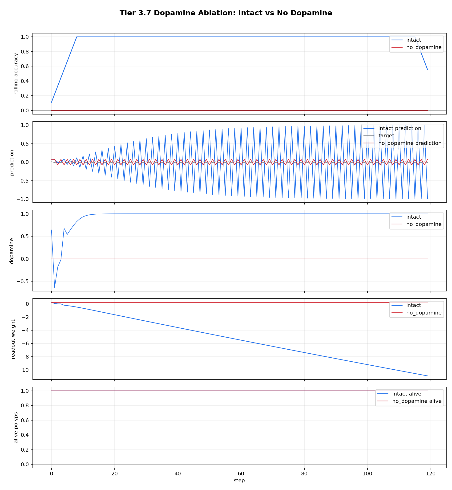
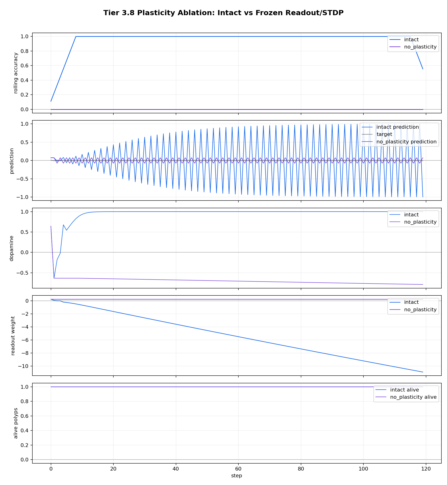
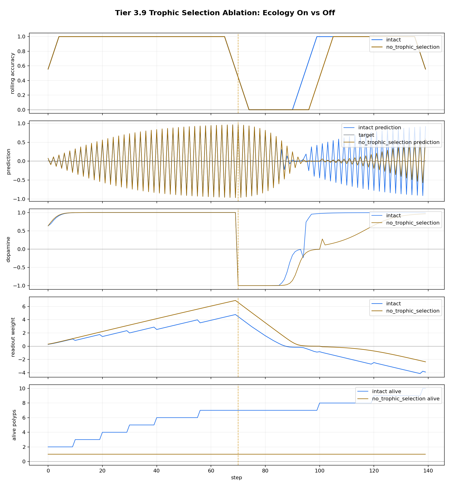

# Tier 3 Controlled Architecture Ablation Findings

- Generated: `2026-04-28T04:56:21+00:00`
- Backend: `mock`
- Overall status: **STOPPED**
- Seeds: `42`
- Fixed-pattern steps: `120`
- Ecology steps: `140`
- Output directory: `<repo>/controlled_test_output/tier5_7_20260428_005610/tier3_ablations`

Tier 3 asks whether named architecture mechanisms are actually doing work. Each result compares an intact organism against a targeted ablation under the same controlled task.

## Artifact Index

- JSON manifest: `tier3_results.json`
- Summary CSV: `tier3_summary.csv`

## Summary

| Test | Status | Key result | Interpretation |
| --- | --- | --- | --- |
| `no_dopamine_ablation` | **PASS** | intact_tail=1, no_da_tail=0, delta=1 | Dopamine-gated learning matters. |
| `no_plasticity_ablation` | **PASS** | intact_tail=1, frozen_tail=0, delta=1 | Plasticity is required, not just inference. |
| `no_trophic_selection_ablation` | **FAIL** | births=9, all_acc_delta=0.0428571, corr_delta=0.164332, alive_delta=9 | Failed criteria: trophic selection improves overall accuracy |

## no_dopamine_ablation

Status: **PASS**

Criteria:

| Criterion | Value | Rule | Pass |
| --- | ---: | --- | --- |
| intact learns fixed pattern | 1 | >= 0.75 | yes |
| no-dopamine fails fixed pattern | 0 | <= 0.55 | yes |
| dopamine ablation performance drop | 1 | >= 0.2 | yes |
| ablated dopamine is zero | 0 | <= 1e-09 | yes |
| ablated readout remains frozen | 0 | <= 0.01 | yes |

Case aggregates:

- `intact`: tail_acc_mean=1, max_da_mean=0.999997, births_sum=0, final_alive_mean=1, final_weight_mean=-10.9131
- `no_dopamine`: tail_acc_mean=0, max_da_mean=0, births_sum=0, final_alive_mean=1, final_weight_mean=0.25

Artifacts:

- `comparison_plot_png`: `no_dopamine_ablation_comparison.png`

## no_plasticity_ablation

Status: **PASS**

Criteria:

| Criterion | Value | Rule | Pass |
| --- | ---: | --- | --- |
| intact learns fixed pattern | 1 | >= 0.75 | yes |
| no-plasticity fails fixed pattern | 0 | <= 0.55 | yes |
| plasticity ablation performance drop | 1 | >= 0.2 | yes |
| dopamine still present under plasticity ablation | 0.787706 | >= 0.5 | yes |
| ablated readout remains frozen | 0 | <= 0.01 | yes |

Case aggregates:

- `intact`: tail_acc_mean=1, max_da_mean=0.999997, births_sum=0, final_alive_mean=1, final_weight_mean=-10.9131
- `no_plasticity`: tail_acc_mean=0, max_da_mean=0.787706, births_sum=0, final_alive_mean=1, final_weight_mean=0.25

Artifacts:

- `comparison_plot_png`: `no_plasticity_ablation_comparison.png`

## no_trophic_selection_ablation

Status: **FAIL**

Criteria:

| Criterion | Value | Rule | Pass |
| --- | ---: | --- | --- |
| intact trophic selection produces births | 9 | >= 1 | yes |
| ablated selection has no births | 0 | == 0 | yes |
| ablated selection has no deaths | 0 | == 0 | yes |
| trophic selection expands population | 9 | >= 1 | yes |
| trophic selection improves overall accuracy | 0.0428571 | >= 0.05 | no |
| trophic selection improves prediction correlation | 0.164332 | >= 0.1 | yes |

Case aggregates:

- `intact`: tail_acc_mean=1, max_da_mean=0.999996, births_sum=9, final_alive_mean=10, final_weight_mean=-3.8833
- `no_trophic_selection`: tail_acc_mean=1, max_da_mean=0.999997, births_sum=0, final_alive_mean=1, final_weight_mean=-2.34848

Artifacts:

- `comparison_plot_png`: `no_trophic_selection_ablation_comparison.png`

## Stop Condition

Execution stopped after `no_trophic_selection_ablation` because `--stop-on-fail` was enabled.
