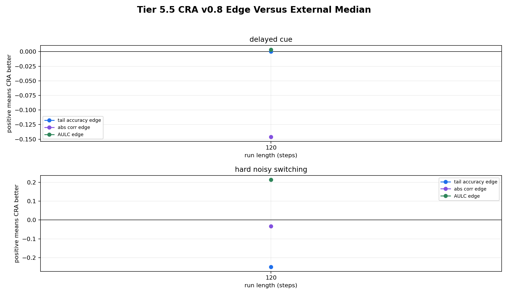

# Tier 5.6 Baseline Hyperparameter Fairness Audit Findings

- Generated: `2026-04-29T01:50:41+00:00`
- Status: **PASS**
- CRA backend: `nest`
- Seeds: `42`
- Run lengths: `120`
- Tasks: `delayed_cue,hard_noisy_switching`
- Candidate budget: `smoke`
- Output directory: `/Users/james/JKS:CRA/controlled_test_output/tier5_7_20260428_214807/target_task_smokes`

Tier 5.6 locks the promoted CRA delayed-credit setting and gives external baselines a documented hyperparameter budget. It is a reviewer-defense audit against the claim that Tier 5.5 only beat weak/default baselines.

## Claim Boundary

- This is controlled software evidence, not hardware evidence.
- Passing does not mean CRA wins every task, metric, or tuned baseline.
- Failing is actionable: it narrows the paper claim or forces mechanism work before stronger claims.

## Fairness Contract

- all candidates receive the same task stream for the same task seed and seed
- all candidates predict before seeing the current evaluation label
- delayed tasks update only when feedback_due_step matures
- no candidate receives future labels, switch locations, reward signs, or privileged task metadata
- CRA and all external candidates share train/evaluation windows and task masks
- candidate selection is reported after the run rather than silently substituted into the task stream

## Candidate Budget

| Base model | Candidate count |
| --- | ---: |
| `online_logistic_regression` | 2 |
| `online_perceptron` | 2 |

## Best Tuned Profiles

| Steps | Task | Base model | Candidates | Best candidate | Best tail | Median candidate tail | Best AULC | Overrides |
| ---: | --- | --- | ---: | --- | ---: | ---: | ---: | --- |
| 120 | delayed_cue | `online_logistic_regression` | 2 | `online_logistic_regression__logistic_l2_0_logistic_lr_0p05` | 1 | 1 | 0.624236 | `{"logistic_l2": 0.0, "logistic_lr": 0.05}` |
| 120 | delayed_cue | `online_perceptron` | 2 | `online_perceptron__perceptron_lr_0p05_perceptron_margin_0` | 1 | 1 | 0.624236 | `{"perceptron_lr": 0.05, "perceptron_margin": 0.0}` |
| 120 | hard_noisy_switching | `online_logistic_regression` | 2 | `online_logistic_regression__logistic_l2_0_logistic_lr_0p02` | 0.75 | 0.75 | 0.387653 | `{"logistic_l2": 0.0, "logistic_lr": 0.02}` |
| 120 | hard_noisy_switching | `online_perceptron` | 2 | `online_perceptron__perceptron_lr_0p05_perceptron_margin_0` | 0.75 | 0.75 | 0.517272 | `{"perceptron_lr": 0.05, "perceptron_margin": 0.0}` |

## CRA Versus Retuned External Candidates

| Steps | Task | CRA | CRA tail | Median tuned external tail | Best tuned external tail | Best tuned candidate | Paired delta vs median | CI low | CI high | Robust edge | Survives best |
| ---: | --- | --- | ---: | ---: | ---: | --- | ---: | ---: | ---: | --- | --- |
| 120 | delayed_cue | `cra_v0_8_delayed_lr_0_20` | 1 | 1 | 1 | `online_logistic_regression__logistic_l2_0_logistic_lr_0p02` | 0 | 0 | 0 | no | yes |
| 120 | hard_noisy_switching | `cra_v0_8_delayed_lr_0_20` | 0.5 | 0.75 | 0.75 | `online_logistic_regression__logistic_l2_0_logistic_lr_0p02` | -0.25 | -0.25 | -0.25 | yes | no |

## Criteria

| Criterion | Value | Rule | Pass | Note |
| --- | --- | --- | --- | --- |
| full tuned-baseline run matrix completed | 10 | == 10 | yes |  |
| all aggregate cells produced | 10 | == 10 | yes |  |
| all requested run lengths represented | [120] | == [120] | yes |  |
| all best-profile groups reported | 4 | == 4 | yes |  |
| all comparison rows produced | 2 | == 2 | yes |  |
| simple tuned external baseline learns fixed-pattern sanity task | None | >= 0.85 | yes | Skipped if fixed_pattern is not part of this run. |
| paired confidence intervals produced for comparisons | 2 | == 2 | yes |  |
| CRA has a target-regime edge after baseline retuning | 1 | >= 0 | yes | Set --min-retuned-robust-regimes 0 for smoke runs only. |
| CRA has a surviving target regime versus retuned baselines | 0 | >= 0 | yes | A surviving regime is robust versus tuned external median and not dominated by the best tuned external candidate. |

## Artifacts

- `tier5_6_results.json`: machine-readable manifest.
- `tier5_6_report.md`: this report.
- `tier5_6_summary.csv`: aggregate task/model/run-length statistics.
- `tier5_6_comparisons.csv`: CRA-vs-retuned-baseline paired comparison rows.
- `tier5_6_best_profiles.csv`: best/median baseline settings by task/run length.
- `tier5_6_candidate_budget.csv`: predeclared candidate budget.
- `tier5_6_fairness_contract.json`: causal/fairness contract and full budget.
- `tier5_6_per_seed.csv`: per-seed audit table.
- `tier5_6_edge_summary.png`: CRA edge versus tuned external median.
- `*_timeseries.csv`: per-run traces for reproducibility.

## Plots

