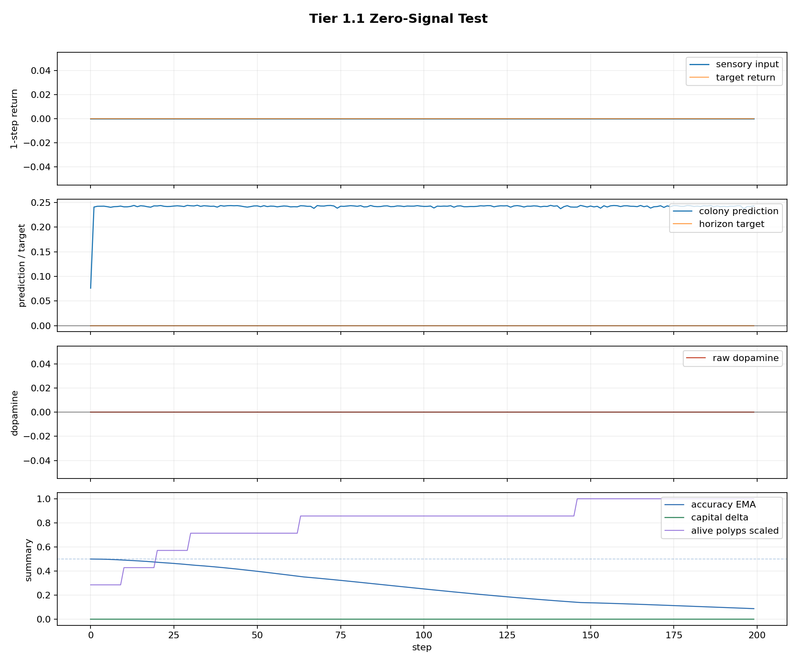
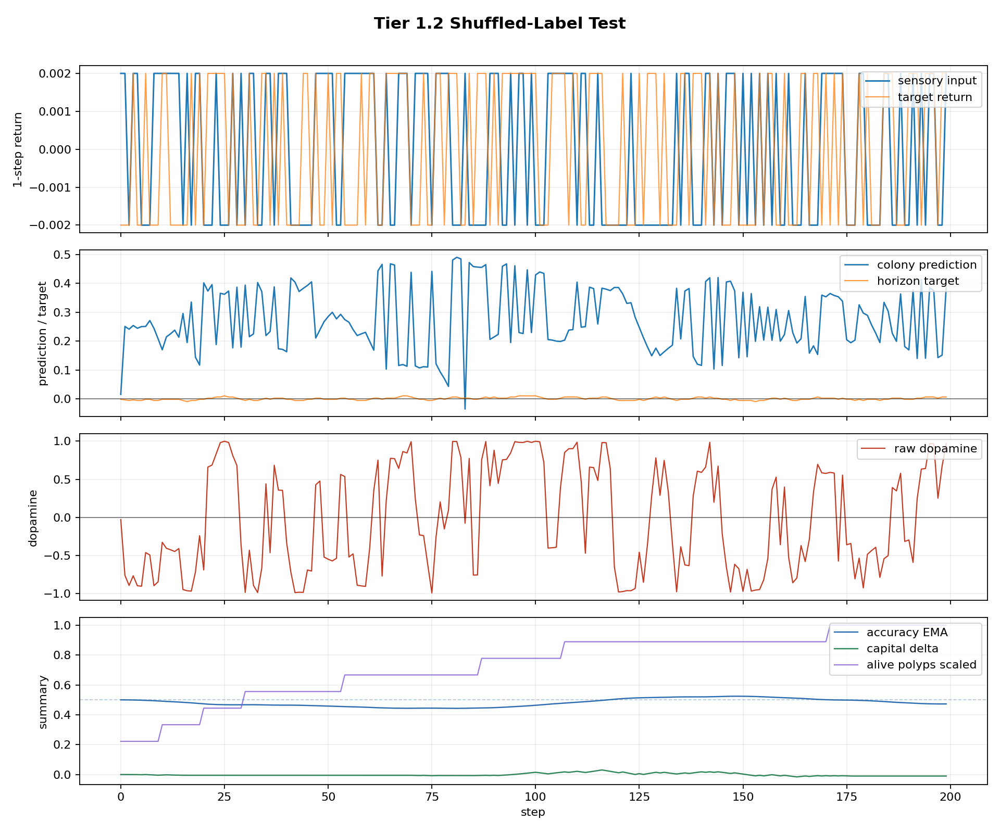
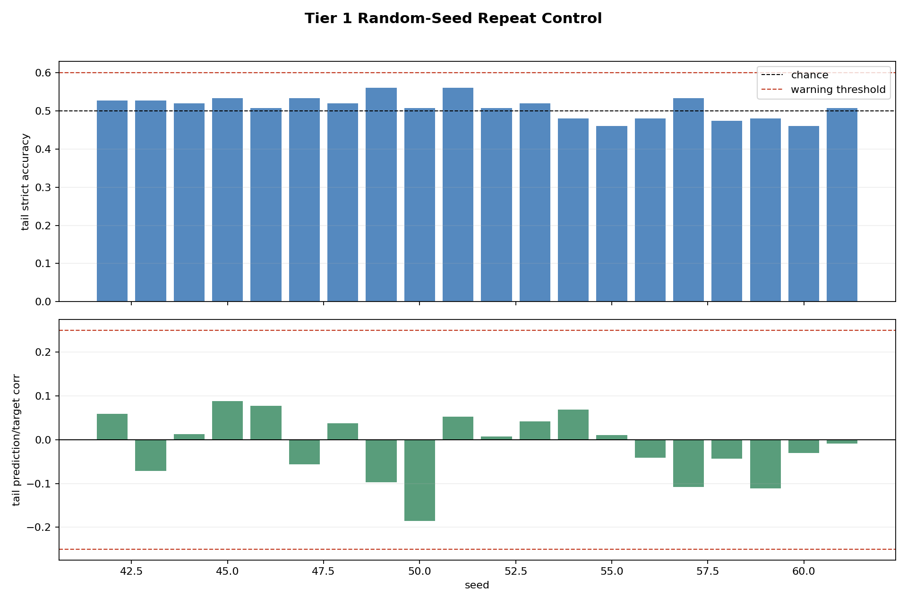

# Tier 1 Controlled Sanity Findings

- Generated: `2026-04-29T03:55:24+00:00`
- Backend: `MockSimulator`
- Overall status: **PASS**
- Steps per run: `200`
- Seed repeat count: `20`
- Base seed: `42`
- Output directory: `<repo>/controlled_test_output/tier5_7_20260428_235507/tier1_controls`

Tier 1 is a negative-control tier. Passing it does not prove learning; it proves the organism does not appear to learn when useful signal is absent or labels are broken.

## Artifact Index

- JSON manifest: `tier1_results.json`
- Summary CSV: `tier1_summary.csv`

## Summary

| Test | Status | Key metric | Notes |
| --- | --- | --- | --- |
| `zero_signal` | **PASS** | max_abs_dopamine=0, capital_delta=0 | criteria satisfied |
| `shuffled_label` | **PASS** | tail_strict_acc=0.526667, tail_corr=0.0590116 | criteria satisfied |
| `seed_repeat` | **PASS** | mean_tail_strict_acc=0.509667, high_seed_fraction=0 | criteria satisfied |

## zero_signal

Status: **PASS**

Criteria:

| Criterion | Value | Rule | Pass |
| --- | ---: | --- | --- |
| zero target stayed zero | 0 | == 0 | yes |
| max absolute dopamine | 0 | <= 1e-09 | yes |
| capital absolute delta | 0 | <= 1e-09 | yes |
| tail accuracy EMA | 0.209257 | <= 0.51 | yes |
| prediction/target correlation | None | is None or abs <=  1e-09 | yes |

Artifacts:

- `timeseries_csv`: `zero_signal_timeseries.csv`
- `plot_png`: `zero_signal_timeseries.png`

## shuffled_label

Status: **PASS**

Criteria:

| Criterion | Value | Rule | Pass |
| --- | ---: | --- | --- |
| tail strict accuracy on nonzero targets | 0.526667 | <= 0.6 | yes |
| tail prediction/target abs correlation | 0.0590116 | is None or <= 0.25 | yes |
| capital absolute delta | 0.00999623 | <= 0.05 | yes |

Artifacts:

- `timeseries_csv`: `shuffled_label_timeseries.csv`
- `plot_png`: `shuffled_label_timeseries.png`

## seed_repeat

Status: **PASS**

Criteria:

| Criterion | Value | Rule | Pass |
| --- | ---: | --- | --- |
| mean tail strict accuracy | 0.509667 | <= 0.56 | yes |
| high-accuracy seed fraction | 0 | <= 0.2 | yes |
| mean absolute tail prediction/target correlation | 0.0604845 | <= 0.2 | yes |

Artifacts:

- `seed_summary_csv`: `seed_repeat_summary.csv`
- `plot_png`: `seed_repeat_summary.png`

