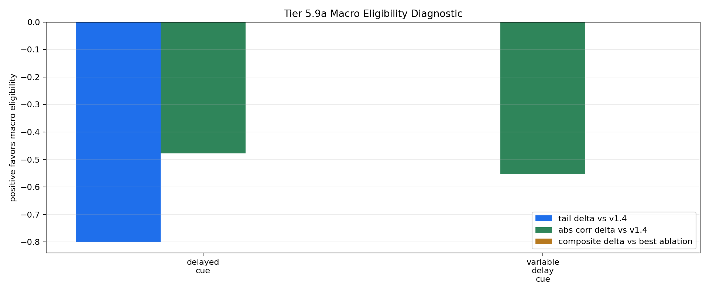

# Tier 5.9a Macro Eligibility Trace Diagnostic Findings

- Generated: `2026-04-28T20:22:56+00:00`
- Status: **PASS**
- Backend: `mock`
- Steps: `160`
- Seeds: `42`
- Tasks: `delayed_cue,variable_delay_cue`
- Variants: `all`
- Selected baselines: `sign_persistence,online_perceptron`
- Smoke mode: `True`
- Output directory: `/Users/james/JKS:CRA/controlled_test_output/tier5_9a_20260428_162252`

Tier 5.9a tests whether a host-side macro eligibility trace earns promotion beyond the frozen v1.4 PendingHorizon delayed-credit path.

## Claim Boundary

- This is software diagnostic evidence, not hardware evidence.
- v1.4 remains the frozen architecture baseline unless macro eligibility passes this gate and then survives compact regression.
- A failed run is still useful: it means the mechanism is not yet earned, not that existing CRA evidence regressed.

## Task Comparisons

| Task | v1.4 tail | Macro tail | Tail delta | Corr delta | Recovery delta | Best ablation | Macro-ablation delta | External median tail edge | Trace active steps | Matured updates |
| --- | ---: | ---: | ---: | ---: | ---: | --- | ---: | ---: | ---: | ---: |
| delayed_cue | 1 | 0.2 | -0.8 | -0.478354 | None | `macro_eligibility_zero` | -0.0017535 | -0.3 | 160 | 88 |
| variable_delay_cue | 1 | 1 | 0 | -0.553395 | None | `macro_eligibility_shuffled` | 0 | 0.5 | 160 | 128 |

## Aggregate Matrix

| Task | Model | Family | Group | Tail acc | Tail std | Corr | Recovery | Runtime s | Trace active | Matured updates |
| --- | --- | --- | --- | ---: | ---: | ---: | ---: | ---: | ---: | ---: |
| delayed_cue | `macro_eligibility` | CRA | candidate | 0.2 | 0 | 0.41783 | None | 0.446437 | 160 | 88 |
| delayed_cue | `macro_eligibility_shuffled` | CRA | trace_ablation | 0.2 | 0 | 0.41783 | None | 0.455719 | 160 | 88 |
| delayed_cue | `macro_eligibility_zero` | CRA | trace_ablation | 0.2 | 0 | -0.424844 | None | 0.416116 | 160 | 0 |
| delayed_cue | `v1_4_pending_horizon` | CRA | frozen_baseline | 1 | 0 | 0.896184 | None | 0.431358 | 0 | 0 |
| delayed_cue | `online_perceptron` | linear |  | 1 | 0 | 0.948683 | None | 0.00132567 | None | None |
| delayed_cue | `sign_persistence` | rule |  | 0 | 0 | -1 | None | 0.000979333 | None | None |
| variable_delay_cue | `macro_eligibility` | CRA | candidate | 1 | 0 | -0.0634304 | None | 0.413866 | 160 | 128 |
| variable_delay_cue | `macro_eligibility_shuffled` | CRA | trace_ablation | 1 | 0 | -0.0634304 | None | 0.494047 | 160 | 128 |
| variable_delay_cue | `macro_eligibility_zero` | CRA | trace_ablation | 0.25 | 0 | -0.673336 | None | 0.432767 | 160 | 0 |
| variable_delay_cue | `v1_4_pending_horizon` | CRA | frozen_baseline | 1 | 0 | 0.616826 | None | 0.40185 | 0 | 0 |
| variable_delay_cue | `online_perceptron` | linear |  | 1 | 0 | 0.945751 | None | 0.00102258 | None | None |
| variable_delay_cue | `sign_persistence` | rule |  | 0 | 0 | -1 | None | 0.00094325 | None | None |

## Criteria

| Criterion | Value | Rule | Pass | Note |
| --- | --- | --- | --- | --- |
| full variant/baseline/task/seed matrix completed | 12 | == 12 | yes |  |
| feedback timing has no leakage violations | 0 | == 0 | yes |  |
| macro trace is active | 320 | > 0 | yes |  |
| macro trace contributes to matured updates | 216 | > 0 | yes |  |

## Artifacts

- `tier5_9a_results.json`: machine-readable manifest.
- `tier5_9a_summary.csv`: aggregate task/model metrics.
- `tier5_9a_comparisons.csv`: macro-vs-v1.4/ablation/baseline comparison table.
- `tier5_9a_fairness_contract.json`: predeclared comparison and leakage constraints.
- `tier5_9a_macro_edges.png`: macro eligibility edge plot.
- `*_timeseries.csv`: per-task/per-model/per-seed traces.

## Plot

