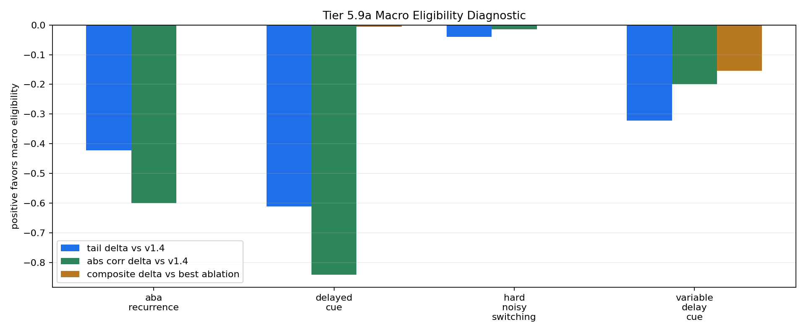

# Tier 5.9a Macro Eligibility Trace Diagnostic Findings

- Generated: `2026-04-28T20:55:15+00:00`
- Status: **FAIL**
- Backend: `nest`
- Steps: `960`
- Seeds: `42, 43, 44`
- Tasks: `delayed_cue,hard_noisy_switching,variable_delay_cue,aba_recurrence`
- Variants: `all`
- Selected baselines: `sign_persistence,online_perceptron,online_logistic_regression,echo_state_network,stdp_only_snn`
- Smoke mode: `False`
- Output directory: `/Users/james/JKS:CRA/controlled_test_output/tier5_9a_20260428_162345`

Tier 5.9a tests whether a host-side macro eligibility trace earns promotion beyond the frozen v1.4 PendingHorizon delayed-credit path.

## Claim Boundary

- This is software diagnostic evidence, not hardware evidence.
- v1.4 remains the frozen architecture baseline unless macro eligibility passes this gate and then survives compact regression.
- A failed run is still useful: it means the mechanism is not yet earned, not that existing CRA evidence regressed.

## Task Comparisons

| Task | v1.4 tail | Macro tail | Tail delta | Corr delta | Recovery delta | Best ablation | Macro-ablation delta | External median tail edge | Trace active steps | Matured updates |
| --- | ---: | ---: | ---: | ---: | ---: | --- | ---: | ---: | ---: | ---: |
| aba_recurrence | 1 | 0.577778 | -0.422222 | -0.600733 | 40 | `macro_eligibility_shuffled` | 0 | -0.344444 | 2880 | 1496 |
| delayed_cue | 1 | 0.388889 | -0.611111 | -0.841925 | None | `macro_eligibility_zero` | -0.00604479 | -0.611111 | 2880 | 1400 |
| hard_noisy_switching | 0.539216 | 0.5 | -0.0392157 | -0.0144141 | 5.2 | `macro_eligibility_shuffled` | 0 | 0.0490196 | 2880 | 2984 |
| variable_delay_cue | 0.758621 | 0.436782 | -0.321839 | -0.198735 | None | `macro_eligibility_zero` | -0.154645 | -0.563218 | 2880 | 2656 |

## Aggregate Matrix

| Task | Model | Family | Group | Tail acc | Tail std | Corr | Recovery | Runtime s | Trace active | Matured updates |
| --- | --- | --- | --- | ---: | ---: | ---: | ---: | ---: | ---: | ---: |
| aba_recurrence | `macro_eligibility` | CRA | candidate | 0.577778 | 0.37466 | -0.0607174 | 2.66667 | 31.2205 | 2880 | 1496 |
| aba_recurrence | `macro_eligibility_shuffled` | CRA | trace_ablation | 0.577778 | 0.37466 | -0.0607174 | 2.66667 | 29.0277 | 2880 | 1496 |
| aba_recurrence | `macro_eligibility_zero` | CRA | trace_ablation | 0.533333 | 0.176383 | 0.0214153 | 42.6667 | 29.6646 | 2880 | 0 |
| aba_recurrence | `v1_4_pending_horizon` | CRA | frozen_baseline | 1 | 0 | 0.66145 | 42.6667 | 56.2295 | 0 | 0 |
| aba_recurrence | `echo_state_network` | reservoir |  | 0.777778 | 0.083887 | 0.295107 | 81.3333 | 0.00997249 | None | None |
| aba_recurrence | `online_logistic_regression` | linear |  | 0.922222 | 0.019245 | 0.551366 | 100 | 0.00532403 | None | None |
| aba_recurrence | `online_perceptron` | linear |  | 1 | 0 | 0.90594 | 24 | 0.00447513 | None | None |
| aba_recurrence | `sign_persistence` | rule |  | 1 | 0 | 0.330966 | 156 | 0.00395956 | None | None |
| aba_recurrence | `stdp_only_snn` | snn_ablation |  | 0.544444 | 0.0509175 | 0.0212287 | 34.6667 | 0.00805246 | None | None |
| delayed_cue | `macro_eligibility` | CRA | candidate | 0.388889 | 0.283497 | -0.020916 | None | 30.0033 | 2880 | 1400 |
| delayed_cue | `macro_eligibility_shuffled` | CRA | trace_ablation | 0.388889 | 0.283497 | -0.020916 | None | 32.3176 | 2880 | 1400 |
| delayed_cue | `macro_eligibility_zero` | CRA | trace_ablation | 0.355556 | 0.0693889 | -0.178429 | None | 31.6375 | 2880 | 0 |
| delayed_cue | `v1_4_pending_horizon` | CRA | frozen_baseline | 1 | 0 | 0.862841 | None | 30.2505 | 0 | 0 |
| delayed_cue | `echo_state_network` | reservoir |  | 1 | 0 | 0.918552 | None | 0.0121383 | None | None |
| delayed_cue | `online_logistic_regression` | linear |  | 1 | 0 | 0.977681 | None | 0.00612871 | None | None |
| delayed_cue | `online_perceptron` | linear |  | 1 | 0 | 0.991632 | None | 0.00478257 | None | None |
| delayed_cue | `sign_persistence` | rule |  | 0 | 0 | -1 | None | 0.00628271 | None | None |
| delayed_cue | `stdp_only_snn` | snn_ablation |  | 0.533333 | 0.0333333 | 0.0562244 | None | 0.00880174 | None | None |
| hard_noisy_switching | `macro_eligibility` | CRA | candidate | 0.5 | 0.0588235 | 0.0688643 | 23.7143 | 36.436 | 2880 | 2984 |
| hard_noisy_switching | `macro_eligibility_shuffled` | CRA | trace_ablation | 0.5 | 0.0588235 | 0.0688643 | 23.7143 | 29.0905 | 2880 | 2984 |
| hard_noisy_switching | `macro_eligibility_zero` | CRA | trace_ablation | 0.392157 | 0.0849045 | 0.0224929 | 39.6143 | 29.6896 | 2880 | 0 |
| hard_noisy_switching | `v1_4_pending_horizon` | CRA | frozen_baseline | 0.539216 | 0.0898544 | 0.0832784 | 28.9143 | 95.7102 | 0 | 0 |
| hard_noisy_switching | `echo_state_network` | reservoir |  | 0.480392 | 0.0679236 | -0.0111828 | 30.2 | 0.0107972 | None | None |
| hard_noisy_switching | `online_logistic_regression` | linear |  | 0.45098 | 0.150929 | -0.0464179 | 34 | 0.00561557 | None | None |
| hard_noisy_switching | `online_perceptron` | linear |  | 0.539216 | 0.0339618 | 0.107485 | 26.6286 | 0.00501032 | None | None |
| hard_noisy_switching | `sign_persistence` | rule |  | 0.441176 | 0.0778162 | -0.0123528 | 26.0286 | 0.00396064 | None | None |
| hard_noisy_switching | `stdp_only_snn` | snn_ablation |  | 0.411765 | 0.0588235 | -0.00465172 | 41.7857 | 0.00814912 | None | None |
| variable_delay_cue | `macro_eligibility` | CRA | candidate | 0.436782 | 0.421386 | -0.428823 | None | 33.8261 | 2880 | 2656 |
| variable_delay_cue | `macro_eligibility_shuffled` | CRA | trace_ablation | 0.436782 | 0.421386 | -0.428823 | None | 32.4512 | 2880 | 2656 |
| variable_delay_cue | `macro_eligibility_zero` | CRA | trace_ablation | 0.655172 | 0.182466 | 0.173841 | None | 69.7776 | 2880 | 0 |
| variable_delay_cue | `v1_4_pending_horizon` | CRA | frozen_baseline | 0.758621 | 0.215345 | 0.627558 | None | 30.7135 | 0 | 0 |
| variable_delay_cue | `echo_state_network` | reservoir |  | 1 | 0 | 0.912006 | None | 0.0198523 | None | None |
| variable_delay_cue | `online_logistic_regression` | linear |  | 1 | 0 | 0.976007 | None | 0.0139594 | None | None |
| variable_delay_cue | `online_perceptron` | linear |  | 1 | 0 | 0.988753 | None | 0.0103818 | None | None |
| variable_delay_cue | `sign_persistence` | rule |  | 0 | 0 | -1 | None | 0.00892379 | None | None |
| variable_delay_cue | `stdp_only_snn` | snn_ablation |  | 0.54023 | 0.0199086 | -0.0259333 | None | 0.0157593 | None | None |

## Criteria

| Criterion | Value | Rule | Pass | Note |
| --- | --- | --- | --- | --- |
| full variant/baseline/task/seed matrix completed | 108 | == 108 | yes |  |
| feedback timing has no leakage violations | 0 | == 0 | yes |  |
| macro trace is active | 11520 | > 0 | yes |  |
| macro trace contributes to matured updates | 8536 | > 0 | yes |  |
| delayed_cue nonregression versus v1.4 | -0.611111 | >= -0.02 | no | Macro eligibility must not damage the known delayed-cue behavior. |
| hard_noisy_switching improves or reduces variance | {'tail_delta': -0.039215686274509776, 'recovery_delta': 5.199999999999999, 'variance_reduction': 0.031030895979526282} | any >= {'tail': 0.01, 'recovery': 1.0, 'variance': 0.01} | yes | This is the main nonstationary/adaptive credit-assignment gate. |
| variable_delay_cue shows delay-robust benefit | {'tail_delta': -0.3218390804597702, 'corr_delta': -0.19873534138513882, 'ablation_delta': -0.1546453768678756} | any >= {'tail': 0.01, 'corr': 0.01, 'ablation': 0.01} | no | Macro eligibility should help as delay varies, not just match a fixed horizon. |
| trace ablations are worse than normal trace | -0.154645 | >= 0.01 | no | Shuffled/zero controls must not explain the candidate improvement. |

Failure: Failed criteria: delayed_cue nonregression versus v1.4, variable_delay_cue shows delay-robust benefit, trace ablations are worse than normal trace

## Artifacts

- `tier5_9a_results.json`: machine-readable manifest.
- `tier5_9a_summary.csv`: aggregate task/model metrics.
- `tier5_9a_comparisons.csv`: macro-vs-v1.4/ablation/baseline comparison table.
- `tier5_9a_fairness_contract.json`: predeclared comparison and leakage constraints.
- `tier5_9a_macro_edges.png`: macro eligibility edge plot.
- `*_timeseries.csv`: per-task/per-model/per-seed traces.

## Plot

