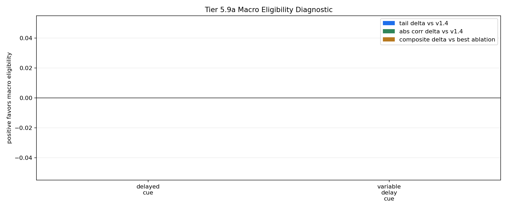

# Tier 5.9b Residual Macro Eligibility Repair Findings

- Generated: `2026-04-28T21:17:00+00:00`
- Status: **PASS**
- Backend: `mock`
- Steps: `160`
- Seeds: `42`
- Tasks: `delayed_cue,variable_delay_cue`
- Repair residual scale: `0.1`
- Repair trace clip: `1.0`
- Repair decay: `0.92`
- Output directory: `/Users/james/JKS:CRA/controlled_test_output/tier5_9b_20260428_171657`

Tier 5.9b tests the narrow repair after 5.9a failed: keep the v1.4 PendingHorizon feature and add only a bounded macro-trace residual.

## Claim Boundary

- This is software diagnostic evidence, not hardware evidence.
- A pass would authorize compact regression only, not SpiNNaker/custom-C migration.
- A fail means the macro-credit mechanism remains unearned; v1.4 stays frozen.

## Task Comparisons

| Task | v1.4 tail | Residual tail | Tail delta | Corr delta | Recovery delta | Best ablation | Residual-ablation delta | Trace active | Matured updates |
| --- | ---: | ---: | ---: | ---: | ---: | --- | ---: | ---: | ---: |
| delayed_cue | 1 | 1 | 0 | 0 | None | `macro_eligibility_shuffled` | 0 | 160 | 88 |
| variable_delay_cue | 1 | 1 | 0 | 0 | None | `macro_eligibility_shuffled` | 0 | 160 | 128 |

## Aggregate Matrix

| Task | Model | Family | Group | Tail acc | Corr | Recovery | Runtime s | Matured updates |
| --- | --- | --- | --- | ---: | ---: | ---: | ---: | ---: |
| delayed_cue | `macro_eligibility` | CRA | candidate | 1 | 0.896184 | None | 0.382825 | 88 |
| delayed_cue | `macro_eligibility_shuffled` | CRA | trace_ablation | 1 | 0.896184 | None | 0.396868 | 88 |
| delayed_cue | `macro_eligibility_zero` | CRA | trace_ablation | 1 | 0.896184 | None | 0.388728 | 0 |
| delayed_cue | `v1_4_pending_horizon` | CRA | frozen_baseline | 1 | 0.896184 | None | 0.447033 | 0 |
| delayed_cue | `online_perceptron` | linear |  | 1 | 0.948683 | None | 0.000912041 | None |
| delayed_cue | `sign_persistence` | rule |  | 0 | -1 | None | 0.000791208 | None |
| variable_delay_cue | `macro_eligibility` | CRA | candidate | 1 | 0.616826 | None | 0.391918 | 128 |
| variable_delay_cue | `macro_eligibility_shuffled` | CRA | trace_ablation | 1 | 0.616826 | None | 0.384703 | 128 |
| variable_delay_cue | `macro_eligibility_zero` | CRA | trace_ablation | 1 | 0.616826 | None | 0.386182 | 0 |
| variable_delay_cue | `v1_4_pending_horizon` | CRA | frozen_baseline | 1 | 0.616826 | None | 0.381936 | 0 |
| variable_delay_cue | `online_perceptron` | linear |  | 1 | 0.945751 | None | 0.000866917 | None |
| variable_delay_cue | `sign_persistence` | rule |  | 0 | -1 | None | 0.000902583 | None |

## Criteria

| Criterion | Value | Rule | Pass | Note |
| --- | --- | --- | --- | --- |
| full variant/baseline/task/seed matrix completed | 12 | == 12 | yes |  |
| feedback timing has no leakage violations | 0 | == 0 | yes |  |
| macro trace is active | 320 | > 0 | yes |  |
| macro trace contributes to matured updates | 216 | > 0 | yes |  |

## Artifacts

- `tier5_9b_results.json`: machine-readable manifest.
- `tier5_9b_report.md`: human findings and claim boundary.
- `tier5_9b_summary.csv`: aggregate task/model metrics.
- `tier5_9b_comparisons.csv`: repair-vs-v1.4/ablation/baseline table.
- `tier5_9b_fairness_contract.json`: predeclared comparison and leakage constraints.
- `tier5_9b_macro_edges.png`: residual macro edge plot.
- `*_timeseries.csv`: per-run traces.

