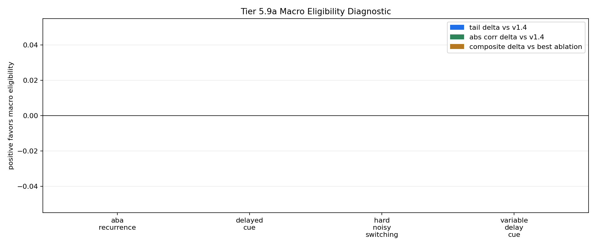

# Tier 5.9b Residual Macro Eligibility Repair Findings

- Generated: `2026-04-28T21:42:49+00:00`
- Status: **FAIL**
- Backend: `nest`
- Steps: `960`
- Seeds: `42, 43, 44`
- Tasks: `delayed_cue,hard_noisy_switching,variable_delay_cue,aba_recurrence`
- Repair residual scale: `0.1`
- Repair trace clip: `1.0`
- Repair decay: `0.92`
- Output directory: `<repo>/controlled_test_output/tier5_9b_20260428_171707`

Tier 5.9b tests the narrow repair after 5.9a failed: keep the v1.4 PendingHorizon feature and add only a bounded macro-trace residual.

## Claim Boundary

- This is software diagnostic evidence, not hardware evidence.
- A pass would authorize compact regression only, not SpiNNaker/custom-C migration.
- A fail means the macro-credit mechanism remains unearned; v1.4 stays frozen.

## Task Comparisons

| Task | v1.4 tail | Residual tail | Tail delta | Corr delta | Recovery delta | Best ablation | Residual-ablation delta | Trace active | Matured updates |
| --- | ---: | ---: | ---: | ---: | ---: | --- | ---: | ---: | ---: |
| aba_recurrence | 1 | 1 | 0 | 0 | 0 | `macro_eligibility_shuffled` | 0 | 2880 | 1496 |
| delayed_cue | 1 | 1 | 0 | 0 | None | `macro_eligibility_shuffled` | 0 | 2880 | 1400 |
| hard_noisy_switching | 0.539216 | 0.539216 | 0 | 0 | 0 | `macro_eligibility_shuffled` | 0 | 2880 | 2984 |
| variable_delay_cue | 0.758621 | 0.758621 | 0 | 0 | None | `macro_eligibility_shuffled` | 0 | 2880 | 2656 |

## Aggregate Matrix

| Task | Model | Family | Group | Tail acc | Corr | Recovery | Runtime s | Matured updates |
| --- | --- | --- | --- | ---: | ---: | ---: | ---: | ---: |
| aba_recurrence | `macro_eligibility` | CRA | candidate | 1 | 0.66145 | 42.6667 | 28.77 | 1496 |
| aba_recurrence | `macro_eligibility_shuffled` | CRA | trace_ablation | 1 | 0.66145 | 42.6667 | 29.1466 | 1496 |
| aba_recurrence | `macro_eligibility_zero` | CRA | trace_ablation | 1 | 0.66145 | 42.6667 | 28.9942 | 0 |
| aba_recurrence | `v1_4_pending_horizon` | CRA | frozen_baseline | 1 | 0.66145 | 42.6667 | 28.61 | 0 |
| aba_recurrence | `echo_state_network` | reservoir |  | 0.777778 | 0.295107 | 81.3333 | 0.0105188 | None |
| aba_recurrence | `online_logistic_regression` | linear |  | 0.922222 | 0.551366 | 100 | 0.00559174 | None |
| aba_recurrence | `online_perceptron` | linear |  | 1 | 0.90594 | 24 | 0.0046326 | None |
| aba_recurrence | `sign_persistence` | rule |  | 1 | 0.330966 | 156 | 0.00409272 | None |
| aba_recurrence | `stdp_only_snn` | snn_ablation |  | 0.544444 | 0.0212287 | 34.6667 | 0.00799908 | None |
| delayed_cue | `macro_eligibility` | CRA | candidate | 1 | 0.862841 | None | 29.4624 | 1400 |
| delayed_cue | `macro_eligibility_shuffled` | CRA | trace_ablation | 1 | 0.862841 | None | 31.5167 | 1400 |
| delayed_cue | `macro_eligibility_zero` | CRA | trace_ablation | 1 | 0.862841 | None | 29.927 | 0 |
| delayed_cue | `v1_4_pending_horizon` | CRA | frozen_baseline | 1 | 0.862841 | None | 28.9613 | 0 |
| delayed_cue | `echo_state_network` | reservoir |  | 1 | 0.918552 | None | 0.0117456 | None |
| delayed_cue | `online_logistic_regression` | linear |  | 1 | 0.977681 | None | 0.00593782 | None |
| delayed_cue | `online_perceptron` | linear |  | 1 | 0.991632 | None | 0.00505679 | None |
| delayed_cue | `sign_persistence` | rule |  | 0 | -1 | None | 0.00470071 | None |
| delayed_cue | `stdp_only_snn` | snn_ablation |  | 0.533333 | 0.0562244 | None | 0.00887603 | None |
| hard_noisy_switching | `macro_eligibility` | CRA | candidate | 0.539216 | 0.0832784 | 28.9143 | 64.4891 | 2984 |
| hard_noisy_switching | `macro_eligibility_shuffled` | CRA | trace_ablation | 0.539216 | 0.0832784 | 28.9143 | 31.4458 | 2984 |
| hard_noisy_switching | `macro_eligibility_zero` | CRA | trace_ablation | 0.539216 | 0.0832784 | 28.9143 | 28.7046 | 0 |
| hard_noisy_switching | `v1_4_pending_horizon` | CRA | frozen_baseline | 0.539216 | 0.0832784 | 28.9143 | 35.5844 | 0 |
| hard_noisy_switching | `echo_state_network` | reservoir |  | 0.480392 | -0.0111828 | 30.2 | 0.010077 | None |
| hard_noisy_switching | `online_logistic_regression` | linear |  | 0.45098 | -0.0464179 | 34 | 0.00537553 | None |
| hard_noisy_switching | `online_perceptron` | linear |  | 0.539216 | 0.107485 | 26.6286 | 0.00506669 | None |
| hard_noisy_switching | `sign_persistence` | rule |  | 0.441176 | -0.0123528 | 26.0286 | 0.00412268 | None |
| hard_noisy_switching | `stdp_only_snn` | snn_ablation |  | 0.411765 | -0.00465172 | 41.7857 | 0.00856054 | None |
| variable_delay_cue | `macro_eligibility` | CRA | candidate | 0.758621 | 0.627558 | None | 29.9645 | 2656 |
| variable_delay_cue | `macro_eligibility_shuffled` | CRA | trace_ablation | 0.758621 | 0.627558 | None | 28.7447 | 2656 |
| variable_delay_cue | `macro_eligibility_zero` | CRA | trace_ablation | 0.758621 | 0.627558 | None | 28.8842 | 0 |
| variable_delay_cue | `v1_4_pending_horizon` | CRA | frozen_baseline | 0.758621 | 0.627558 | None | 29.0963 | 0 |
| variable_delay_cue | `echo_state_network` | reservoir |  | 1 | 0.912006 | None | 0.0104083 | None |
| variable_delay_cue | `online_logistic_regression` | linear |  | 1 | 0.976007 | None | 0.00582247 | None |
| variable_delay_cue | `online_perceptron` | linear |  | 1 | 0.988753 | None | 0.00535706 | None |
| variable_delay_cue | `sign_persistence` | rule |  | 0 | -1 | None | 0.00479611 | None |
| variable_delay_cue | `stdp_only_snn` | snn_ablation |  | 0.54023 | -0.0259333 | None | 0.00831735 | None |

## Criteria

| Criterion | Value | Rule | Pass | Note |
| --- | --- | --- | --- | --- |
| full variant/baseline/task/seed matrix completed | 108 | == 108 | yes |  |
| feedback timing has no leakage violations | 0 | == 0 | yes |  |
| macro trace is active | 11520 | > 0 | yes |  |
| macro trace contributes to matured updates | 8536 | > 0 | yes |  |
| delayed_cue nonregression versus v1.4 | 0 | >= -0.02 | yes | Macro eligibility must not damage the known delayed-cue behavior. |
| hard_noisy_switching improves or reduces variance | {'tail_delta': 0.0, 'recovery_delta': 0.0, 'variance_reduction': 0.0} | any >= {'tail': 0.0, 'recovery': 1.0, 'variance': 0.01} | yes | This is the main nonstationary/adaptive credit-assignment gate. |
| variable_delay_cue shows delay-robust benefit | {'tail_delta': 0.0, 'corr_delta': 0.0, 'ablation_delta': 0.0} | any >= {'tail': 0.0, 'corr': 0.0, 'ablation': 0.005} | yes | Macro eligibility should help as delay varies, not just match a fixed horizon. |
| trace ablations are worse than normal trace | 0 | >= 0.005 | no | Shuffled/zero controls must not explain the candidate improvement. |

Failure: Failed criteria: trace ablations are worse than normal trace

## Artifacts

- `tier5_9b_results.json`: machine-readable manifest.
- `tier5_9b_report.md`: human findings and claim boundary.
- `tier5_9b_summary.csv`: aggregate task/model metrics.
- `tier5_9b_comparisons.csv`: repair-vs-v1.4/ablation/baseline table.
- `tier5_9b_fairness_contract.json`: predeclared comparison and leakage constraints.
- `tier5_9b_macro_edges.png`: residual macro edge plot.
- `*_timeseries.csv`: per-run traces.

