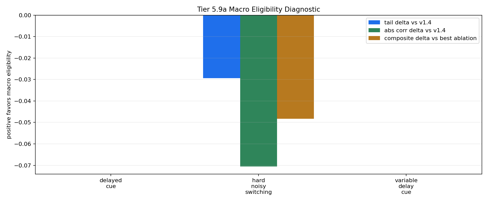

# Tier 5.9b Residual Macro Eligibility Repair Findings

- Generated: `2026-04-28T22:01:31+00:00`
- Status: **FAIL**
- Backend: `nest`
- Steps: `960`
- Seeds: `42, 43, 44`
- Tasks: `delayed_cue,hard_noisy_switching,variable_delay_cue`
- Repair residual scale: `0.5`
- Repair trace clip: `1.0`
- Repair decay: `0.92`
- Output directory: `<repo>/controlled_test_output/tier5_9b_20260428_174327`

Tier 5.9b tests the narrow repair after 5.9a failed: keep the v1.4 PendingHorizon feature and add only a bounded macro-trace residual.

## Claim Boundary

- This is software diagnostic evidence, not hardware evidence.
- A pass would authorize compact regression only, not SpiNNaker/custom-C migration.
- A fail means the macro-credit mechanism remains unearned; v1.4 stays frozen.

## Task Comparisons

| Task | v1.4 tail | Residual tail | Tail delta | Corr delta | Recovery delta | Best ablation | Residual-ablation delta | Trace active | Matured updates |
| --- | ---: | ---: | ---: | ---: | ---: | --- | ---: | ---: | ---: |
| delayed_cue | 1 | 1 | 0 | 0 | None | `macro_eligibility_shuffled` | 0 | 2880 | 1400 |
| hard_noisy_switching | 0.539216 | 0.509804 | -0.0294118 | -0.0705717 | -0.614286 | `macro_eligibility_zero` | -0.0482832 | 2880 | 2984 |
| variable_delay_cue | 0.758621 | 0.758621 | 0 | 0 | None | `macro_eligibility_shuffled` | 0 | 2880 | 2656 |

## Aggregate Matrix

| Task | Model | Family | Group | Tail acc | Corr | Recovery | Runtime s | Matured updates |
| --- | --- | --- | --- | ---: | ---: | ---: | ---: | ---: |
| delayed_cue | `macro_eligibility` | CRA | candidate | 1 | 0.862841 | None | 31.2409 | 1400 |
| delayed_cue | `macro_eligibility_shuffled` | CRA | trace_ablation | 1 | 0.862841 | None | 29.3745 | 1400 |
| delayed_cue | `macro_eligibility_zero` | CRA | trace_ablation | 1 | 0.862841 | None | 30.3035 | 0 |
| delayed_cue | `v1_4_pending_horizon` | CRA | frozen_baseline | 1 | 0.862841 | None | 29.3844 | 0 |
| delayed_cue | `sign_persistence` | rule |  | 0 | -1 | None | 0.00411375 | None |
| hard_noisy_switching | `macro_eligibility` | CRA | candidate | 0.509804 | 0.0127068 | 29.5286 | 29.5321 | 2984 |
| hard_noisy_switching | `macro_eligibility_shuffled` | CRA | trace_ablation | 0.509804 | 0.0127068 | 29.5286 | 29.6297 | 2984 |
| hard_noisy_switching | `macro_eligibility_zero` | CRA | trace_ablation | 0.539216 | 0.0832784 | 28.9143 | 29.6492 | 0 |
| hard_noisy_switching | `v1_4_pending_horizon` | CRA | frozen_baseline | 0.539216 | 0.0832784 | 28.9143 | 29.4294 | 0 |
| hard_noisy_switching | `sign_persistence` | rule |  | 0.441176 | -0.0123528 | 26.0286 | 0.00432721 | None |
| variable_delay_cue | `macro_eligibility` | CRA | candidate | 0.758621 | 0.627558 | None | 29.3083 | 2656 |
| variable_delay_cue | `macro_eligibility_shuffled` | CRA | trace_ablation | 0.758621 | 0.627558 | None | 30.5725 | 2656 |
| variable_delay_cue | `macro_eligibility_zero` | CRA | trace_ablation | 0.758621 | 0.627558 | None | 29.8368 | 0 |
| variable_delay_cue | `v1_4_pending_horizon` | CRA | frozen_baseline | 0.758621 | 0.627558 | None | 32.0169 | 0 |
| variable_delay_cue | `sign_persistence` | rule |  | 0 | -1 | None | 0.00444104 | None |

## Criteria

| Criterion | Value | Rule | Pass | Note |
| --- | --- | --- | --- | --- |
| full variant/baseline/task/seed matrix completed | 45 | == 45 | yes |  |
| feedback timing has no leakage violations | 0 | == 0 | yes |  |
| macro trace is active | 8640 | > 0 | yes |  |
| macro trace contributes to matured updates | 7040 | > 0 | yes |  |
| delayed_cue nonregression versus v1.4 | 0 | >= -0.02 | yes | Macro eligibility must not damage the known delayed-cue behavior. |
| hard_noisy_switching improves or reduces variance | {'tail_delta': -0.02941176470588236, 'recovery_delta': -0.6142857142857139, 'variance_reduction': 0.07287353512100789} | any >= {'tail': 0.0, 'recovery': 1.0, 'variance': 0.01} | yes | This is the main nonstationary/adaptive credit-assignment gate. |
| variable_delay_cue shows delay-robust benefit | {'tail_delta': 0.0, 'corr_delta': 0.0, 'ablation_delta': 0.0} | any >= {'tail': 0.0, 'corr': 0.0, 'ablation': 0.005} | yes | Macro eligibility should help as delay varies, not just match a fixed horizon. |
| trace ablations are worse than normal trace | -0.0482832 | >= 0.005 | no | Shuffled/zero controls must not explain the candidate improvement. |

Failure: Failed criteria: trace ablations are worse than normal trace

## Artifacts

- `tier5_9b_results.json`: machine-readable manifest.
- `tier5_9b_report.md`: human findings and claim boundary.
- `tier5_9b_summary.csv`: aggregate task/model metrics.
- `tier5_9b_comparisons.csv`: repair-vs-v1.4/ablation/baseline table.
- `tier5_9b_fairness_contract.json`: predeclared comparison and leakage constraints.
- `tier5_9b_macro_edges.png`: residual macro edge plot.
- `*_timeseries.csv`: per-run traces.

