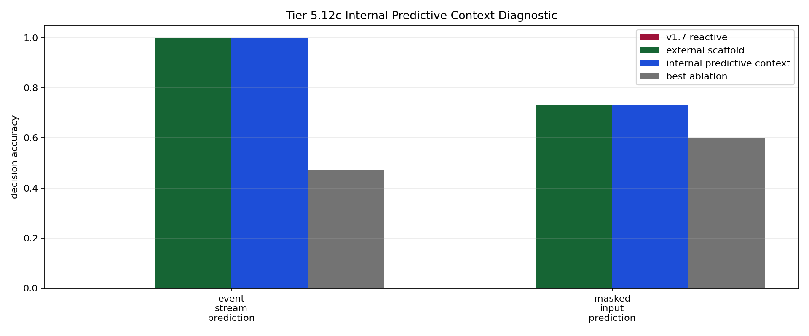

# Tier 5.12c Internal Predictive Context Mechanism Findings

- Generated: `2026-04-29T23:03:31+00:00`
- Status: **PASS**
- Steps: `180`
- Seeds: `42`
- Tasks: `masked_input_prediction,event_stream_prediction`
- Variants: `all`
- Selected standard baselines: `sign_persistence,online_perceptron`
- Backend: `mock`
- Smoke mode: `True`
- Output directory: `/Users/james/JKS:CRA/controlled_test_output/tier5_9c_20260429_190257/v2_1_guardrail/v2_0_compact_regression_gate/v1_8_compact_regression/predictive_context_guardrail`

Tier 5.12c tests whether CRA can store a visible causal predictive precursor before feedback arrives and use it later at a decision point.

## Claim Boundary

- This is software mechanism evidence, not hardware evidence.
- This is visible predictive-context binding, not full world modeling or hidden-state inference.
- This does not prove language grounding, planning, or AGI capability.
- A pass authorizes compact regression/promotion review; it does not automatically freeze v1.8.
- `hidden_regime_switching` is intentionally excluded from the default mechanism run because that needs latent-regime inference, not visible precursor storage.

## Comparisons

| Task | v1.7 acc | Scaffold acc | Internal predictive acc | Best ablation | Ablation acc | Best control | Control acc | Best baseline | Baseline acc | Edge vs v1.7 | Edge vs ablation | Edge vs baseline | Updates | Active steps |
| --- | ---: | ---: | ---: | --- | ---: | --- | ---: | --- | ---: | ---: | ---: | ---: | ---: | ---: |
| event_stream_prediction | 0 | 1 | 1 | `permuted_predictive_context` | 0.470588 | `shuffled_target_control` | 0.411765 | `online_perceptron` | 0.470588 | 1 | 0.529412 | 0.529412 | 17 | 17 |
| masked_input_prediction | 0 | 0.733333 | 0.733333 | `permuted_predictive_context` | 0.6 | `rolling_majority` | 0.6 | `online_perceptron` | 0.333333 | 0.733333 | 0.133333 | 0.4 | 15 | 15 |

## Aggregate Matrix

| Task | Model | Family | Group | Tail acc | All acc | Corr | Runtime s |
| --- | --- | --- | --- | ---: | ---: | ---: | ---: |
| event_stream_prediction | `current_reflex` | predictive_control | None | 0 | 0 | None | 0.000776834 |
| event_stream_prediction | `external_predictive_scaffold` | CRA | external_scaffold | 1 | 1 | 1 | 0.405765 |
| event_stream_prediction | `internal_predictive_context` | CRA | candidate | 1 | 1 | 1 | 0.40675 |
| event_stream_prediction | `no_write_predictive_context` | CRA | predictive_ablation | 0 | 0 | None | 0.458706 |
| event_stream_prediction | `online_perceptron` | linear | None | 0.333333 | 0.470588 | -0.0121614 | 0.00115362 |
| event_stream_prediction | `permuted_predictive_context` | CRA | predictive_ablation | 0.666667 | 0.470588 | -0.042719 | 0.423012 |
| event_stream_prediction | `predictive_memory` | predictive_control | None | 1 | 1 | 1 | 0.000821375 |
| event_stream_prediction | `rolling_majority` | predictive_control | None | 0.666667 | 0.294118 | -0.382518 | 0.000902667 |
| event_stream_prediction | `shuffled_predictive_context` | CRA | predictive_ablation | 0.333333 | 0.352941 | -0.369945 | 0.418798 |
| event_stream_prediction | `shuffled_target_control` | predictive_control | None | 0.666667 | 0.411765 | -0.287879 | 0.000813875 |
| event_stream_prediction | `sign_persistence` | rule | None | 0 | 0.352941 | -0.227273 | 0.00113583 |
| event_stream_prediction | `sign_persistence_control` | predictive_control | None | 0 | 0.352941 | -0.227273 | 0.000841542 |
| event_stream_prediction | `v1_7_reactive` | CRA | frozen_baseline | 0 | 0 | None | 0.407403 |
| event_stream_prediction | `wrong_horizon_control` | predictive_control | None | 0.333333 | 0.411765 | -0.287879 | 0.000864125 |
| event_stream_prediction | `wrong_predictive_context` | CRA | alternate_code_control | 1 | 0.941176 | 0.882735 | 0.407766 |
| masked_input_prediction | `current_reflex` | predictive_control | None | 0 | 0 | None | 0.000757791 |
| masked_input_prediction | `external_predictive_scaffold` | CRA | external_scaffold | 0.75 | 0.733333 | 0.43789 | 0.410905 |
| masked_input_prediction | `internal_predictive_context` | CRA | candidate | 0.75 | 0.733333 | 0.43789 | 0.419364 |
| masked_input_prediction | `no_write_predictive_context` | CRA | predictive_ablation | 0 | 0 | None | 0.426177 |
| masked_input_prediction | `online_perceptron` | linear | None | 0.25 | 0.333333 | -0.210567 | 0.00118637 |
| masked_input_prediction | `permuted_predictive_context` | CRA | predictive_ablation | 0.75 | 0.6 | 0.218555 | 0.460736 |
| masked_input_prediction | `predictive_memory` | predictive_control | None | 1 | 1 | 1 | 0.000841333 |
| masked_input_prediction | `rolling_majority` | predictive_control | None | 0.5 | 0.6 | 0.408248 | 0.00101508 |
| masked_input_prediction | `shuffled_predictive_context` | CRA | predictive_ablation | 0.75 | 0.4 | -0.169211 | 0.476072 |
| masked_input_prediction | `shuffled_target_control` | predictive_control | None | 0.5 | 0.6 | 0.166667 | 0.00102421 |
| masked_input_prediction | `sign_persistence` | rule | None | 0.25 | 0.333333 | -0.288675 | 0.00114683 |
| masked_input_prediction | `sign_persistence_control` | predictive_control | None | 0.25 | 0.333333 | -0.288675 | 0.000890625 |
| masked_input_prediction | `v1_7_reactive` | CRA | frozen_baseline | 0 | 0 | None | 0.413588 |
| masked_input_prediction | `wrong_horizon_control` | predictive_control | None | 0.25 | 0.466667 | -0.111111 | 0.000899666 |
| masked_input_prediction | `wrong_predictive_context` | CRA | alternate_code_control | 1 | 0.933333 | 0.872872 | 0.431575 |

## Criteria

| Criterion | Value | Rule | Pass | Note |
| --- | --- | --- | --- | --- |
| full variant/baseline/control/task/seed matrix completed | 30 | == 30 | yes |  |
| feedback timing has no leakage violations | 0 | == 0 | yes |  |
| task remains shortcut-ambiguous | True | == True | yes |  |
| candidate predictive context feature is active | 32 | > 0 | yes |  |
| candidate receives predictive-context writes | 32 | > 0 | yes |  |
| metadata exposes precursor writes before decisions | 32 | > 0 | yes |  |

## Artifacts

- `tier5_12c_results.json`: machine-readable manifest.
- `tier5_12c_report.md`: human findings and claim boundary.
- `tier5_12c_summary.csv`: aggregate task/model metrics.
- `tier5_12c_comparisons.csv`: predictive-context comparison table.
- `tier5_12c_fairness_contract.json`: predeclared comparison/leakage rules.
- `tier5_12c_predictive_context.png`: comparison plot.
- `*_timeseries.csv`: per-task/per-model/per-seed traces.

