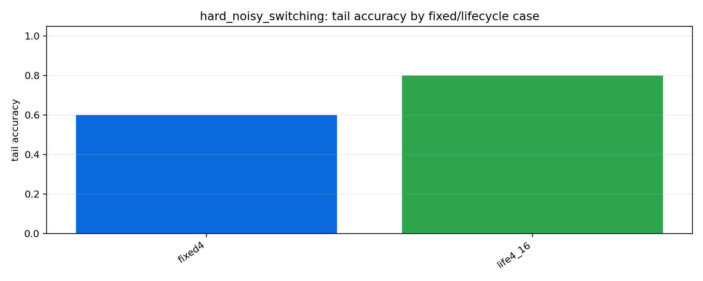
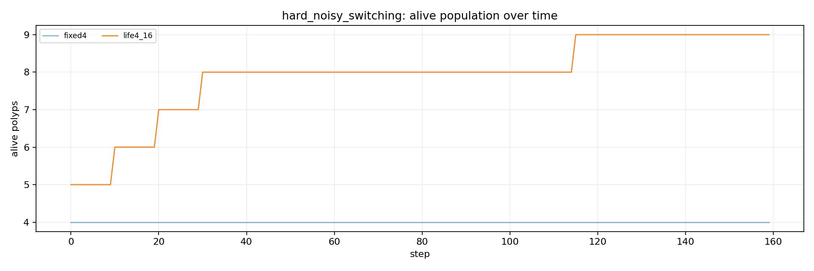

# Tier 6.1 Lifecycle / Self-Scaling Findings

- Generated: `2026-04-28T05:21:00+00:00`
- Backend: `mock`
- Status: **PASS**
- Output directory: `/Users/james/Kimi_Agent_Spinnaker Neuromorphic Design/controlled_test_output/tier6_1_20260428_012059`

Tier 6.1 asks whether CRA's lifecycle/self-scaling machinery adds measurable value over fixed-N CRA controls on identical hard/adaptive streams.

## Claim Boundary

- PASS would support a software-only lifecycle/self-scaling claim for the tested tasks and seeds.
- PASS is not hardware lifecycle evidence, not on-chip birth/death, not continuous/custom-C runtime evidence, and not external-baseline superiority.
- FAIL means the organism/ecology claim must narrow until repaired by later mechanisms or sham controls.

## Summary

- expected_runs: `2`
- actual_runs: `2`
- fixed_births_sum: `0`
- lifecycle_births_sum: `5`
- lifecycle_deaths_sum: `0`
- lineage_integrity_failures: `0`
- advantage_regime_count: `1`
- advantage_tasks: `['hard_noisy_switching']`

## Criteria

| Criterion | Value | Rule | Pass |
| --- | ---: | --- | --- |
| matrix completed | 2 | == 2 | yes |
| fixed controls have no births | 0 | == 0 | yes |
| fixed controls have no deaths | 0 | == 0 | yes |
| lifecycle produces real births | 5 | >= 1 | yes |
| lineage integrity remains clean | 0 | == 0 | yes |
| no aggregate extinction | 0 | == 0 | yes |
| lifecycle advantage regimes | 1 | >= 0 | yes |

## Case Aggregates

| Task | Case | Group | Tail Acc | Abs Corr | Recovery | Births | Deaths | Mean Alive | Lineage Fails |
| --- | --- | --- | ---: | ---: | ---: | ---: | ---: | ---: | ---: |
| `hard_noisy_switching` | `fixed4` | `fixed` | 0.6 | 0.249197 | 9.66667 | 0 | 0 | 4 | 0 |
| `hard_noisy_switching` | `life4_16` | `lifecycle` | 0.8 | 0.274949 | 7.33333 | 5 | 0 | 7.90625 | 0 |

## Lifecycle vs Fixed Comparisons

| Task | Lifecycle | Fixed Pair | Tail Delta | Corr Delta | Recovery Improvement | Efficiency Delta | Advantage | Reason |
| --- | --- | --- | ---: | ---: | ---: | ---: | --- | --- |
| `hard_noisy_switching` | `life4_16` | `fixed4` | 0.2 | 0.0257521 | 2.33333 | -0.0180205 | yes | `tail_accuracy,all_accuracy,prediction_correlation,switch_recovery` |

## Artifacts

- `tier6_1_results.json`: machine-readable manifest.
- `tier6_1_summary.csv`: aggregate fixed/lifecycle metrics.
- `tier6_1_comparisons.csv`: lifecycle-vs-fixed deltas.
- `tier6_1_lifecycle_events.csv`: birth/death/handoff event log.
- `tier6_1_lineage_final.csv`: final lineage audit table.
- `*_timeseries.csv`: per-task/per-case/per-seed traces.

## Plots

