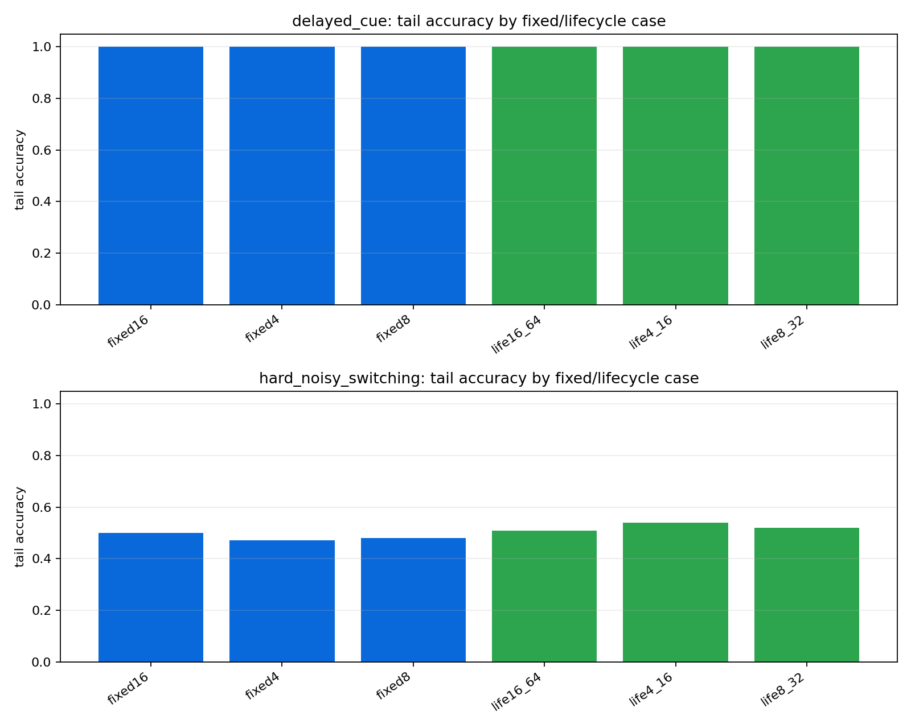
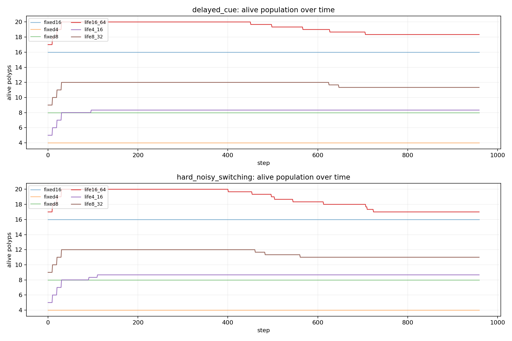

# Tier 6.1 Lifecycle / Self-Scaling Findings

- Generated: `2026-04-28T05:59:44+00:00`
- Backend: `nest`
- Status: **PASS**
- Output directory: `<repo>/controlled_test_output/tier6_1_20260428_012109`

Tier 6.1 asks whether CRA's lifecycle/self-scaling machinery adds measurable value over fixed-N CRA controls on identical hard/adaptive streams.

## Claim Boundary

- PASS would support a software-only lifecycle/self-scaling claim for the tested tasks and seeds.
- PASS is not hardware lifecycle evidence, not on-chip birth/death, not continuous/custom-C runtime evidence, and not external-baseline superiority.
- FAIL means the organism/ecology claim must narrow until repaired by later mechanisms or sham controls.

## Summary

- expected_runs: `36`
- actual_runs: `36`
- fixed_births_sum: `0`
- lifecycle_births_sum: `75`
- lifecycle_deaths_sum: `0`
- lineage_integrity_failures: `0`
- advantage_regime_count: `2`
- advantage_tasks: `['hard_noisy_switching']`

## Criteria

| Criterion | Value | Rule | Pass |
| --- | ---: | --- | --- |
| matrix completed | 36 | == 36 | yes |
| fixed controls have no births | 0 | == 0 | yes |
| fixed controls have no deaths | 0 | == 0 | yes |
| lifecycle produces real births | 75 | >= 1 | yes |
| lineage integrity remains clean | 0 | == 0 | yes |
| no aggregate extinction | 0 | == 0 | yes |
| lifecycle advantage regimes | 2 | >= 1 | yes |

## Case Aggregates

| Task | Case | Group | Tail Acc | Abs Corr | Recovery | Births | Deaths | Mean Alive | Lineage Fails |
| --- | --- | --- | ---: | ---: | ---: | ---: | ---: | ---: | ---: |
| `delayed_cue` | `fixed16` | `fixed` | 1 | 0.879138 | None | 0 | 0 | 16 | 0 |
| `delayed_cue` | `fixed4` | `fixed` | 1 | 0.880023 | None | 0 | 0 | 4 | 0 |
| `delayed_cue` | `fixed8` | `fixed` | 1 | 0.879083 | None | 0 | 0 | 8 | 0 |
| `delayed_cue` | `life16_64` | `lifecycle` | 1 | 0.886472 | None | 12 | 0 | 19.2601 | 0 |
| `delayed_cue` | `life4_16` | `lifecycle` | 1 | 0.889696 | None | 13 | 0 | 8.2375 | 0 |
| `delayed_cue` | `life8_32` | `lifecycle` | 1 | 0.889425 | None | 12 | 0 | 11.7125 | 0 |
| `hard_noisy_switching` | `fixed16` | `fixed` | 0.5 | 0.0695225 | 29.2319 | 0 | 0 | 16 | 0 |
| `hard_noisy_switching` | `fixed4` | `fixed` | 0.470588 | 0.063205 | 39.3478 | 0 | 0 | 4 | 0 |
| `hard_noisy_switching` | `fixed8` | `fixed` | 0.480392 | 0.0650302 | 30.4783 | 0 | 0 | 8 | 0 |
| `hard_noisy_switching` | `life16_64` | `lifecycle` | 0.509804 | 0.0685405 | 30.0435 | 12 | 0 | 18.7274 | 0 |
| `hard_noisy_switching` | `life4_16` | `lifecycle` | 0.539216 | 0.0749826 | 30.6377 | 14 | 0 | 8.53437 | 0 |
| `hard_noisy_switching` | `life8_32` | `lifecycle` | 0.519608 | 0.0768039 | 28 | 12 | 0 | 11.4601 | 0 |

## Lifecycle vs Fixed Comparisons

| Task | Lifecycle | Fixed Pair | Tail Delta | Corr Delta | Recovery Improvement | Efficiency Delta | Advantage | Reason |
| --- | --- | --- | ---: | ---: | ---: | ---: | --- | --- |
| `delayed_cue` | `life16_64` | `fixed16` | 0 | 0.00733318 | None | -0.0005192 | no | `` |
| `delayed_cue` | `life4_16` | `fixed4` | 0 | 0.00967285 | None | -0.00865973 | no | `` |
| `delayed_cue` | `life8_32` | `fixed8` | 0 | 0.0103417 | None | -0.00244223 | no | `` |
| `hard_noisy_switching` | `life16_64` | `fixed16` | 0.00980392 | -0.000982072 | -0.811594 | -0.000267787 | no | `` |
| `hard_noisy_switching` | `life4_16` | `fixed4` | 0.0686275 | 0.0117776 | 8.71014 | -0.0111071 | yes | `tail_accuracy,switch_recovery` |
| `hard_noisy_switching` | `life8_32` | `fixed8` | 0.0392157 | 0.0117738 | 2.47826 | -0.00266864 | yes | `tail_accuracy,switch_recovery` |

## Artifacts

- `tier6_1_results.json`: machine-readable manifest.
- `tier6_1_summary.csv`: aggregate fixed/lifecycle metrics.
- `tier6_1_comparisons.csv`: lifecycle-vs-fixed deltas.
- `tier6_1_lifecycle_events.csv`: birth/death/handoff event log.
- `tier6_1_lineage_final.csv`: final lineage audit table.
- `*_timeseries.csv`: per-task/per-case/per-seed traces.

## Plots

