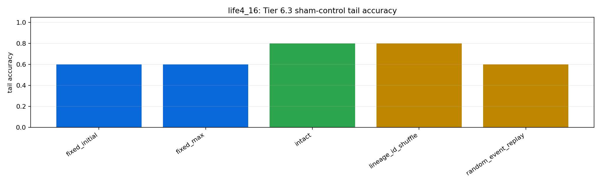
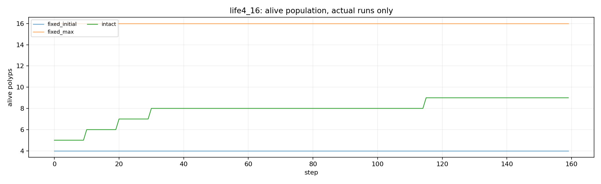

# Tier 6.3 Lifecycle Sham-Control Findings

- Generated: `2026-04-28T16:11:40+00:00`
- Backend: `mock`
- Status: **PASS**
- Output directory: `<repo>/controlled_test_output/tier6_3_20260428_121138`

Tier 6.3 defends the Tier 6.1 lifecycle/self-scaling result against capacity, random-event, bookkeeping, trophic, dopamine, and plasticity sham explanations.

## Claim Boundary

- PASS supports a software-only claim that lifecycle dynamics add value beyond the tested sham explanations.
- PASS is not hardware lifecycle evidence, not on-chip birth/death, not custom-C runtime evidence, and not AGI/compositionality evidence.
- Replay/shuffle controls are audit artifacts, not independently learning biological mechanisms.
- FAIL means the organism/ecology claim must narrow or the lifecycle mechanism needs repair before promotion.

## Summary

- expected_actual_runs: `3`
- actual_runs: `3`
- intact_non_handoff_lifecycle_events_sum: `5`
- fixed_non_handoff_lifecycle_events_sum: `0`
- actual_lineage_integrity_failures: `0`
- performance_control_win_count: `2`
- fixed_max_win_count: `1`
- random_event_replay_win_count: `1`
- lineage_shuffle_detected_count: `1`

## Criteria

| Criterion | Value | Rule | Pass |
| --- | ---: | --- | --- |
| actual-run matrix completed | 3 | == 3 | yes |
| intact lifecycle produces events | 5 | >= 0 | yes |
| fixed capacity controls have no lifecycle events | 0 | == 0 | yes |
| actual-run lineage integrity remains clean | 0 | == 0 | yes |
| no actual-run aggregate extinction | 0 | == 0 | yes |
| all performance sham comparisons emitted | 2 | >= 2 | yes |
| intact beats performance shams | 2 | >= 0 | yes |
| intact beats fixed max-pool capacity controls | 1 | >= 0 | yes |
| event-count replay does not explain advantage | 1 | >= 0 | yes |
| lineage-ID shuffle is detected | 1 | >= 1 | yes |

## Case Aggregates

| Task | Regime | Control | Group | Tail Acc | Abs Corr | Recovery | Events | Mean Alive | Lineage Fails |
| --- | --- | --- | --- | ---: | ---: | ---: | ---: | ---: | ---: |
| `hard_noisy_switching` | `life4_16` | `fixed_initial` | `capacity_control` | 0.6 | 0.249197 | 9.66667 | 0 | 4 | 0 |
| `hard_noisy_switching` | `life4_16` | `fixed_max` | `capacity_control` | 0.6 | 0.248786 | 9.66667 | 0 | 16 | 0 |
| `hard_noisy_switching` | `life4_16` | `intact` | `intact` | 0.8 | 0.274949 | 7.33333 | 5 | 7.90625 | 0 |
| `hard_noisy_switching` | `life4_16` | `lineage_id_shuffle` | `lineage_shuffle` | 0.8 | 0.274949 | 7.33333 | 5 | 7.90625 | 1 |
| `hard_noisy_switching` | `life4_16` | `random_event_replay` | `event_replay_sham` | 0.6 | 0.249197 | 9.66667 | 5 | 4 | 0 |

## Intact Lifecycle vs Sham Controls

| Task | Regime | Control | Tail Delta | Corr Delta | Recovery Improvement | Efficiency Delta | Advantage | Reason |
| --- | --- | --- | ---: | ---: | ---: | ---: | --- | --- |
| `hard_noisy_switching` | `life4_16` | `fixed_initial` | 0.2 | 0.0257521 | 2.33333 | -0.0180205 | yes | `tail_accuracy,all_accuracy,prediction_correlation,switch_recovery` |
| `hard_noisy_switching` | `life4_16` | `fixed_max` | 0.2 | 0.0261628 | 2.33333 | 0.0105905 | yes | `tail_accuracy,all_accuracy,prediction_correlation,switch_recovery,active_population_efficiency` |
| `hard_noisy_switching` | `life4_16` | `lineage_id_shuffle` | 0 | 0 | 0 | 0 | no | `` |
| `hard_noisy_switching` | `life4_16` | `random_event_replay` | 0.2 | 0.0257521 | 2.33333 | -0.0180205 | yes | `tail_accuracy,all_accuracy,prediction_correlation,switch_recovery` |

## Artifacts

- `tier6_3_results.json`: machine-readable manifest.
- `tier6_3_summary.csv`: aggregate intact/control metrics.
- `tier6_3_comparisons.csv`: intact-vs-sham deltas.
- `tier6_3_lifecycle_events.csv`: birth/death/handoff/sham event log.
- `tier6_3_lineage_final.csv`: final lineage audit table.
- `tier6_3_sham_manifest.json`: control definitions and claim boundaries.
- `*_timeseries.csv`: per-task/per-regime/per-control/per-seed traces.

## Plots

