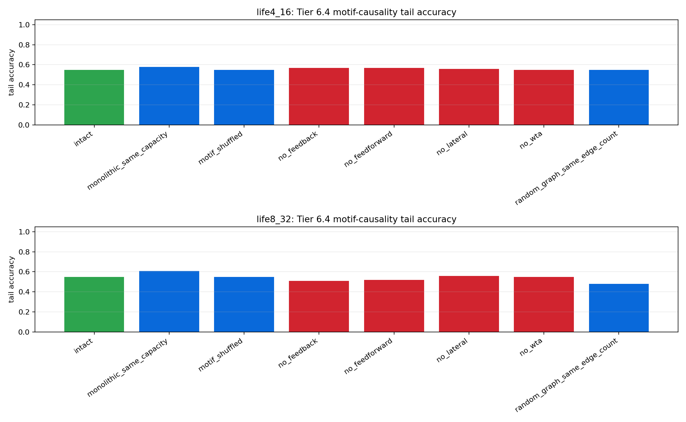
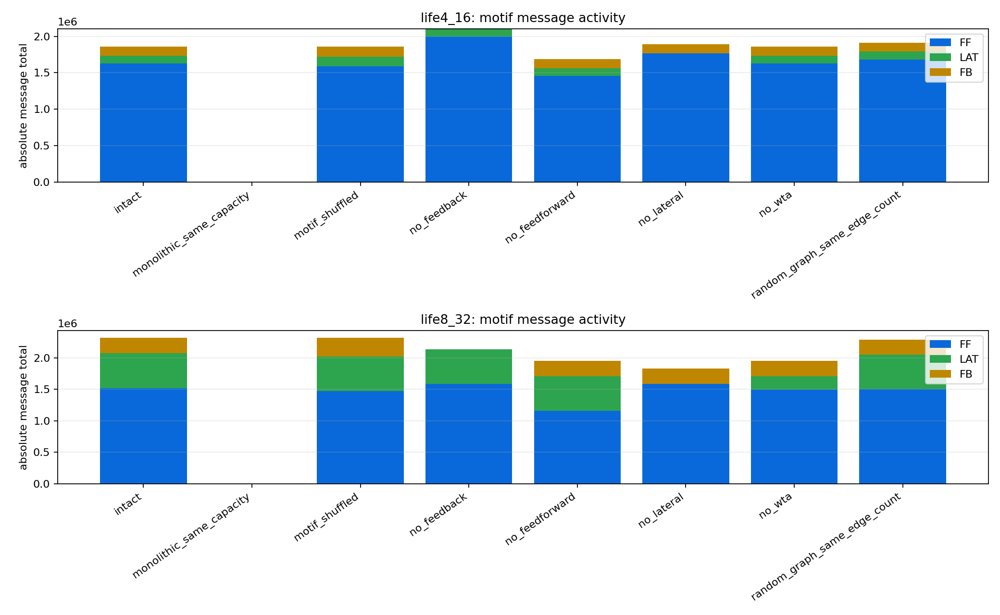

# Tier 6.4 Circuit Motif Causality Findings

- Generated: `2026-04-28T19:54:16+00:00`
- Backend: `nest`
- Status: **PASS**
- Output directory: `<repo>/controlled_test_output/tier6_4_20260428_144354`

Tier 6.4 tests whether seeded reef circuit motifs are causal contributors rather than decorative labels.

## Claim Boundary

- PASS supports a controlled software claim that motif structure contributes measurable value under the tested tasks/seeds.
- PASS is not hardware motif evidence, not custom-C/on-chip evidence, not proof of compositionality, and not proof that every motif is individually optimal.
- The suite seeds a motif-diverse graph before the first outcome feedback because Tier 6.3 traces were feedforward-only and could not honestly ablate absent motifs.
- FAIL means the reef-motif claim must narrow or the motif implementation needs repair before promotion.

## Summary

- expected_runs: `48`
- actual_runs: `48`
- intact_motif_diverse_aggregate_count: `2`
- intact_motif_activity_steps_sum: `1920`
- motif_ablation_loss_count: `4`
- random_or_monolithic_domination_count: `0`
- lineage_integrity_failures: `0`

## Criteria

| Criterion | Value | Rule | Pass |
| --- | ---: | --- | --- |
| matrix completed | 48 | == 48 | yes |
| intact graph is motif-diverse | 2 | == 2 | yes |
| intact motifs active before reward/learning | 1920 | >= 100 | yes |
| lineage integrity remains clean | 0 | == 0 | yes |
| no aggregate extinction | 0 | == 0 | yes |
| all performance motif comparisons emitted | 14 | >= 14 | yes |
| motif ablations produce predicted losses | 4 | >= 3 | yes |
| random/monolithic controls do not dominate intact | 0 | <= 0 | yes |
| motif-shuffled control emitted | 2 | >= 2 | yes |
| WTA/lateral-inhibition ablation emitted | 2 | >= 2 | yes |

## Case Aggregates

| Task | Regime | Variant | Group | Tail Acc | Abs Corr | Recovery | Motif Msg | FF/LAT/FB Edges | Events | Lineage Fails |
| --- | --- | --- | --- | ---: | ---: | ---: | ---: | --- | ---: | ---: |
| `hard_noisy_switching` | `life4_16` | `intact` | `intact` | 0.54902 | 0.0157181 | 17.8382 | 1.8553e+06 | 4/4/4 | 15 | 0 |
| `hard_noisy_switching` | `life4_16` | `monolithic_same_capacity` | `monolithic_control` | 0.578431 | 0.0657893 | 21.0441 | 0 | 0/0/0 | 0 | 0 |
| `hard_noisy_switching` | `life4_16` | `motif_shuffled` | `same_edges_label_control` | 0.54902 | 0.0157181 | 17.8382 | 1.8553e+06 | 4/4/4 | 15 | 0 |
| `hard_noisy_switching` | `life4_16` | `no_feedback` | `motif_ablation` | 0.568627 | 0.0124036 | 16.9118 | 2.10404e+06 | 4/4/0 | 21 | 0 |
| `hard_noisy_switching` | `life4_16` | `no_feedforward` | `motif_ablation` | 0.568627 | 0.00462087 | 17.6618 | 1.68479e+06 | 0/4/4 | 15 | 0 |
| `hard_noisy_switching` | `life4_16` | `no_lateral` | `motif_ablation` | 0.558824 | 0.0117168 | 17.1176 | 1.88797e+06 | 4/0/4 | 17 | 0 |
| `hard_noisy_switching` | `life4_16` | `no_wta` | `motif_ablation` | 0.54902 | 0.0157181 | 17.8382 | 1.8553e+06 | 4/4/4 | 15 | 0 |
| `hard_noisy_switching` | `life4_16` | `random_graph_same_edge_count` | `same_capacity_graph_control` | 0.54902 | 0.0148559 | 17.8382 | 1.91201e+06 | 4/4/4 | 16 | 0 |
| `hard_noisy_switching` | `life8_32` | `intact` | `intact` | 0.54902 | 0.00218299 | 18.2794 | 2.31958e+06 | 8/16/8 | 12 | 0 |
| `hard_noisy_switching` | `life8_32` | `monolithic_same_capacity` | `monolithic_control` | 0.607843 | 0.0710667 | 21.1471 | 0 | 0/0/0 | 0 | 0 |
| `hard_noisy_switching` | `life8_32` | `motif_shuffled` | `same_edges_label_control` | 0.54902 | 0.00218299 | 18.2794 | 2.31958e+06 | 8/16/8 | 12 | 0 |
| `hard_noisy_switching` | `life8_32` | `no_feedback` | `motif_ablation` | 0.509804 | 0.027181 | 23.8529 | 2.13882e+06 | 8/16/0 | 13 | 0 |
| `hard_noisy_switching` | `life8_32` | `no_feedforward` | `motif_ablation` | 0.519608 | 0.0174209 | 24.0588 | 1.9487e+06 | 0/16/8 | 12 | 0 |
| `hard_noisy_switching` | `life8_32` | `no_lateral` | `motif_ablation` | 0.558824 | 0.00858346 | 17.1176 | 1.83284e+06 | 8/0/8 | 13 | 0 |
| `hard_noisy_switching` | `life8_32` | `no_wta` | `motif_ablation` | 0.54902 | 0.0137132 | 18.8971 | 1.95608e+06 | 8/8/8 | 12 | 0 |
| `hard_noisy_switching` | `life8_32` | `random_graph_same_edge_count` | `same_capacity_graph_control` | 0.480392 | 0.0261613 | 23.9559 | 2.29098e+06 | 8/16/8 | 12 | 0 |

## Intact vs Motif Controls

| Task | Regime | Control | Tail Delta | Corr Delta | Recovery Improvement | Efficiency Delta | Loss | Reason | Dominates Intact |
| --- | --- | --- | ---: | ---: | ---: | ---: | --- | --- | --- |
| `hard_noisy_switching` | `life4_16` | `monolithic_same_capacity` | -0.0294118 | -0.0500712 | 3.20588 | 0.0428916 | yes | `switch_recovery_loss,active_population_efficiency_loss` | no |
| `hard_noisy_switching` | `life4_16` | `motif_shuffled` | 0 | 0 | 0 | 0 | no | `` | no |
| `hard_noisy_switching` | `life4_16` | `no_feedback` | -0.0196078 | 0.0033145 | -0.926471 | 0.00811912 | yes | `active_population_efficiency_loss` | no |
| `hard_noisy_switching` | `life4_16` | `no_feedforward` | -0.0196078 | 0.0110972 | -0.176471 | -0.000151152 | no | `` | no |
| `hard_noisy_switching` | `life4_16` | `no_lateral` | -0.00980392 | 0.00400132 | -0.720588 | 0.00250535 | yes | `active_population_efficiency_loss` | no |
| `hard_noisy_switching` | `life4_16` | `no_wta` | 0 | 0 | 0 | 0 | no | `` | no |
| `hard_noisy_switching` | `life4_16` | `random_graph_same_edge_count` | 0 | 0.000862242 | 0 | 0.00136119 | no | `` | no |
| `hard_noisy_switching` | `life8_32` | `monolithic_same_capacity` | -0.0588235 | -0.0688837 | 2.86765 | 0.033843 | yes | `switch_recovery_loss,active_population_efficiency_loss` | no |
| `hard_noisy_switching` | `life8_32` | `motif_shuffled` | 0 | 0 | 0 | 0 | no | `` | no |
| `hard_noisy_switching` | `life8_32` | `no_feedback` | 0.0392157 | -0.024998 | 5.57353 | 0.00430776 | yes | `tail_accuracy_loss,all_accuracy_loss,switch_recovery_loss,active_population_efficiency_loss` | no |
| `hard_noisy_switching` | `life8_32` | `no_feedforward` | 0.0294118 | -0.0152379 | 5.77941 | 0.00439303 | yes | `tail_accuracy_loss,all_accuracy_loss,switch_recovery_loss,active_population_efficiency_loss` | no |
| `hard_noisy_switching` | `life8_32` | `no_lateral` | -0.00980392 | -0.00640048 | -1.16176 | 0.00054653 | no | `` | no |
| `hard_noisy_switching` | `life8_32` | `no_wta` | 0 | -0.0115302 | 0.617647 | -0.00095482 | no | `` | no |
| `hard_noisy_switching` | `life8_32` | `random_graph_same_edge_count` | 0.0686275 | -0.0239783 | 5.67647 | 0.00172594 | yes | `tail_accuracy_loss,all_accuracy_loss,switch_recovery_loss,active_population_efficiency_loss` | no |

## Artifacts

- `tier6_4_results.json`: machine-readable manifest.
- `tier6_4_summary.csv`: aggregate motif/control metrics.
- `tier6_4_comparisons.csv`: intact-vs-control deltas.
- `tier6_4_motif_graph.csv`: seeded motif graph and roles.
- `tier6_4_lifecycle_events.csv`: lifecycle event log.
- `tier6_4_lineage_final.csv`: final lineage audit table.
- `tier6_4_motif_manifest.json`: variant definitions and claim boundaries.
- `*_timeseries.csv`: per-task/per-regime/per-variant/per-seed traces.

## Plots

