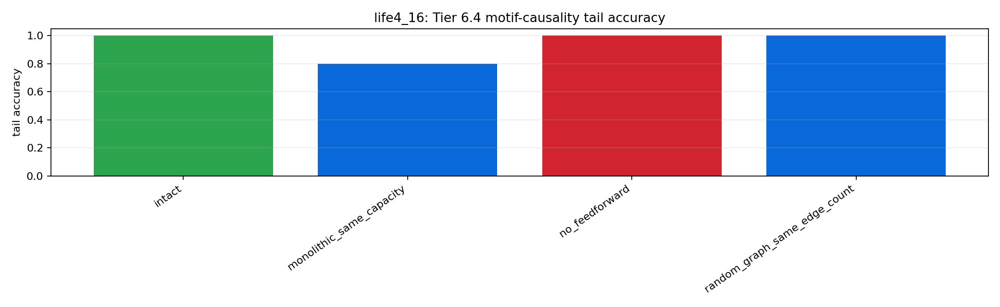
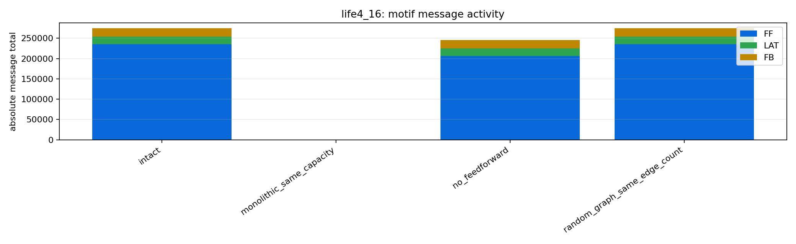

# Tier 6.4 Circuit Motif Causality Findings

- Generated: `2026-04-28T20:05:28+00:00`
- Backend: `mock`
- Status: **PASS**
- Output directory: `/Users/james/JKS:CRA/controlled_test_output/tier6_4_20260428_160526`

Tier 6.4 tests whether seeded reef circuit motifs are causal contributors rather than decorative labels.

## Claim Boundary

- PASS supports a controlled software claim that motif structure contributes measurable value under the tested tasks/seeds.
- PASS is not hardware motif evidence, not custom-C/on-chip evidence, not proof of compositionality, and not proof that every motif is individually optimal.
- The suite seeds a motif-diverse graph before the first outcome feedback because Tier 6.3 traces were feedforward-only and could not honestly ablate absent motifs.
- FAIL means the reef-motif claim must narrow or the motif implementation needs repair before promotion.

## Summary

- expected_runs: `4`
- actual_runs: `4`
- intact_motif_diverse_aggregate_count: `1`
- intact_motif_activity_steps_sum: `160`
- motif_ablation_loss_count: `0`
- random_or_monolithic_domination_count: `0`
- lineage_integrity_failures: `0`

## Criteria

| Criterion | Value | Rule | Pass |
| --- | ---: | --- | --- |
| matrix completed | 4 | == 4 | yes |
| intact graph is motif-diverse | 1 | == 1 | yes |
| intact motifs active before reward/learning | 160 | >= 1 | yes |
| lineage integrity remains clean | 0 | == 0 | yes |
| no aggregate extinction | 0 | == 0 | yes |
| all performance motif comparisons emitted | 3 | >= 3 | yes |
| motif ablations produce predicted losses | 0 | >= 0 | yes |
| random/monolithic controls do not dominate intact | 0 | <= 1 | yes |

## Case Aggregates

| Task | Regime | Variant | Group | Tail Acc | Abs Corr | Recovery | Motif Msg | FF/LAT/FB Edges | Events | Lineage Fails |
| --- | --- | --- | --- | ---: | ---: | ---: | ---: | --- | ---: | ---: |
| `hard_noisy_switching` | `life4_16` | `intact` | `intact` | 1 | 0.182743 | 13.6667 | 274541 | 4/4/4 | 6 | 0 |
| `hard_noisy_switching` | `life4_16` | `monolithic_same_capacity` | `monolithic_control` | 0.8 | 0.490801 | 11.3333 | 0 | 0/0/0 | 0 | 0 |
| `hard_noisy_switching` | `life4_16` | `no_feedforward` | `motif_ablation` | 1 | 0.185658 | 13.6667 | 245334 | 0/4/4 | 6 | 0 |
| `hard_noisy_switching` | `life4_16` | `random_graph_same_edge_count` | `same_capacity_graph_control` | 1 | 0.182069 | 13.6667 | 274529 | 4/4/4 | 6 | 0 |

## Intact vs Motif Controls

| Task | Regime | Control | Tail Delta | Corr Delta | Recovery Improvement | Efficiency Delta | Loss | Reason | Dominates Intact |
| --- | --- | --- | ---: | ---: | ---: | ---: | --- | --- | --- |
| `hard_noisy_switching` | `life4_16` | `monolithic_same_capacity` | 0.2 | -0.308058 | -2.33333 | 0.0264272 | yes | `tail_accuracy_loss,active_population_efficiency_loss` | no |
| `hard_noisy_switching` | `life4_16` | `no_feedforward` | 0 | -0.00291515 | 0 | -0.000111233 | no | `` | no |
| `hard_noisy_switching` | `life4_16` | `random_graph_same_edge_count` | 0 | 0.00067383 | 0 | 0 | no | `` | no |

## Artifacts

- `tier6_4_results.json`: machine-readable manifest.
- `tier6_4_summary.csv`: aggregate motif/control metrics.
- `tier6_4_comparisons.csv`: intact-vs-control deltas.
- `tier6_4_motif_graph.csv`: seeded motif graph and roles.
- `tier6_4_lifecycle_events.csv`: lifecycle event log.
- `tier6_4_lineage_final.csv`: final lineage audit table.
- `tier6_4_motif_manifest.json`: variant definitions and claim boundaries.
- `*_timeseries.csv`: per-task/per-regime/per-variant/per-seed traces.

## Plots

